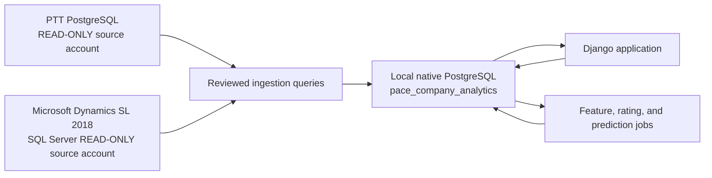

# Pace Company Analytics
## Django Build Specification for 070 Historical Profitability and Active-Project Forecasting

## 0. Executive build decision

Build a **new, standalone Django application** named **Pace Company Analytics** that runs locally on Owner's secured company Mac and uses its own native PostgreSQL database.

The application will periodically **read** data from:

1. **PTT**, the Pace time-tracking application running on PostgreSQL; and
2. **Microsoft Dynamics SL 2018**, running on Microsoft SQL Server.

It will normalize and store copies of the required source data in Pace Company Analytics' own PostgreSQL database, calculate 070 project profitability, create historical ratings, and predict the final profitability of awarded-not-started and in-progress projects.

### Non-negotiable architecture rule

> **The Pace Company Analytics must never alter the schema or data in PTT or Microsoft Dynamics SL.**

This means the application must never:

- run Django migrations against PTT or SL;
- create, alter, or drop source tables, columns, views, indexes, functions, triggers, or procedures;
- insert, update, merge, or delete source records;
- execute source-system stored procedures;
- write classifications, corrections, predictions, ratings, or annotations back to either source;
- expose a free-form SQL console against either source database.

All application writes occur only in the new local Pace Company Analytics database. PTT and SL are immutable upstream source systems from this application's perspective.

### Release sequence

**Release 1 — 070 Historical Profitability Truth Layer**

- ingest at least five years of 070 project history;
- join PTT and SL by normalized project number;
- display observed project revenue, direct-cost components, gross-profit dollars, and gross-margin percentage;
- show original estimate/budget versus actual outcome;
- show PTT hours, PM-entered remaining hours, and project participants;
- classify project type and solution from project titles and work-log text;
- calculate preliminary customer, site, project-type, PM, estimator, and salesperson ratings;
- make every number traceable to its source and ingestion run.

**Release 2 — Awarded and In-Progress Project Forecasting**

- produce deterministic estimate-at-completion calculations immediately;
- train an award-time prediction model for awarded-but-not-started projects;
- train an in-flight prediction model where historical as-of data can be reconstructed;
- predict final revenue, labor hours, direct cost, GP dollars, and GP percentage;
- calculate probability of losing money and probability of missing sold margin by more than a defined threshold;
- show prediction intervals, principal drivers, comparable historical projects, and risk status;
- refresh nightly, show the last successful refresh time, and provide a manual refresh button.

### Important scope clarification

PTT does not currently contain a complete work schedule. Therefore, until another scheduling source is added, the app can reliably distinguish:

- awarded/open with no field hours;
- active/in progress;
- field-complete but financially open;
- financially closed/stabilized;
- dormant or stalled;
- unknown.

It **cannot truthfully display exact scheduled start dates, completion dates, or scheduled crews** from PTT/SL alone unless source inspection discovers fields not currently known. The first screen should call these projects **"Awarded / Not Started"**, not "Scheduled," unless a legitimate scheduling source is integrated.

---

# 1. Decisions and facts now locked

## 1.1 Source systems

### PTT

- PostgreSQL source database.
- Authoritative for actual hours worked and daily work-log notes.
- Employees are expected to log hours to projects every day.
- Contains PM-entered remaining labor hours.
- Contains or calculates a percentage complete based on actual and remaining hours; the exact implementation must be copied from the Pace Scheduler `timetracker-master` code after inspection.
- Contains project status/planning information but not a complete scheduling system.
- Receives financial actuals back from SL through a daily synchronization, but SL remains the authoritative accounting source.

### Microsoft Dynamics SL 2018

- SQL Server source database.
- Authoritative for project revenue, costs, billing, initial budgets, current budgets, percent complete, customers, and financial status.
- Stores actual labor **dollars**, not labor hours.
- Labor cost is posted to projects when payroll is processed.
- Stores original estimate/budget information and current revised values.
- Does not presently provide a clean change-order history; the main contract value is updated and context is recorded externally.

## 1.2 Source access

Dedicated read-only credentials already exist for PTT and SL, and the `.env` file points only to those accounts.

These database permissions are the ultimate technical control. Application-level protections are additional defense in depth.

## 1.3 Project identity

- PTT and SL projects have a one-to-one relationship.
- Project number is the authoritative join key.
- Human-readable example: `254286`.
- Source values may contain leading zeroes.
- Most SL subaccounts are absent or `000`; all subaccounts should aggregate to the project unless source inspection identifies a valid exception.

Canonical normalization rule:

```text
1. Read the source project number as text.
2. Trim whitespace.
3. Convert to uppercase.
4. Remove non-semantic leading zeroes.
5. Preserve the exact raw PTT and SL values separately.
6. Never convert the canonical project number to an integer.
```

Examples:

```text
"000254286" -> "254286"
" 00254286 " -> "254286"
"000000"    -> "0" and a data-quality warning
```

The canonical key must be deterministic and unit-tested against every observed format.

## 1.4 Initial project population

- At least five years of 070 projects.
- Include closed, partially closed, awarded, and active projects.
- Ingest service tickets, time-and-material work, pure hardware, installation work, internal jobs, warranty jobs, canceled jobs, and zero-dollar jobs where they exist.
- Do not assume all project types belong in the same statistical model.
- Every project receives separate eligibility flags for:
  - descriptive reporting;
  - closed-project profitability;
  - award-time modeling;
  - in-flight modeling;
  - entity ratings.

## 1.5 Primary gross-profit definition

For the first release:

```text
Gross profit
= Revenue
- Actual field labor cost
- Actual material cost
- Actual subcontractor cost
- Actual freight cost
- Actual equipment cost
- Other direct project costs only where Pace's accounting mapping says they belong
```

The first release does not allocate divisional or corporate overhead into project gross profit. PM, estimating, engineering, commissions, and other overhead remain outside the primary GP measure until Pace deliberately creates a separate contribution-margin layer.

## 1.6 Labor facts

- PTT is authoritative for hours.
- SL is authoritative for actual labor dollars.
- There may be a timing lag between today's PTT hours and the latest labor cost posted in SL.
- The application must represent posted labor cost and estimated unposted labor accrual separately.
- It must never pretend that labor dollars and labor hours are synchronized to the same timestamp unless reconciliation proves they are.

## 1.7 Known data limitations

- Approved change orders are not cleanly represented as first-class records.
- Historical internal budget revisions may not be available.
- Work type, solution, manufacturer, and project mode generally must be inferred from project title, description, and work logs.
- Assistant PM, foreman/crew-lead, engineering, programming, design, and commissioning assignments are not currently available as explicit roles.
- Historical as-of reconstruction is possible only to the extent PTT and SL preserve transaction dates and prior values. A source-aware agent must confirm exact fields.

These limitations are not reasons to delay the app. They determine which outputs are factual, approximate, provisional, or unavailable.

---

# 2. Non-negotiable read-only architecture

## 2.1 Three physically and logically separate databases



### Local application database

The local database is the **only** database Django manages.

Recommended database name:

```text
pace_company_analytics
```

It contains:

- Django auth, sessions, and administration tables;
- imported raw source record versions;
- canonical projects, customers, employees, time entries, and financial facts;
- daily snapshots;
- local mappings, overrides, annotations, and classifications;
- features, model artifacts, predictions, ratings, and refresh logs.

### Source databases

PTT and SL are not Django application databases. They should **not appear in Django's `DATABASES` setting at all**.

This is intentionally stricter than using unmanaged Django models. `managed=False` prevents Django from managing the table lifecycle, but it does not make model instances inherently read-only. The cleanest control is to avoid source ORM models and avoid source database aliases entirely.

## 2.2 Required settings pattern

```python
# config/settings/base.py
DATABASES = {
    "default": {
        "ENGINE": "django.db.backends.postgresql",
        "NAME": env("PCA_DB_NAME", default="pace_company_analytics"),
        "USER": env("PCA_DB_USER"),
        "PASSWORD": env("PCA_DB_PASSWORD"),
        "HOST": env("PCA_DB_HOST", default="127.0.0.1"),
        "PORT": env("PCA_DB_PORT", default="5432"),
        "CONN_MAX_AGE": 60,
    }
}

# Deliberately NOT part of DATABASES.
PTT_READ_ONLY_DSN = env("PTT_READ_ONLY_DSN")
SL_READ_ONLY_DSN = env("SL_READ_ONLY_DSN")
```

Consequences:

- `python manage.py migrate` can affect only the local Pace Company Analytics database.
- Django ORM calls cannot accidentally route to PTT or SL.
- Django admin cannot save a PTT or SL object because no such ORM models exist.
- Cross-database foreign keys are impossible.

## 2.3 Source client modules

Only two modules may open source connections:

```text
apps/ingestion/sources/ptt_client.py
apps/ingestion/sources/sl_client.py
```

All other code consumes rows returned by these source clients or reads imported local models.

### PTT client controls

- `psycopg` connection using the dedicated read-only role.
- Session default set to read-only where supported.
- Each extraction transaction explicitly begins as `READ ONLY`.
- Statement timeout, lock timeout, and application name configured.
- No autocommit writes.
- Only static, reviewed query files may execute.

Conceptual implementation:

```python
from contextlib import contextmanager
import psycopg
from psycopg.rows import dict_row

@contextmanager
def ptt_read_connection(dsn: str):
    with psycopg.connect(
        dsn,
        row_factory=dict_row,
        autocommit=False,
        options=(
            "-c default_transaction_read_only=on "
            "-c statement_timeout=300000 "
            "-c lock_timeout=10000 "
            "-c application_name=pace_company_analytics"
        ),
    ) as connection:
        with connection.transaction():
            with connection.cursor() as cursor:
                cursor.execute("SET TRANSACTION READ ONLY")
            yield connection
```

### SL client controls

- `pyodbc` using Microsoft ODBC Driver 18.
- Dedicated SL account with `SELECT` only and no `EXECUTE`, DDL, or DML permissions.
- `ApplicationIntent=ReadOnly` in the connection string as an additional intent signal; permissions remain the security boundary.
- Static, reviewed queries only.
- Query timeout and explicit application name.

Conceptual connection string additions:

```text
ApplicationIntent=ReadOnly;
APP=PaceCompanyAnalytics;
Encrypt=yes;
TrustServerCertificate=<approved setting>;
```

## 2.4 Static query registry

Source queries live in version control:

```text
sql/source/ptt/projects.sql
sql/source/ptt/employees.sql
sql/source/ptt/time_entries_since.sql
sql/source/ptt/project_operational_state.sql
sql/source/sl/projects.sql
sql/source/sl/customers.sql
sql/source/sl/budgets.sql
sql/source/sl/financial_transactions_since.sql
sql/source/sl/project_financial_state.sql
```

The web app may request a query by a hard-coded query name. It may never submit arbitrary SQL.

```python
ALLOWED_SOURCE_QUERIES = {
    "ptt.projects": "sql/source/ptt/projects.sql",
    "ptt.time_entries_since": "sql/source/ptt/time_entries_since.sql",
    "sl.projects": "sql/source/sl/projects.sql",
    "sl.financial_transactions_since": "sql/source/sl/financial_transactions_since.sql",
}
```

Additional checks should reject:

- multiple SQL statements;
- DML or DDL tokens such as `INSERT`, `UPDATE`, `DELETE`, `MERGE`, `CREATE`, `ALTER`, `DROP`, `TRUNCATE`, `GRANT`, `REVOKE`, `EXEC`, or `CALL`;
- unreviewed query names;
- string interpolation of identifiers or values.

These checks are defense in depth, not a replacement for database permissions.

## 2.5 No source writes from tests or development

- Test settings omit source DSNs by default.
- Unit tests mock the source clients or use local fixtures.
- Integration tests against live PTT/SL are tagged and explicitly opt-in.
- No automated test should attempt a harmless write to prove read-only access.
- Source permissions should be verified through metadata queries and a DBA-reviewed permission report.
- CI searches the source SQL directory for forbidden statement types.

## 2.6 Source-load protections

- Run nightly refreshes outside peak business hours.
- Read in ordered chunks rather than one unbounded query.
- Apply statement timeouts.
- Use incremental watermarks where trustworthy.
- Re-read a trailing overlap window to catch late edits.
- Run a controlled full reconciliation weekly.
- Never add indexes or views to source databases for this project. If a query is too slow, optimize the query or ask the source-system owner for an approved reporting solution outside this app's scope.

## 2.7 Local-only application exposure

Initial bind address:

```text
127.0.0.1:8000
```

The app is initially for Owner's use on his Mac. It should not listen on all network interfaces and should not be made available to other computers until authentication, deployment, backup, and access requirements are deliberately expanded.

---

# 3. Recommended native Mac stack

## 3.1 Pinned application stack

Recommended conservative stack:

```text
Python 3.13
Django 5.2 LTS
Native PostgreSQL 17
psycopg 3 for local PostgreSQL and PTT extraction
pyodbc + Microsoft ODBC Driver 18 for Dynamics SL
pandas or Polars for feature assembly
scikit-learn for baseline, quantile, and forecasting models
joblib for model artifacts
Django templates plus lightweight JavaScript for dashboards
pytest + pytest-django for testing
ruff for linting and formatting
mypy for static checks on critical ingestion/model code
```

No Docker is required.

## 3.2 Local directories

```text
~/Pace/performance-lab/                         # Git repository
~/Library/Application Support/PaceCompanyAnalytics/
├── artifacts/                                  # serialized model artifacts
├── exports/                                    # deliberate user exports
├── logs/                                       # application and refresh logs
└── backups/                                    # local pg_dump files
```

## 3.3 Repository structure

```text
pace-performance-lab/
├── manage.py
├── pyproject.toml
├── .env.example
├── README.md
├── config/
│   ├── settings/
│   │   ├── base.py
│   │   ├── local.py
│   │   └── test.py
│   ├── urls.py
│   ├── wsgi.py
│   └── asgi.py
├── apps/
│   ├── ingestion/
│   │   ├── models.py
│   │   ├── services.py
│   │   ├── source_guard.py
│   │   ├── sources/
│   │   │   ├── ptt_client.py
│   │   │   └── sl_client.py
│   │   └── management/commands/
│   │       ├── refresh_all.py
│   │       ├── refresh_ptt.py
│   │       ├── refresh_sl.py
│   │       └── reconcile_sources.py
│   ├── core/
│   ├── finance/
│   ├── operations/
│   ├── classification/
│   ├── analytics/
│   ├── forecasting/
│   ├── ratings/
│   └── dashboard/
├── sql/
│   └── source/
│       ├── ptt/
│       └── sl/
├── pipelines/
│   ├── canonicalize.py
│   ├── build_snapshots.py
│   ├── build_features.py
│   ├── train_models.py
│   ├── score_projects.py
│   └── calculate_ratings.py
├── model_artifacts/
├── notebooks/
│   └── exploration_only/
├── docs/
│   ├── source_mapping.md
│   ├── metric_dictionary.md
│   ├── model_cards/
│   ├── runbooks/
│   └── data_quality_rules.md
└── tests/
    ├── unit/
    ├── integration/
    └── fixtures/
```

Notebooks are permitted for exploration but cannot become the production pipeline. Production calculations must live in tested Python modules or SQL transformations called by Django management commands.

---

# 4. Canonical economic definitions

## 4.1 Money and percentages

- Store money in `DecimalField`, never floating point.
- Store percentages as decimal fractions.
- Example: 25% is stored as `0.250000`, not `25`.
- Round only for display; preserve source precision in local facts.

Recommended field helpers:

```python
MONEY = {"max_digits": 20, "decimal_places": 4}
PERCENT = {"max_digits": 12, "decimal_places": 6}
HOURS = {"max_digits": 14, "decimal_places": 4}
```

## 4.2 Sold economics

```text
Original direct-cost budget
= Original labor budget
+ Original material budget
+ Original subcontract budget
+ Original freight budget
+ Original equipment budget
+ Original other-direct budget

Sold gross profit dollars
= Original contract value - Original direct-cost budget

Sold gross margin percentage
= Sold gross profit dollars / Original contract value
```

If a source field is missing, store `NULL`; do not silently convert missing to zero.

## 4.3 Actual closed-project economics

```text
Final direct cost
= Final actual labor cost
+ Final actual material cost
+ Final actual subcontract cost
+ Final actual freight cost
+ Final actual equipment cost
+ Final actual other direct cost

Final gross profit dollars
= Final actual revenue - Final direct cost

Final gross margin percentage
= Final gross profit dollars / Final actual revenue
```

A project is considered financially stabilized only after:

- it is in an SL closed/completed state; and
- no material financial transaction has posted during a configurable stabilization window.

Initial stabilization window: **45 days**. Display the close date and last transaction date so this assumption can be changed based on observed Pace behavior.

## 4.4 Margin preservation

Primary observed measure:

```text
Margin preservation, percentage points
= Final gross margin percentage - Sold gross margin percentage
```

Secondary dollar measure:

```text
Expected GP at current/final contract value
= Current/final contract value × Sold gross margin percentage

GP preservation dollars
= Final gross profit dollars - Expected GP at current/final contract value
```

Because Pace does not have clean historical change-order records, both measures must display a **commercial-change quality flag**. Large changes in contract value can make original sold margin an imperfect benchmark.

## 4.5 Contract-change proxy

```text
Net contract change dollars
= Current contract value - Original contract value

Net contract change percentage
= Net contract change dollars / Original contract value
```

This is a proxy, not a true change-order record.

Starting with the first nightly refresh, the app will preserve every observed change in current contract value and budget. That creates a reliable local change history going forward without modifying SL.

## 4.6 Current project economics

For open projects, keep three concepts separate:

1. **Actual to date** — financial data posted in SL.
2. **Accrued estimate** — estimated cost incurred but not yet posted, especially labor hours after the latest payroll posting.
3. **Estimate at completion** — predicted final revenue, hours, cost, GP, and margin.

Do not label actual-to-date GP as final profitability.

---

# 5. Django application models

The following is the destination model design. Exact source-table names do not affect these local models; source-aware extraction queries must return the agreed canonical column contracts.

## 5.1 Shared enums and base classes

```python
# apps/core/model_types.py
import uuid
from django.conf import settings
from django.db import models


class TimeStampedModel(models.Model):
    created_at = models.DateTimeField(auto_now_add=True)
    updated_at = models.DateTimeField(auto_now=True)

    class Meta:
        abstract = True


class SourceSystem(models.TextChoices):
    PTT = "ptt", "PTT"
    SL = "sl", "Microsoft Dynamics SL"
    LOCAL = "local", "Pace Company Analytics"


class ProjectLifecycle(models.TextChoices):
    AWARDED_NOT_STARTED = "awarded_not_started", "Awarded / Not Started"
    IN_PROGRESS = "in_progress", "In Progress"
    FIELD_COMPLETE = "field_complete", "Field Complete / Financially Open"
    CLOSED_STABILIZING = "closed_stabilizing", "Closed / Stabilizing"
    CLOSED_STABILIZED = "closed_stabilized", "Closed / Stabilized"
    DORMANT = "dormant", "Dormant / Stalled"
    CANCELED = "canceled", "Canceled"
    UNKNOWN = "unknown", "Unknown"


class RoleType(models.TextChoices):
    SALESPERSON = "salesperson", "Salesperson"
    ESTIMATOR = "estimator", "Estimator"
    PROJECT_MANAGER = "project_manager", "Project Manager"
    ELECTRICIAN = "electrician", "Electrician"
    OTHER = "other", "Other"
```

## 5.2 Ingestion and lineage models

### `IngestionRun`

One row per source or full refresh execution.

```python
# apps/ingestion/models.py
class IngestionRun(TimeStampedModel):
    class Trigger(models.TextChoices):
        NIGHTLY = "nightly", "Nightly"
        MANUAL = "manual", "Manual"
        BACKFILL = "backfill", "Backfill"
        RETRY = "retry", "Retry"

    class Status(models.TextChoices):
        QUEUED = "queued", "Queued"
        RUNNING = "running", "Running"
        SUCCEEDED = "succeeded", "Succeeded"
        PARTIAL = "partial", "Partial"
        FAILED = "failed", "Failed"

    id = models.UUIDField(primary_key=True, default=uuid.uuid4, editable=False)
    source_system = models.CharField(max_length=16, choices=SourceSystem.choices)
    trigger = models.CharField(max_length=16, choices=Trigger.choices)
    status = models.CharField(max_length=16, choices=Status.choices)
    requested_by = models.ForeignKey(
        settings.AUTH_USER_MODEL, null=True, blank=True,
        on_delete=models.SET_NULL,
    )
    started_at = models.DateTimeField(null=True, blank=True)
    finished_at = models.DateTimeField(null=True, blank=True)
    watermark_start = models.JSONField(default=dict, blank=True)
    watermark_end = models.JSONField(default=dict, blank=True)
    rows_read = models.BigIntegerField(default=0)
    rows_inserted = models.BigIntegerField(default=0)
    rows_updated = models.BigIntegerField(default=0)
    rows_unchanged = models.BigIntegerField(default=0)
    rows_rejected = models.BigIntegerField(default=0)
    query_versions = models.JSONField(default=dict, blank=True)
    code_commit = models.CharField(max_length=64, blank=True)
    error_summary = models.TextField(blank=True)
    log_path = models.TextField(blank=True)
```

### `SourceWatermark`

Stores the last successful incremental position by query.

```python
class SourceWatermark(TimeStampedModel):
    source_system = models.CharField(max_length=16, choices=SourceSystem.choices)
    query_name = models.CharField(max_length=128)
    watermark = models.JSONField(default=dict)
    last_successful_run = models.ForeignKey(
        IngestionRun, null=True, blank=True, on_delete=models.SET_NULL
    )

    class Meta:
        constraints = [
            models.UniqueConstraint(
                fields=["source_system", "query_name"],
                name="uniq_source_query_watermark",
            )
        ]
```

### `SourceRecordVersion`

Append-oriented raw lineage. It preserves changed source payloads without duplicating identical rows on every refresh.

```python
class SourceRecordVersion(models.Model):
    id = models.UUIDField(primary_key=True, default=uuid.uuid4, editable=False)
    source_system = models.CharField(max_length=16, choices=SourceSystem.choices)
    entity_type = models.CharField(max_length=64)
    source_key = models.CharField(max_length=255)
    content_hash = models.CharField(max_length=64)
    payload = models.JSONField()
    source_created_at = models.DateTimeField(null=True, blank=True)
    source_updated_at = models.DateTimeField(null=True, blank=True)
    first_seen_at = models.DateTimeField()
    last_seen_at = models.DateTimeField()
    first_seen_run = models.ForeignKey(
        IngestionRun, related_name="first_seen_records", on_delete=models.PROTECT
    )
    last_seen_run = models.ForeignKey(
        IngestionRun, related_name="last_seen_records", on_delete=models.PROTECT
    )

    class Meta:
        constraints = [
            models.UniqueConstraint(
                fields=["source_system", "entity_type", "source_key", "content_hash"],
                name="uniq_source_record_version",
            )
        ]
        indexes = [
            models.Index(fields=["source_system", "entity_type", "source_key"]),
            models.Index(fields=["last_seen_at"]),
        ]
```

### `DataQualityIssue`

```python
class DataQualityIssue(TimeStampedModel):
    class Severity(models.TextChoices):
        INFO = "info", "Info"
        WARNING = "warning", "Warning"
        ERROR = "error", "Error"
        BLOCKING = "blocking", "Blocking"

    class Status(models.TextChoices):
        OPEN = "open", "Open"
        ACKNOWLEDGED = "acknowledged", "Acknowledged"
        RESOLVED = "resolved", "Resolved"
        ACCEPTED = "accepted", "Accepted Limitation"

    code = models.CharField(max_length=64)
    severity = models.CharField(max_length=16, choices=Severity.choices)
    status = models.CharField(max_length=16, choices=Status.choices, default=Status.OPEN)
    project = models.ForeignKey(
        "core.Project", null=True, blank=True,
        on_delete=models.CASCADE, related_name="data_quality_issues"
    )
    source_system = models.CharField(max_length=16, choices=SourceSystem.choices, blank=True)
    source_key = models.CharField(max_length=255, blank=True)
    field_name = models.CharField(max_length=128, blank=True)
    details = models.JSONField(default=dict)
    detected_run = models.ForeignKey(IngestionRun, on_delete=models.PROTECT)
    resolved_at = models.DateTimeField(null=True, blank=True)
    resolution_note = models.TextField(blank=True)
```

## 5.3 Core identity models

### `Division`

```python
class Division(TimeStampedModel):
    code = models.CharField(max_length=8, unique=True)
    name = models.CharField(max_length=128)
    active = models.BooleanField(default=True)
```

Release 1 seeds `070` as the target division but does not hard-code business logic so later divisions can be added.

### `Customer` and `CustomerSite`

```python
class Customer(TimeStampedModel):
    id = models.UUIDField(primary_key=True, default=uuid.uuid4, editable=False)
    canonical_name = models.CharField(max_length=255)
    sl_customer_key = models.CharField(max_length=128, unique=True, null=True, blank=True)
    market_segment = models.CharField(max_length=64, blank=True)
    active = models.BooleanField(default=True)
    source_payload_hash = models.CharField(max_length=64, blank=True)


class CustomerSite(TimeStampedModel):
    id = models.UUIDField(primary_key=True, default=uuid.uuid4, editable=False)
    customer = models.ForeignKey(Customer, on_delete=models.PROTECT, related_name="sites")
    canonical_name = models.CharField(max_length=255)
    source_site_key = models.CharField(max_length=128, blank=True)
    city = models.CharField(max_length=128, blank=True)
    state = models.CharField(max_length=32, blank=True)
    classification_confidence = models.DecimalField(**PERCENT, null=True, blank=True)

    class Meta:
        constraints = [
            models.UniqueConstraint(
                fields=["customer", "canonical_name"], name="uniq_customer_site_name"
            )
        ]
```

Site may initially be inferred from title/description and should remain nullable.

### `Employee`

```python
class Employee(TimeStampedModel):
    id = models.UUIDField(primary_key=True, default=uuid.uuid4, editable=False)
    canonical_name = models.CharField(max_length=255)
    ptt_employee_key = models.CharField(max_length=128, unique=True, null=True, blank=True)
    sl_employee_key = models.CharField(max_length=128, null=True, blank=True)
    active = models.BooleanField(default=True)
    default_role = models.CharField(max_length=32, choices=RoleType.choices, blank=True)
    hire_date = models.DateField(null=True, blank=True)
    termination_date = models.DateField(null=True, blank=True)
```

The UI may display names because this is an internal tool. Model outputs must still show sample size, reliability, and limitations.

### `Project`

```python
class Project(TimeStampedModel):
    id = models.UUIDField(primary_key=True, default=uuid.uuid4, editable=False)
    canonical_project_number = models.CharField(max_length=64, unique=True)
    division = models.ForeignKey(Division, on_delete=models.PROTECT, related_name="projects")
    customer = models.ForeignKey(
        Customer, null=True, blank=True, on_delete=models.PROTECT, related_name="projects"
    )
    site = models.ForeignKey(
        CustomerSite, null=True, blank=True, on_delete=models.PROTECT, related_name="projects"
    )
    title = models.CharField(max_length=500, blank=True)
    description = models.TextField(blank=True)
    lifecycle_state = models.CharField(
        max_length=32, choices=ProjectLifecycle.choices, default=ProjectLifecycle.UNKNOWN
    )
    ptt_status = models.CharField(max_length=128, blank=True)
    sl_status = models.CharField(max_length=128, blank=True)
    award_date = models.DateField(null=True, blank=True)
    first_work_date = models.DateField(null=True, blank=True)
    last_work_date = models.DateField(null=True, blank=True)
    sl_close_date = models.DateField(null=True, blank=True)
    financially_stabilized_at = models.DateField(null=True, blank=True)
    current_salesperson = models.ForeignKey(
        Employee, null=True, blank=True, on_delete=models.SET_NULL,
        related_name="current_sales_projects"
    )
    current_estimator = models.ForeignKey(
        Employee, null=True, blank=True, on_delete=models.SET_NULL,
        related_name="current_estimated_projects"
    )
    current_project_manager = models.ForeignKey(
        Employee, null=True, blank=True, on_delete=models.SET_NULL,
        related_name="current_managed_projects"
    )
    latest_source_observed_at = models.DateTimeField(null=True, blank=True)
    descriptive_eligible = models.BooleanField(default=False)
    closed_model_eligible = models.BooleanField(default=False)
    award_model_eligible = models.BooleanField(default=False)
    inflight_model_eligible = models.BooleanField(default=False)
    rating_eligible = models.BooleanField(default=False)

    class Meta:
        indexes = [
            models.Index(fields=["division", "lifecycle_state"]),
            models.Index(fields=["customer"]),
            models.Index(fields=["current_project_manager"]),
            models.Index(fields=["sl_close_date"]),
        ]
```

### `ProjectSourceIdentity`

Preserves raw source identifiers and proves the PTT/SL join.

```python
class ProjectSourceIdentity(models.Model):
    project = models.ForeignKey(Project, on_delete=models.CASCADE, related_name="source_identities")
    source_system = models.CharField(max_length=16, choices=SourceSystem.choices)
    source_primary_key = models.CharField(max_length=255)
    project_number_raw = models.CharField(max_length=128)
    project_number_normalized = models.CharField(max_length=64)
    subaccount_raw = models.CharField(max_length=64, blank=True)
    source_record_hash = models.CharField(max_length=64)
    last_seen_run = models.ForeignKey(IngestionRun, on_delete=models.PROTECT)

    class Meta:
        constraints = [
            models.UniqueConstraint(
                fields=["source_system", "source_primary_key"],
                name="uniq_project_source_identity",
            ),
            models.UniqueConstraint(
                fields=["project", "source_system"],
                name="uniq_project_per_source_system",
            ),
        ]
```

### `ProjectRoleAssignment`

```python
class ProjectRoleAssignment(TimeStampedModel):
    project = models.ForeignKey(Project, on_delete=models.CASCADE, related_name="assignments")
    employee = models.ForeignKey(Employee, on_delete=models.PROTECT, related_name="assignments")
    role = models.CharField(max_length=32, choices=RoleType.choices)
    start_date = models.DateField(null=True, blank=True)
    end_date = models.DateField(null=True, blank=True)
    source_system = models.CharField(max_length=16, choices=SourceSystem.choices)
    assignment_method = models.CharField(
        max_length=32,
        choices=[
            ("explicit", "Explicit Source Field"),
            ("work_log", "Inferred from Work Logs"),
            ("manual", "Local Manual Assignment"),
        ],
    )
    confidence = models.DecimalField(**PERCENT, default=1)
    actual_hours = models.DecimalField(**HOURS, null=True, blank=True)

    class Meta:
        indexes = [
            models.Index(fields=["project", "role"]),
            models.Index(fields=["employee", "role"]),
        ]
```

## 5.4 PTT operational models

### `TimeEntry`

```python
class TimeEntry(models.Model):
    id = models.UUIDField(primary_key=True, default=uuid.uuid4, editable=False)
    source_key = models.CharField(max_length=255, unique=True)
    project = models.ForeignKey(Project, on_delete=models.CASCADE, related_name="time_entries")
    employee = models.ForeignKey(Employee, on_delete=models.PROTECT, related_name="time_entries")
    work_date = models.DateField()
    hours = models.DecimalField(**HOURS)
    note = models.TextField(blank=True)
    source_created_at = models.DateTimeField(null=True, blank=True)
    source_updated_at = models.DateTimeField(null=True, blank=True)
    content_hash = models.CharField(max_length=64)
    last_seen_run = models.ForeignKey(IngestionRun, on_delete=models.PROTECT)

    class Meta:
        indexes = [
            models.Index(fields=["project", "work_date"]),
            models.Index(fields=["employee", "work_date"]),
        ]
```

### `ProjectOperationalSnapshot`

One daily row per project after each successful refresh.

```python
class ProjectOperationalSnapshot(models.Model):
    id = models.UUIDField(primary_key=True, default=uuid.uuid4, editable=False)
    project = models.ForeignKey(Project, on_delete=models.CASCADE, related_name="operational_snapshots")
    as_of_date = models.DateField()
    ingestion_run = models.ForeignKey(IngestionRun, on_delete=models.PROTECT)
    actual_labor_hours_to_date = models.DecimalField(**HOURS, null=True, blank=True)
    pm_remaining_labor_hours = models.DecimalField(**HOURS, null=True, blank=True)
    calculated_labor_percent_complete = models.DecimalField(**PERCENT, null=True, blank=True)
    source_percent_complete = models.DecimalField(**PERCENT, null=True, blank=True)
    hours_last_7_days = models.DecimalField(**HOURS, default=0)
    hours_last_30_days = models.DecimalField(**HOURS, default=0)
    active_workers_last_30_days = models.PositiveIntegerField(default=0)
    days_since_last_work = models.IntegerField(null=True, blank=True)
    first_work_date = models.DateField(null=True, blank=True)
    last_work_date = models.DateField(null=True, blank=True)
    remaining_hours_updated_at = models.DateTimeField(null=True, blank=True)
    data_quality_flags = models.JSONField(default=list)

    class Meta:
        constraints = [
            models.UniqueConstraint(
                fields=["project", "as_of_date"], name="uniq_project_operational_snapshot_day"
            )
        ]
        indexes = [models.Index(fields=["as_of_date", "project"])]
```

Initial calculated percent-complete formula, subject to confirmation from the PTT code:

```text
actual hours / (actual hours + PM remaining hours)
```

When both values are zero or remaining hours are stale/missing, percentage complete is null and a data-quality flag is raised.

## 5.5 SL financial models

### `CostCategoryRule`

This local table maps SL accounts, transaction types, subaccounts, or other source attributes into Pace's direct-cost categories. It never modifies SL.

```python
class CostCategory(models.TextChoices):
    REVENUE = "revenue", "Revenue"
    LABOR = "labor", "Field Labor"
    MATERIAL = "material", "Material"
    SUBCONTRACT = "subcontract", "Subcontractor"
    FREIGHT = "freight", "Freight"
    EQUIPMENT = "equipment", "Equipment"
    OTHER_DIRECT = "other_direct", "Other Direct"
    EXCLUDED = "excluded", "Excluded / Overhead"
    UNKNOWN = "unknown", "Unknown"


class CostCategoryRule(TimeStampedModel):
    priority = models.PositiveIntegerField(default=100)
    source_account_pattern = models.CharField(max_length=128, blank=True)
    source_subaccount_pattern = models.CharField(max_length=128, blank=True)
    source_transaction_type = models.CharField(max_length=128, blank=True)
    source_description_pattern = models.CharField(max_length=255, blank=True)
    category = models.CharField(max_length=32, choices=CostCategory.choices)
    effective_start = models.DateField(null=True, blank=True)
    effective_end = models.DateField(null=True, blank=True)
    active = models.BooleanField(default=True)
    rationale = models.TextField(blank=True)
```

### `ProjectFinancialTransaction`

```python
class ProjectFinancialTransaction(models.Model):
    id = models.UUIDField(primary_key=True, default=uuid.uuid4, editable=False)
    source_key = models.CharField(max_length=255, unique=True)
    project = models.ForeignKey(Project, on_delete=models.CASCADE, related_name="financial_transactions")
    transaction_date = models.DateField(null=True, blank=True)
    posting_date = models.DateField(null=True, blank=True)
    fiscal_period = models.CharField(max_length=32, blank=True)
    source_account = models.CharField(max_length=128, blank=True)
    source_subaccount = models.CharField(max_length=128, blank=True)
    source_transaction_type = models.CharField(max_length=128, blank=True)
    source_description = models.TextField(blank=True)
    amount = models.DecimalField(**MONEY)
    category = models.CharField(max_length=32, choices=CostCategory.choices)
    category_rule = models.ForeignKey(
        CostCategoryRule, null=True, blank=True, on_delete=models.SET_NULL
    )
    category_confidence = models.DecimalField(**PERCENT, default=1)
    source_created_at = models.DateTimeField(null=True, blank=True)
    source_updated_at = models.DateTimeField(null=True, blank=True)
    content_hash = models.CharField(max_length=64)
    last_seen_run = models.ForeignKey(IngestionRun, on_delete=models.PROTECT)

    class Meta:
        indexes = [
            models.Index(fields=["project", "posting_date"]),
            models.Index(fields=["category", "posting_date"]),
        ]
```

### `ProjectFinancialSnapshot`

This is the primary historical and current project economics table.

```python
class ProjectFinancialSnapshot(models.Model):
    id = models.UUIDField(primary_key=True, default=uuid.uuid4, editable=False)
    project = models.ForeignKey(Project, on_delete=models.CASCADE, related_name="financial_snapshots")
    as_of_date = models.DateField()
    ingestion_run = models.ForeignKey(IngestionRun, on_delete=models.PROTECT)

    original_contract_value = models.DecimalField(**MONEY, null=True, blank=True)
    current_contract_value = models.DecimalField(**MONEY, null=True, blank=True)

    original_budget_labor = models.DecimalField(**MONEY, null=True, blank=True)
    original_budget_material = models.DecimalField(**MONEY, null=True, blank=True)
    original_budget_subcontract = models.DecimalField(**MONEY, null=True, blank=True)
    original_budget_freight = models.DecimalField(**MONEY, null=True, blank=True)
    original_budget_equipment = models.DecimalField(**MONEY, null=True, blank=True)
    original_budget_other_direct = models.DecimalField(**MONEY, null=True, blank=True)
    original_estimated_labor_hours = models.DecimalField(**HOURS, null=True, blank=True)

    current_budget_labor = models.DecimalField(**MONEY, null=True, blank=True)
    current_budget_material = models.DecimalField(**MONEY, null=True, blank=True)
    current_budget_subcontract = models.DecimalField(**MONEY, null=True, blank=True)
    current_budget_freight = models.DecimalField(**MONEY, null=True, blank=True)
    current_budget_equipment = models.DecimalField(**MONEY, null=True, blank=True)
    current_budget_other_direct = models.DecimalField(**MONEY, null=True, blank=True)

    actual_revenue_to_date = models.DecimalField(**MONEY, null=True, blank=True)
    billed_revenue_to_date = models.DecimalField(**MONEY, null=True, blank=True)
    actual_labor_cost_to_date = models.DecimalField(**MONEY, null=True, blank=True)
    actual_material_cost_to_date = models.DecimalField(**MONEY, null=True, blank=True)
    actual_subcontract_cost_to_date = models.DecimalField(**MONEY, null=True, blank=True)
    actual_freight_cost_to_date = models.DecimalField(**MONEY, null=True, blank=True)
    actual_equipment_cost_to_date = models.DecimalField(**MONEY, null=True, blank=True)
    actual_other_direct_cost_to_date = models.DecimalField(**MONEY, null=True, blank=True)

    open_purchase_commitments = models.DecimalField(**MONEY, null=True, blank=True)
    sl_percent_complete = models.DecimalField(**PERCENT, null=True, blank=True)
    last_financial_transaction_date = models.DateField(null=True, blank=True)

    sold_gp_dollars = models.DecimalField(**MONEY, null=True, blank=True)
    sold_gp_percent = models.DecimalField(**PERCENT, null=True, blank=True)
    actual_direct_cost_to_date = models.DecimalField(**MONEY, null=True, blank=True)
    actual_gp_to_date = models.DecimalField(**MONEY, null=True, blank=True)
    actual_gp_percent_to_date = models.DecimalField(**PERCENT, null=True, blank=True)
    net_contract_change_dollars = models.DecimalField(**MONEY, null=True, blank=True)
    net_contract_change_percent = models.DecimalField(**PERCENT, null=True, blank=True)

    calculation_version = models.CharField(max_length=32)
    data_quality_flags = models.JSONField(default=list)

    class Meta:
        constraints = [
            models.UniqueConstraint(
                fields=["project", "as_of_date"], name="uniq_project_financial_snapshot_day"
            )
        ]
        indexes = [
            models.Index(fields=["as_of_date", "project"]),
            models.Index(fields=["sold_gp_percent"]),
            models.Index(fields=["actual_gp_percent_to_date"]),
        ]
```

Calculated fields are materialized for reproducibility and indexed analysis. The calculation service owns them; users do not edit them.

### `ProjectCommercialChange`

```python
class ProjectCommercialChange(TimeStampedModel):
    class Origin(models.TextChoices):
        DETECTED = "detected", "Detected from Source Snapshot"
        MANUAL = "manual", "Local Manual Entry"

    class ReviewStatus(models.TextChoices):
        UNREVIEWED = "unreviewed", "Unreviewed"
        CONFIRMED = "confirmed", "Confirmed"
        EXPLAINED = "explained", "Explained"
        IGNORED = "ignored", "Ignored"

    project = models.ForeignKey(Project, on_delete=models.CASCADE, related_name="commercial_changes")
    detected_at = models.DateField()
    prior_contract_value = models.DecimalField(**MONEY, null=True, blank=True)
    new_contract_value = models.DecimalField(**MONEY, null=True, blank=True)
    change_amount = models.DecimalField(**MONEY, null=True, blank=True)
    prior_budget = models.DecimalField(**MONEY, null=True, blank=True)
    new_budget = models.DecimalField(**MONEY, null=True, blank=True)
    origin = models.CharField(max_length=16, choices=Origin.choices)
    review_status = models.CharField(
        max_length=16, choices=ReviewStatus.choices, default=ReviewStatus.UNREVIEWED
    )
    note = models.TextField(blank=True)
    source_run = models.ForeignKey(IngestionRun, null=True, blank=True, on_delete=models.PROTECT)
```

This gives Pace a clean commercial-change history **from Pace Company Analytics go-live forward**, despite SL's current limitation.

## 5.6 Classification and local-override models

### Controlled taxonomies

Initial solution classes:

```text
access_control
cctv_video_surveillance
intrusion
intercom
fire_alarm
structured_cabling
service
hardware_only
mixed_security
other
unknown
```

Initial project modes:

```text
new_installation
upgrade_expansion
replacement
service_ticket
time_and_material
warranty_callback
internal
hardware_only
canceled
other
unknown
```

These are initial values, not a claim that the source already stores them.

### `TaxonomyVersion`

```python
class TaxonomyVersion(TimeStampedModel):
    name = models.CharField(max_length=128)
    version = models.CharField(max_length=32)
    schema = models.JSONField()
    prompt_template = models.TextField(blank=True)
    active = models.BooleanField(default=False)

    class Meta:
        constraints = [
            models.UniqueConstraint(fields=["name", "version"], name="uniq_taxonomy_version")
        ]
```

### `ProjectClassification`

```python
class ProjectClassification(TimeStampedModel):
    class Method(models.TextChoices):
        RULE = "rule", "Rule"
        AI = "ai", "AI"
        MANUAL = "manual", "Manual Override"

    project = models.ForeignKey(Project, on_delete=models.CASCADE, related_name="classifications")
    taxonomy_version = models.ForeignKey(TaxonomyVersion, on_delete=models.PROTECT)
    solution_class = models.CharField(max_length=64)
    project_mode = models.CharField(max_length=64)
    customer_segment = models.CharField(max_length=64, blank=True)
    manufacturer_tags = models.JSONField(default=list)
    product_tags = models.JSONField(default=list)
    method = models.CharField(max_length=16, choices=Method.choices)
    confidence = models.DecimalField(**PERCENT)
    evidence = models.JSONField(default=list)
    active = models.BooleanField(default=True)
    overridden_classification = models.ForeignKey(
        "self", null=True, blank=True, on_delete=models.SET_NULL
    )

    class Meta:
        indexes = [
            models.Index(fields=["solution_class", "project_mode"]),
            models.Index(fields=["active"]),
        ]
```

Only one active classification per project and taxonomy should be enforced in service logic or with a conditional unique constraint.

### `WorkLogClassification`

```python
class WorkLogClassification(TimeStampedModel):
    time_entry = models.OneToOneField(
        TimeEntry, on_delete=models.CASCADE, related_name="classification"
    )
    taxonomy_version = models.ForeignKey(TaxonomyVersion, on_delete=models.PROTECT)
    primary_task = models.CharField(max_length=64)
    project_phase = models.CharField(max_length=64, blank=True)
    blocker_category = models.CharField(max_length=64, blank=True)
    rework_flag = models.BooleanField(default=False)
    out_of_scope_flag = models.BooleanField(default=False)
    customer_delay_flag = models.BooleanField(default=False)
    material_delay_flag = models.BooleanField(default=False)
    confidence = models.DecimalField(**PERCENT)
    evidence_span = models.TextField(blank=True)
    provider = models.CharField(max_length=64)
    model_name = models.CharField(max_length=128)
    prompt_hash = models.CharField(max_length=64)
    human_reviewed = models.BooleanField(default=False)
```

External AI calls should send only the minimum necessary text. Financial values and employee names are not needed for classification.

### `ProjectAnnotation`

All corrections and context remain local.

```python
class ProjectAnnotation(TimeStampedModel):
    class AnnotationType(models.TextChoices):
        COMMERCIAL_CHANGE = "commercial_change", "Commercial Change"
        MODEL_EXCLUSION = "model_exclusion", "Model Exclusion"
        PROJECT_CONTEXT = "project_context", "Project Context"
        DATA_CORRECTION = "data_correction", "Local Data Correction"
        RISK_NOTE = "risk_note", "Risk Note"

    project = models.ForeignKey(Project, on_delete=models.CASCADE, related_name="annotations")
    annotation_type = models.CharField(max_length=32, choices=AnnotationType.choices)
    effective_date = models.DateField(null=True, blank=True)
    amount = models.DecimalField(**MONEY, null=True, blank=True)
    note = models.TextField()
    created_by = models.ForeignKey(settings.AUTH_USER_MODEL, on_delete=models.PROTECT)
    active = models.BooleanField(default=True)
```

No annotation is pushed back to PTT or SL.

## 5.7 Eligibility and cohort models

### `ProjectEligibility`

```python
class ProjectEligibility(TimeStampedModel):
    project = models.OneToOneField(Project, on_delete=models.CASCADE, related_name="eligibility")
    descriptive_ready = models.BooleanField(default=False)
    closed_profitability_ready = models.BooleanField(default=False)
    award_model_ready = models.BooleanField(default=False)
    inflight_model_ready = models.BooleanField(default=False)
    customer_rating_ready = models.BooleanField(default=False)
    pm_rating_ready = models.BooleanField(default=False)
    estimator_rating_ready = models.BooleanField(default=False)
    salesperson_rating_ready = models.BooleanField(default=False)
    field_rating_ready = models.BooleanField(default=False)
    exclusion_reasons = models.JSONField(default=list)
    evaluated_at = models.DateTimeField()
    rule_version = models.CharField(max_length=32)
```

### `CohortDefinition`

```python
class CohortDefinition(TimeStampedModel):
    slug = models.SlugField(max_length=128, unique=True)
    name = models.CharField(max_length=255)
    description = models.TextField()
    filter_spec = models.JSONField()
    active = models.BooleanField(default=True)
    minimum_closed_projects = models.PositiveIntegerField(default=50)
```

Initial cohorts should separate at least:

- installation/upgrade projects;
- service and time-and-material work;
- hardware-only work;
- warranty/internal/canceled work;
- unknown/mixed work.

All are visible descriptively. Only cohorts with sufficient volume and reliable fields are modeled.

## 5.8 Feature, model, prediction, and rating models

### `ProjectFeatureSnapshot`

This is the exact, immutable row used for training or scoring.

```python
class ProjectFeatureSnapshot(models.Model):
    class SnapshotType(models.TextChoices):
        AWARD = "award", "Award-Time"
        HISTORICAL_INFLIGHT = "historical_inflight", "Historical In-Flight"
        CURRENT = "current", "Current"
        FINAL = "final", "Final Outcome"

    id = models.UUIDField(primary_key=True, default=uuid.uuid4, editable=False)
    project = models.ForeignKey(Project, on_delete=models.CASCADE, related_name="feature_snapshots")
    as_of_date = models.DateField()
    snapshot_type = models.CharField(max_length=32, choices=SnapshotType.choices)
    cohort = models.ForeignKey(CohortDefinition, null=True, blank=True, on_delete=models.PROTECT)
    feature_schema_version = models.CharField(max_length=32)
    features = models.JSONField()
    targets = models.JSONField(default=dict)
    feature_hash = models.CharField(max_length=64)
    leakage_cutoff = models.DateTimeField(null=True, blank=True)
    eligible = models.BooleanField(default=True)
    exclusion_reasons = models.JSONField(default=list)
    built_from_financial_snapshot = models.ForeignKey(
        ProjectFinancialSnapshot, null=True, blank=True, on_delete=models.PROTECT
    )
    built_from_operational_snapshot = models.ForeignKey(
        ProjectOperationalSnapshot, null=True, blank=True, on_delete=models.PROTECT
    )

    class Meta:
        constraints = [
            models.UniqueConstraint(
                fields=["project", "as_of_date", "snapshot_type", "feature_schema_version"],
                name="uniq_project_feature_snapshot",
            )
        ]
        indexes = [
            models.Index(fields=["snapshot_type", "as_of_date"]),
            models.Index(fields=["cohort", "eligible"]),
        ]
```

### `ModelDefinition` and `ModelVersion`

```python
class ModelDefinition(TimeStampedModel):
    slug = models.SlugField(max_length=128, unique=True)
    name = models.CharField(max_length=255)
    purpose = models.TextField()
    target_name = models.CharField(max_length=128)
    snapshot_type = models.CharField(max_length=32, choices=ProjectFeatureSnapshot.SnapshotType.choices)
    cohort = models.ForeignKey(CohortDefinition, null=True, blank=True, on_delete=models.PROTECT)
    active = models.BooleanField(default=True)


class ModelVersion(TimeStampedModel):
    class Status(models.TextChoices):
        CANDIDATE = "candidate", "Candidate"
        VALIDATED = "validated", "Validated"
        PRODUCTION = "production", "Production"
        RETIRED = "retired", "Retired"
        REJECTED = "rejected", "Rejected"

    id = models.UUIDField(primary_key=True, default=uuid.uuid4, editable=False)
    definition = models.ForeignKey(ModelDefinition, on_delete=models.PROTECT, related_name="versions")
    version = models.CharField(max_length=64)
    status = models.CharField(max_length=16, choices=Status.choices)
    trained_through = models.DateField()
    training_started_at = models.DateTimeField()
    training_finished_at = models.DateTimeField(null=True, blank=True)
    algorithm = models.CharField(max_length=128)
    hyperparameters = models.JSONField(default=dict)
    feature_names = models.JSONField(default=list)
    training_metrics = models.JSONField(default=dict)
    validation_metrics = models.JSONField(default=dict)
    calibration_metrics = models.JSONField(default=dict)
    baseline_comparison = models.JSONField(default=dict)
    data_window = models.JSONField(default=dict)
    code_commit = models.CharField(max_length=64)
    artifact_path = models.TextField()
    artifact_hash = models.CharField(max_length=64)
    model_card_path = models.TextField()

    class Meta:
        constraints = [
            models.UniqueConstraint(
                fields=["definition", "version"], name="uniq_model_definition_version"
            )
        ]
```

### `ProjectPrediction`

```python
class ProjectPrediction(models.Model):
    id = models.UUIDField(primary_key=True, default=uuid.uuid4, editable=False)
    project = models.ForeignKey(Project, on_delete=models.CASCADE, related_name="predictions")
    feature_snapshot = models.ForeignKey(ProjectFeatureSnapshot, on_delete=models.PROTECT)
    as_of_date = models.DateField()
    generated_at = models.DateTimeField()
    model_versions = models.JSONField()

    predicted_final_revenue_p10 = models.DecimalField(**MONEY, null=True, blank=True)
    predicted_final_revenue_p50 = models.DecimalField(**MONEY, null=True, blank=True)
    predicted_final_revenue_p90 = models.DecimalField(**MONEY, null=True, blank=True)

    predicted_final_labor_hours_p10 = models.DecimalField(**HOURS, null=True, blank=True)
    predicted_final_labor_hours_p50 = models.DecimalField(**HOURS, null=True, blank=True)
    predicted_final_labor_hours_p90 = models.DecimalField(**HOURS, null=True, blank=True)

    predicted_final_direct_cost_p10 = models.DecimalField(**MONEY, null=True, blank=True)
    predicted_final_direct_cost_p50 = models.DecimalField(**MONEY, null=True, blank=True)
    predicted_final_direct_cost_p90 = models.DecimalField(**MONEY, null=True, blank=True)

    predicted_final_gp_dollars_p10 = models.DecimalField(**MONEY, null=True, blank=True)
    predicted_final_gp_dollars_p50 = models.DecimalField(**MONEY, null=True, blank=True)
    predicted_final_gp_dollars_p90 = models.DecimalField(**MONEY, null=True, blank=True)

    predicted_final_gp_percent_p10 = models.DecimalField(**PERCENT, null=True, blank=True)
    predicted_final_gp_percent_p50 = models.DecimalField(**PERCENT, null=True, blank=True)
    predicted_final_gp_percent_p90 = models.DecimalField(**PERCENT, null=True, blank=True)

    probability_of_loss = models.DecimalField(**PERCENT, null=True, blank=True)
    probability_of_margin_miss = models.DecimalField(**PERCENT, null=True, blank=True)
    margin_miss_threshold_points = models.DecimalField(**PERCENT, default=0.05)
    projected_gp_shortfall_dollars = models.DecimalField(**MONEY, null=True, blank=True)
    projected_margin_change_points = models.DecimalField(**PERCENT, null=True, blank=True)

    risk_score = models.PositiveSmallIntegerField(null=True, blank=True)
    risk_level = models.CharField(max_length=16, blank=True)
    prediction_method = models.CharField(
        max_length=32,
        choices=[
            ("deterministic", "Deterministic EAC"),
            ("award_model", "Award-Time Model"),
            ("inflight_model", "In-Flight Model"),
            ("blended", "Blended / Fallback"),
        ],
    )
    data_freshness = models.JSONField(default=dict)
    warnings = models.JSONField(default=list)

    class Meta:
        constraints = [
            models.UniqueConstraint(
                fields=["project", "as_of_date"], name="uniq_project_prediction_day"
            )
        ]
        indexes = [
            models.Index(fields=["as_of_date", "risk_level"]),
            models.Index(fields=["probability_of_loss"]),
        ]
```

### `PredictionDriver` and `ComparableProject`

```python
class PredictionDriver(models.Model):
    prediction = models.ForeignKey(ProjectPrediction, on_delete=models.CASCADE, related_name="drivers")
    rank = models.PositiveSmallIntegerField()
    feature_name = models.CharField(max_length=128)
    feature_value = models.JSONField(null=True, blank=True)
    impact_on_gp_points = models.DecimalField(**PERCENT, null=True, blank=True)
    direction = models.CharField(max_length=16)
    explanation = models.TextField()


class ComparableProject(models.Model):
    prediction = models.ForeignKey(ProjectPrediction, on_delete=models.CASCADE, related_name="comparables")
    comparable_project = models.ForeignKey(Project, on_delete=models.PROTECT)
    rank = models.PositiveSmallIntegerField()
    distance = models.DecimalField(max_digits=12, decimal_places=6)
    similarity_reasons = models.JSONField(default=list)
    comparable_final_gp_percent = models.DecimalField(**PERCENT, null=True, blank=True)
    comparable_margin_preservation = models.DecimalField(**PERCENT, null=True, blank=True)
```

### `RatingRun` and `EntityRating`

```python
class RatingRun(TimeStampedModel):
    id = models.UUIDField(primary_key=True, default=uuid.uuid4, editable=False)
    as_of_date = models.DateField()
    cohort = models.ForeignKey(CohortDefinition, null=True, blank=True, on_delete=models.PROTECT)
    methodology_version = models.CharField(max_length=32)
    training_cutoff = models.DateField()
    status = models.CharField(max_length=16)
    metrics = models.JSONField(default=dict)
    code_commit = models.CharField(max_length=64)


class EntityType(models.TextChoices):
    PROJECT = "project", "Project"
    CUSTOMER = "customer", "Customer"
    SITE = "site", "Customer Site"
    SOLUTION = "solution", "Solution / Project Type"
    PROJECT_MANAGER = "project_manager", "Project Manager"
    ESTIMATOR = "estimator", "Estimator"
    SALESPERSON = "salesperson", "Salesperson"
    ELECTRICIAN = "electrician", "Electrician"
    MANUFACTURER = "manufacturer", "Manufacturer"


class EntityRating(models.Model):
    rating_run = models.ForeignKey(RatingRun, on_delete=models.CASCADE, related_name="ratings")
    entity_type = models.CharField(max_length=32, choices=EntityType.choices)
    entity_key = models.CharField(max_length=128)
    entity_name = models.CharField(max_length=255)
    metric_name = models.CharField(max_length=128)

    raw_effect = models.DecimalField(max_digits=20, decimal_places=8, null=True, blank=True)
    adjusted_effect = models.DecimalField(max_digits=20, decimal_places=8, null=True, blank=True)
    interval_low = models.DecimalField(max_digits=20, decimal_places=8, null=True, blank=True)
    interval_high = models.DecimalField(max_digits=20, decimal_places=8, null=True, blank=True)
    standard_error = models.DecimalField(max_digits=20, decimal_places=8, null=True, blank=True)

    project_count = models.PositiveIntegerField(default=0)
    effective_project_count = models.DecimalField(max_digits=12, decimal_places=4, default=0)
    revenue_exposure = models.DecimalField(**MONEY, default=0)
    labor_hours_exposure = models.DecimalField(**HOURS, default=0)
    customer_count = models.PositiveIntegerField(default=0)
    solution_count = models.PositiveIntegerField(default=0)
    teammate_count = models.PositiveIntegerField(default=0)

    shrinkage_factor = models.DecimalField(**PERCENT, null=True, blank=True)
    connectedness_score = models.DecimalField(**PERCENT, null=True, blank=True)
    data_quality_score = models.DecimalField(**PERCENT, null=True, blank=True)
    reliability_score = models.DecimalField(**PERCENT, null=True, blank=True)
    percentile = models.DecimalField(**PERCENT, null=True, blank=True)
    display_index = models.DecimalField(max_digits=8, decimal_places=3, null=True, blank=True)
    publication_status = models.CharField(
        max_length=32,
        choices=[
            ("insufficient", "Insufficient Data"),
            ("provisional", "Provisional"),
            ("publishable", "Publishable"),
            ("not_identifiable", "Not Identifiable"),
        ],
    )
    limitations = models.JSONField(default=list)

    class Meta:
        constraints = [
            models.UniqueConstraint(
                fields=["rating_run", "entity_type", "entity_key", "metric_name"],
                name="uniq_entity_rating_metric_run",
            )
        ]
        indexes = [
            models.Index(fields=["entity_type", "metric_name", "publication_status"]),
            models.Index(fields=["display_index"]),
        ]
```

The `entity_key` is the UUID string for local entities or the classification slug for solution/project type. The entity name is snapshotted so historical rating reports remain intelligible if names change.

### `RefreshRequest`

```python
class RefreshRequest(TimeStampedModel):
    class Status(models.TextChoices):
        QUEUED = "queued", "Queued"
        RUNNING = "running", "Running"
        SUCCEEDED = "succeeded", "Succeeded"
        FAILED = "failed", "Failed"
        REJECTED = "rejected", "Rejected"

    requested_by = models.ForeignKey(settings.AUTH_USER_MODEL, on_delete=models.PROTECT)
    requested_at = models.DateTimeField(auto_now_add=True)
    status = models.CharField(max_length=16, choices=Status.choices, default=Status.QUEUED)
    scope = models.CharField(max_length=32, default="all")
    started_at = models.DateTimeField(null=True, blank=True)
    finished_at = models.DateTimeField(null=True, blank=True)
    ingestion_run = models.ForeignKey(IngestionRun, null=True, blank=True, on_delete=models.SET_NULL)
    message = models.TextField(blank=True)
```

The manual refresh button creates a request and launches the same management command used by the nightly job. It does not execute ingestion logic inside the web request and cannot pass SQL.

---

# 6. Source extraction contracts

The agent with repository/database access should locate exact source tables and write `SELECT` queries that return these stable aliases. The Pace Company Analytics should depend on these query contracts, not on Dynamics SL's or PTT's native column names throughout the codebase.

## 6.1 PTT project contract

Required output:

```text
ptt_project_key
project_number_raw
title
description
division_code
ptt_status
salesperson_source_key
estimator_source_key
project_manager_source_key
remaining_labor_hours
remaining_labor_hours_updated_at
source_percent_complete
source_created_at
source_updated_at
```

The source-aware agent must document:

- the exact project model/table;
- whether division `070` is stored directly or derived;
- exact status values;
- where salesperson, estimator, and PM are stored;
- where remaining hours are stored and how revisions are dated;
- the exact percentage-complete formula from Pace Scheduler code;
- whether original estimated labor hours exist in PTT.

## 6.2 PTT employee contract

```text
ptt_employee_key
employee_name
active_flag
default_role
hire_date
termination_date
source_created_at
source_updated_at
```

## 6.3 PTT time-entry contract

```text
ptt_time_entry_key
project_number_raw
ptt_employee_key
work_date
hours
note
source_created_at
source_updated_at
```

Incremental query must support a safe watermark. Preferred watermark order:

1. reliable `updated_at` timestamp;
2. monotonically increasing primary key plus trailing date overlap;
3. work date with a re-read of at least the last 45 days and content hashing.

## 6.4 SL project/customer/budget contract

```text
sl_project_key
project_number_raw
subaccount_raw
division_code
customer_source_key
customer_name
sl_status
award_date
close_date
original_contract_value
current_contract_value
original_budget_labor
original_budget_material
original_budget_subcontract
original_budget_freight
original_budget_equipment
original_budget_other_direct
original_estimated_labor_hours
current_budget_labor
current_budget_material
current_budget_subcontract
current_budget_freight
current_budget_equipment
current_budget_other_direct
actual_revenue_to_date
billed_revenue_to_date
actual_labor_cost_to_date
actual_material_cost_to_date
actual_subcontract_cost_to_date
actual_freight_cost_to_date
actual_equipment_cost_to_date
actual_other_direct_cost_to_date
open_purchase_commitments
sl_percent_complete
last_financial_transaction_date
source_created_at
source_updated_at
```

The source-aware agent must identify which values come from project master, budget, project-controller, billing, WIP, or transaction tables and which are derived.

## 6.5 SL financial transaction contract

Required if SL preserves enough detail to reconstruct historical as-of states:

```text
sl_transaction_key
project_number_raw
subaccount_raw
transaction_date
posting_date
fiscal_period
source_account
source_transaction_type
source_description
amount
source_created_at
source_updated_at
```

The agent must determine:

- amount sign conventions;
- revenue versus cost transaction types;
- void/reversal handling;
- payroll posting dates;
- whether transaction records can be linked to employees;
- material, subcontract, freight, and equipment account mappings;
- whether prior-period adjustments and WIP entries should be included or separately modeled.

## 6.6 Safe SQL Server version query

The source-aware agent can determine the SQL Server version with this read-only query:

```sql
SELECT
    SERVERPROPERTY('ProductVersion') AS product_version,
    SERVERPROPERTY('ProductLevel') AS product_level,
    SERVERPROPERTY('Edition') AS edition,
    @@VERSION AS full_version;
```

The result belongs in `docs/source_mapping.md`.

## 6.7 Required source sample

Before broad ingestion, reconcile at least ten projects:

- two highly profitable closed projects;
- two unprofitable closed projects;
- two projects with large contract-value changes;
- one service/time-and-material job;
- one hardware-only job;
- one awarded-not-started job;
- one active job with meaningful hours and remaining hours.

For each, capture the exact PTT record, SL project values, financial transactions, and the number leadership currently trusts.

---

# 7. Ingestion pipeline

## 7.1 Nightly pipeline order

```text
1. Acquire a local PostgreSQL advisory lock.
2. Create parent IngestionRun.
3. Read and version PTT employees.
4. Read and version PTT projects.
5. Incrementally read and version PTT time entries.
6. Read and version SL customers/projects/budgets/current financial state.
7. Incrementally read and version SL financial transactions where available.
8. Normalize project numbers and build one-to-one source identity mappings.
9. Upsert canonical local dimensions and facts.
10. Build daily financial snapshots.
11. Build daily operational snapshots.
12. Detect contract/budget changes since prior snapshot.
13. Reconcile PTT hours, SL labor dollars, projects, and financial totals.
14. Evaluate lifecycle and eligibility rules.
15. Classify new or changed projects/work logs.
16. Build feature snapshots.
17. Score current projects with production models or deterministic fallback.
18. Recalculate ratings when scheduled.
19. Owner refresh successful and release lock.
20. Create a local PostgreSQL backup.
```

If a source extract fails, do not publish a partially refreshed project prediction as though it were current. Owner the run partial/failed, preserve the prior successful prediction, and display a freshness warning.

## 7.2 Idempotence

Running the same refresh twice against unchanged sources must produce:

- no duplicate canonical projects;
- no duplicate time entries or financial transactions;
- no duplicate daily snapshots;
- no duplicate predictions for the same project/date;
- identical calculation hashes;
- an ingestion log showing unchanged rows.

## 7.3 Incremental strategy

### PTT time entries

- Re-read a trailing 45-day window nightly to capture edits.
- Hash every row.
- Upsert local typed facts only when the hash changes.
- Perform a five-year backfill once, in chunks.

### SL financial transactions

- Use `source_updated_at` if reliable.
- Otherwise use posting date with a 90-day overlap because accounting adjustments can post late.
- Run a full five-year reconciliation weekly or monthly depending source load.

### Project master/current state

Read all open 070 projects nightly. Read closed projects whose source update timestamp or recent transaction date falls inside the overlap window.

## 7.4 Reconciliation checks

At minimum:

- count of PTT 070 projects versus imported PTT identities;
- count of SL 070 projects versus imported SL identities;
- one-to-one match rate by canonical project number;
- PTT projects without SL matches;
- SL projects without PTT matches;
- duplicate normalized project numbers;
- sum of PTT hours by project versus PTT's own project total;
- sum of SL financial transactions versus SL current-state totals;
- total 070 revenue and cost versus Pace's trusted SL profitability report;
- unknown cost-category dollars;
- missing original budget fields;
- missing PM, estimator, salesperson, or customer;
- stale remaining-hours estimates.

Release 1 should not be declared financially trustworthy until:

- the selected ten-project sample ties exactly or has documented source/report differences;
- aggregate 070 revenue and direct cost tie to the approved SL report within a defined tolerance;
- all remaining differences appear in an explicit reconciliation queue.

Initial aggregate tolerance target: lesser of **0.10% or $10,000**, with every material variance explained. The final accepted tolerance should be set with the finance reviewer/finance after seeing SL's reporting behavior.

---

# 8. Historical 070 profitability product

## 8.1 070 Command Center

Top row:

- last successful PTT refresh;
- last successful SL refresh;
- last model scoring time;
- projects with stale data;
- blocking data-quality issues.

Historical cards:

- five-year 070 project revenue;
- five-year direct cost;
- five-year gross profit;
- five-year gross margin;
- sold versus final GP variance;
- project count and closed/stabilized count.

Active cards:

- current open contract value;
- predicted final GP dollars;
- predicted margin shortfall versus sold plan;
- number and dollar exposure of critical/high-risk jobs;
- projects missing remaining-hour estimates.

Charts:

- GP dollars and GP percentage by month/quarter/year;
- sold margin versus final margin;
- distribution of margin preservation;
- actual labor cost versus budget;
- profitability by customer, solution, project mode, PM, estimator, and salesperson;
- contract-change proxy distribution.

## 8.2 Project list

Required columns:

```text
Project number
Title
Customer
Lifecycle state
Project mode
Solution class
Current PM
Salesperson
Estimator
Original contract
Current contract
Sold GP %
Actual GP % to date
Final GP % if closed
PTT actual hours
PM remaining hours
PTT calculated % complete
SL % complete
Predicted final GP $
Predicted final GP %
Probability of loss
Probability of margin miss
Risk level
Data freshness
Eligibility / warning status
```

Filters:

- date window;
- lifecycle;
- customer/site;
- project mode;
- solution;
- PM/estimator/salesperson;
- risk;
- margin band;
- contract size;
- data-quality status;
- modeling eligibility.

## 8.3 Project detail

### Header

- project identity and raw PTT/SL IDs;
- customer, people, classification, lifecycle;
- data freshness and warnings.

### Economics panel

- original and current contract;
- original/current direct-cost budget by category;
- actual-to-date cost by category;
- sold GP and margin;
- actual GP to date;
- final GP if closed;
- net contract change proxy.

### Time and progress panel

- PTT actual hours;
- PM remaining hours;
- estimated total hours;
- PTT calculated percentage complete;
- SL percentage complete;
- hours velocity over 7/30/90 days;
- worker count;
- last work date;
- posted labor dollars and estimated unposted labor accrual.

### Prediction panel

- P10/P50/P90 final revenue;
- P10/P50/P90 final labor hours;
- P10/P50/P90 final direct cost;
- P10/P50/P90 final GP dollars and percentage;
- probability of loss;
- probability of missing sold margin by more than 5 points;
- expected shortfall dollars;
- risk score and risk level;
- model method and version;
- top drivers;
- comparable historical projects.

### History panel

- daily financial snapshots;
- daily operational snapshots;
- contract/budget changes;
- prediction history versus later actuals;
- work logs and AI task classifications;
- local annotations.

## 8.4 Ratings pages

For every rating, display:

- adjusted effect in business units;
- interval;
- reliability;
- project count;
- effective project count;
- revenue/hours exposure;
- customer/solution diversity;
- raw observed result;
- adjusted result;
- major limitations.

Do not lead with an opaque 0–100 index. The index is a secondary sorting aid.

---

# 9. Statistical and prediction model design

## 9.1 Why the first model is not ELO

Pace projects are not pairwise contests. They involve many participants, continuous outcomes, non-random assignments, different starting margins, and different customers and work types. The system should use:

- deterministic accounting;
- expected-outcome prediction;
- residual analysis;
- empirical-Bayes shrinkage for first ratings;
- later cross-classified hierarchical models if the assignment graph supports them.

ELO-style presentation can be added later, but it should not be the mathematical engine.

## 9.2 Model populations

### Descriptive population

All imported 070 projects, with appropriate warnings.

### Closed outcome population

Project must have:

- reliable PTT/SL identity match;
- final/stabilized SL financial outcome;
- actual revenue and mapped direct costs;
- original contract and original direct budget for margin-preservation models;
- valid outcome denominator;
- classification or usable unknown category;
- no blocking reconciliation issue.

### Award-time population

Closed outcome population plus the features that would have been known at award/handoff.

### In-flight population

Closed outcome population plus reconstructable historical as-of snapshots from dated PTT and SL facts.

If historical as-of reconstruction is incomplete, the app must still ship deterministic EAC and award-time forecasting; the ML in-flight model remains experimental until data support is proven.

## 9.3 Model target stack

Do not predict only one final margin number. Train component models and derive accounting-consistent outputs.

### Award-time models

1. **Final revenue multiplier**

```text
final actual revenue / original contract value
```

2. **Final labor-hours multiplier** where original hours exist

```text
final PTT labor hours / original estimated labor hours
```

3. **Final labor-cost multiplier**

```text
final actual labor cost / original labor budget
```

4. **Final material-cost multiplier**

5. **Final subcontract-cost multiplier**

6. **Final freight/equipment-cost multiplier**

7. **Direct final GP percentage benchmark model**

Component-derived GP is primary; direct GP model is a benchmark and consistency check.

### In-flight models

For a snapshot at date `t`, predict remaining outcomes:

```text
final revenue - revenue known at t
final hours - PTT actual hours through t
final labor cost - SL labor cost through t - estimated unposted labor through t
final material cost - material cost through t
final subcontract cost - subcontract cost through t
final freight/equipment cost - cost through t
```

Predicting remaining cost reduces impossible outputs such as final cost below actual cost to date.

## 9.4 Award-time feature set v1

Numerical:

- log of original contract value;
- sold GP percentage;
- original labor, material, subcontract, freight, and equipment shares of contract;
- original estimated labor hours;
- contract dollars per estimated hour;
- award year and quarter;
- prior customer project count and adjusted profitability rating;
- prior site project count and rating;
- prior solution/project-mode rating;
- prior PM, estimator, and salesperson ratings as available;
- customer concentration and historical variance;
- missing-data indicators.

Categorical:

- customer;
- site;
- solution class;
- project mode;
- market segment;
- PM;
- estimator;
- salesperson;
- contract-size band;
- calendar period.

Every historical rating feature must be calculated using projects completed before the predicted project's cutoff date. No future outcome may leak into a historical prediction row.

## 9.5 In-flight feature set v1

All award-time features plus:

- days since first PTT work entry;
- days since last PTT work entry;
- actual PTT hours to date;
- PM remaining hours;
- PTT calculated labor percentage complete;
- SL percentage complete;
- difference between PTT and SL percentage complete;
- actual labor cost to date;
- estimated unposted labor accrual;
- actual material/subcontract/freight/equipment to date;
- open purchase commitments where available;
- cost-to-budget ratios by category;
- actual hours divided by original estimated hours;
- hours in the last 7, 30, and 90 days;
- active worker count;
- contract change since award;
- time since remaining-hours estimate was updated;
- note-derived task-phase shares;
- note-derived blocker, rework, out-of-scope, customer-delay, and material-delay shares;
- current customer, solution, PM, estimator, and salesperson ratings;
- data-freshness indicators.

## 9.6 Deterministic estimate-at-completion model

This ships before ML and remains a permanent baseline.

### Labor hours

```text
Baseline final labor hours
= PTT actual hours to date + PM remaining hours
```

### Labor cost

```text
Posted labor cost
= SL actual labor cost to date

Estimated unposted hours
= PTT hours after the latest matched SL payroll cutoff

Estimated unposted labor cost
= Estimated unposted hours × current effective loaded rate

Remaining labor cost
= PM remaining hours × projected effective loaded rate

Baseline final labor cost
= Posted labor cost + Estimated unposted labor cost + Remaining labor cost
```

The effective loaded rate hierarchy should be:

1. employee-level historical rate if SL detail can support it;
2. employee classification/role rate;
3. 070 rolling payroll-period rate;
4. project rolling actual labor dollars divided by synchronized PTT hours;
5. division fallback.

The app must display which fallback was used.

### Non-labor cost baseline

For each category:

```text
Baseline final category cost
= maximum(actual cost to date + known open commitments, current category budget)
```

When commitments are unavailable:

```text
Baseline final category cost
= maximum(actual cost to date, current category budget)
```

This is intentionally simple and may be optimistic after an overrun. ML predicts an adjustment to this baseline rather than replacing accounting logic entirely.

### Revenue baseline

```text
Baseline final revenue = current contract value
```

Because clean change-order history is unavailable, expected future contract growth should be modeled only as a separate probabilistic adjustment and clearly labeled.

### Derived GP

```text
Baseline final direct cost
= labor + material + subcontract + freight + equipment + other direct

Baseline final GP
= baseline final revenue - baseline final direct cost
```

## 9.7 Production model candidates

For each target:

1. deterministic/cohort baseline;
2. regularized linear model for interpretability;
3. histogram gradient boosting for nonlinear benchmark;
4. quantile models for P10/P50/P90.

Recommended first production candidate:

- `HistGradientBoostingRegressor` for median and quantiles;
- categorical values encoded with stable local mappings or one-hot/ordinal pipelines;
- separate models per broad cohort where volume supports it;
- fallback to pooled model with cohort feature when a cohort is small.

A complex model is promoted only if it beats the simpler baseline on time-based holdout data and retains acceptable calibration.

## 9.8 Training and validation split

- Sort projects by outcome/close date.
- Use rolling-origin validation.
- Never randomly mix later projects into earlier training folds.
- Keep all snapshots from one project in one fold.
- Final test set should be the newest 15–20% of eligible projects.
- Report performance by cohort and project-size band, not only overall.

Required metrics:

- MAE and median absolute error for dollars/hours;
- MAE in margin percentage points;
- mean pinball loss for quantiles;
- interval coverage and average interval width;
- Brier score/calibration for probability of loss and margin miss;
- error by customer, solution, PM, size band, and lifecycle stage;
- comparison to deterministic and cohort-median baselines.

Promotion rule:

- If the ML model does not materially beat the deterministic/cohort baseline, keep the baseline in production and label ML experimental.
- No deadline justifies publishing a worse model.

## 9.9 Historical as-of reconstruction

To train a true in-flight model, build snapshots as the project looked at prior dates.

Preferred reconstruction:

- PTT work logs by work date;
- SL transactions by posting date;
- original/current budget history where source versions exist;
- contract value history where source versions exist;
- PM remaining-hours history if PTT preserves it.

Create month-end or weekly snapshots while a project was active. To prevent long projects from dominating, cap or weight snapshots per project.

If PM remaining-hours history is not preserved, begin collecting it nightly now. The initial in-flight model can use current remaining hours and other reconstructable features, but it cannot honestly claim to have historically measured PM forecast accuracy until enough local snapshot history accumulates.

## 9.10 Prediction intervals and probabilities

Use two complementary methods:

1. direct quantile models for P10/P50/P90;
2. empirical out-of-fold residual simulation for probabilities and accounting-consistent outcome draws.

Conceptual simulation:

```text
For each active project:
1. Generate median component predictions.
2. Sample a residual vector from validation projects in a similar cohort/progress band.
3. Apply residuals to revenue, hours, and costs.
4. Enforce logical bounds: final costs >= actual costs, final hours >= actual hours.
5. Derive GP and margin.
6. Repeat 2,000 times.
7. Calculate quantiles, P(loss), and P(margin miss).
```

This preserves correlated error better than independently sampling every cost component.

## 9.11 Risk score v1

The risk score is a versioned management heuristic derived from prediction outputs, not a separate ML target.

```text
Risk score = 100 × (
    0.40 × probability of loss
  + 0.30 × probability of missing sold margin by >5 points
  + 0.20 × normalized expected margin shortfall
  + 0.10 × normalized prediction uncertainty
)
```

Where:

```text
normalized expected margin shortfall
= min(max(sold margin - predicted P50 margin, 0) / 10 percentage points, 1)

normalized uncertainty
= min((P90 margin - P10 margin) / 20 percentage points, 1)
```

Initial levels:

```text
0–24   Low
25–49  Moderate
50–74  High
75–100 Critical
```

Additional critical override:

- predicted P50 GP loss greater than $50,000; or
- probability of loss greater than 60%; or
- stale/missing data prevents a credible forecast on a financially material job.

The weights and thresholds must be editable in local configuration and versioned.

## 9.12 Comparable projects

Use a weighted mixed-feature distance over:

- log contract value;
- sold margin;
- labor/material/subcontract mix;
- estimated hours;
- customer/site when appropriate;
- solution and project mode;
- PM/estimator/salesperson;
- year/market period.

Return five to ten closed projects and explain similarity:

```text
Same solution and project mode
Contract value within 20%
Similar sold margin
Similar labor share
Same customer segment
Same PM or estimator
```

Do not present a comparable whose data quality is blocking or whose outcome was unavailable at the prediction cutoff.

---

# 10. Rating system design

## 10.1 General rating method v1

The initial rating system should use **role-specific expected-outcome residuals with empirical-Bayes shrinkage**.

For the entity being rated:

1. Train an expected-outcome model that includes all reasonable context but excludes the identity of the entity being rated.
2. Calculate project residuals.
3. Aggregate residuals to the entity with capped exposure weights.
4. Estimate effective sample size.
5. Shrink small/noisy samples toward zero.
6. calculate uncertainty, connectedness, and reliability.
7. Publish business-unit effect and only then a secondary 50-centered index.

### Residual

```text
residual_project
= actual outcome - expected outcome without entity identity
```

### Capped exposure weight

Initial margin-effect weight:

```text
weight = min(sqrt(original contract value / median contract value), 3.0)
```

Also calculate an equal-project-weight metric. Large projects matter more, but one giant project must not fully determine a person's rating.

### Effective sample size

```text
n_effective = (sum(weights)^2) / sum(weights^2)
```

### Empirical-Bayes shrinkage

```text
shrinkage = between_entity_variance /
            (between_entity_variance + within_entity_variance / n_effective)

adjusted_effect = raw_weighted_mean_residual × shrinkage
```

### Reliability

```text
reliability
= shrinkage
× connectedness score
× data-quality score
```

### Secondary display index

```text
index = 50 + 10 × adjusted_effect / cross-entity standard deviation
```

Clip to 0–100. The index is not meaningful without the underlying effect and reliability.

## 10.2 Project outcome and risk rating

### Closed project outcome

Primary:

```text
Adjusted outcome = actual final GP % - expected final GP % at award
```

Also show:

- actual versus expected GP dollars;
- labor-hour and labor-cost residuals;
- contract-change flag;
- project outcome percentile among comparable work.

### Active project risk

Use the risk score in Section 9.11.

## 10.3 Customer and site profitability rating

Outcome models exclude customer/site identity but control for:

- sold margin;
- contract size and cost mix;
- solution/project mode;
- PM, estimator, and salesperson;
- year/period;
- available complexity indicators.

Primary customer effect:

```text
Adjusted final GP percentage-point effect
```

Secondary:

```text
Adjusted GP dollars per $1 million revenue
Adjusted labor-hour effect
Margin variability/risk
```

Customer and site ratings should be separate because one campus may behave differently from the rest of the customer.

## 10.4 Project/solution difficulty and profitability rating

Primary difficulty metric:

```text
Negative adjusted margin-preservation effect after controlling for sold margin,
customer/site, people, size, and period.
```

Secondary:

- adjusted labor-hour multiplier;
- adjusted material/subcontract overrun;
- prediction uncertainty.

A difficult solution can still be attractive if sold margin compensates for the difficulty. Display both **difficulty** and **realized profitability**.

## 10.5 PM margin-preservation rating

Target:

```text
Final GP % - Sold GP %
```

Controls:

- customer/site;
- solution/project mode;
- original margin;
- contract size and cost mix;
- estimator;
- salesperson;
- year;
- net contract change proxy;
- field-work mix as available.

Primary PM output:

```text
Adjusted margin-preservation effect in percentage points
```

Secondary:

- adjusted GP dollars per $1 million revenue;
- labor overrun effect;
- closeout/stabilization speed;
- remaining-hours forecast accuracy once history exists;
- risk/intervention rate.

A PM rating is provisional if the PM is nearly inseparable from one customer, salesperson, estimator, or solution.

## 10.6 Estimator accuracy rating

Do not collapse estimator performance into one number.

Required metrics:

```text
Labor-budget bias = actual labor cost / original labor budget - 1
Material-budget bias
Subcontract-budget bias
Absolute budget error
Sold-margin quality
Adjusted final margin preservation
```

Controls include customer, solution, PM, salesperson, size, and period.

Display whether the estimator tends to be:

- systematically optimistic;
- systematically conservative;
- accurate on average but volatile;
- strong in specific solution types.

## 10.7 Salesperson adjusted economic rating

Release 1 can rate sold-work economics, not full sales effectiveness, because opportunity/loss data was not identified as part of PTT/SL.

Metrics:

- sold GP percentage relative to comparable work;
- final adjusted GP percentage and dollars;
- contract-change intensity;
- customer mix;
- outcome variance.

Do not label this a win-rate or sales-productivity rating without CRM opportunity data.

## 10.8 Electrician ratings — later release

PTT hours and notes make field analysis possible, but Release 1 lacks explicit foreman, task assignment, quality, and rework structures. Individual electrician ratings should not be published until:

- work-log classification quality is validated;
- assignment connectedness is measured;
- project and PM effects are stable;
- the model can distinguish task type and crew context;
- minimum exposure thresholds are met.

The app should still build the data foundation now: employee hours, task classifications, coworker overlap, project residual allocation, and connectedness graphs.

## 10.9 Initial publication thresholds

Starting thresholds, to be adjusted after seeing data volume:

| Entity | Minimum starting evidence |
|---|---:|
| Customer | 5 eligible closed projects or a material approved revenue threshold |
| Site | 5 eligible closed projects |
| Solution/project mode | 20 eligible closed projects |
| PM | 12 eligible closed projects, 3 customers, 2 solution contexts |
| Estimator | 12 eligible closed projects, 3 customers, 2 solution contexts |
| Salesperson | 12 eligible closed projects and multiple customers |
| Electrician | Later: 500 eligible hours, 5 projects, meaningful crew overlap |

Meeting a threshold does not guarantee publication. Wide uncertainty or poor connectedness yields `not_identifiable` or `provisional`.

---

# 11. Lifecycle and eligibility rules

## 11.1 Lifecycle derivation v1

```text
Awarded / Not Started
- SL/PTT open
- zero PTT work hours
- contract or budget exists

In Progress
- open
- positive PTT work hours
- positive PM remaining hours, recent work, or active PTT status

Field Complete / Financially Open
- open financially
- remaining hours is zero or field-complete status
- no recent meaningful field activity

Closed / Stabilizing
- SL closed/completed
- inside 45-day stabilization window or recent financial posting

Closed / Stabilized
- SL closed/completed
- outside stabilization window
- no material recent posting

Dormant / Stalled
- open
- remaining hours > 0 or incomplete
- no work for configurable period, initially 45 days

Canceled
- explicit source status or confirmed local annotation
```

Every derived state stores the rule version and source evidence.

## 11.2 Model eligibility examples

### Descriptive-ready

Requires a canonical project number and at least one source identity.

### Closed profitability-ready

Requires stabilized revenue and mapped direct cost.

### Award-model-ready

Requires closed profitability-ready plus original contract, original budget, and cutoff date.

### In-flight-model-ready

Requires award-model-ready plus at least one reconstructable pre-close snapshot.

### Rating-ready

Requires valid people/customer assignments and no blocking commercial/reconciliation issue.

Projects excluded from models remain visible in dashboards with the exact reason.

---

# 12. Refresh scheduling and operations

## 12.1 Nightly refresh

Use macOS `launchd`, not Docker or a persistent distributed queue.

Recommended schedule:

```text
2:00 AM local time — python manage.py refresh_all --trigger nightly
```

The command writes its own run log and uses a local PostgreSQL advisory lock so two refreshes cannot overlap.

## 12.2 Manual refresh

- POST-only endpoint;
- authenticated superuser initially;
- creates `RefreshRequest`;
- starts `refresh_all --trigger manual` as a background subprocess;
- UI polls run status;
- if a refresh is already running, reject the new request with a clear message;
- manual refresh uses identical source queries and controls as nightly refresh.

## 12.3 Cadence by job

```text
Nightly: source ingestion, snapshots, current predictions
Weekly: full reconciliation and data-quality rollup
Monthly or on demand: model retraining and entity ratings
On taxonomy change: reclassification backfill
```

Predictions may refresh nightly without retraining the models nightly.

## 12.4 Backups

After each successful nightly run:

- `pg_dump` the local Pace Company Analytics database;
- retain daily backups for 30 days and monthly backups for 12 months initially;
- store inside the encrypted company Mac or an approved encrypted company location;
- test restore before the app is treated as operationally important.

---

# 13. Development method and quality gates

## 13.1 Appropriate use of AI coding

AI coding agents may accelerate:

- Django scaffolding;
- model/admin/forms generation;
- test fixture generation;
- dashboard templates;
- source-query mapping documentation;
- feature-pipeline boilerplate;
- exploratory analysis.

Human review is mandatory for:

- read-only source connection code;
- source SQL;
- project-number normalization;
- financial category mapping;
- profitability formulas;
- model cutoff and leakage logic;
- prediction calibration;
- rating methodology;
- permissions and secrets.

## 13.2 Required automated tests

### Architecture tests

- settings contain only the local app database;
- no PTT/SL Django model modules exist;
- source query registry rejects unknown queries;
- source SQL contains no forbidden statements;
- source clients cannot be imported from ordinary web views except through the refresh service;
- source credentials are absent from logs and exceptions.

### Identity tests

- project-number normalization;
- leading-zero variants join correctly;
- duplicate normalized identifiers become blocking issues;
- subaccounts aggregate correctly.

### Finance tests

- sold GP formula;
- final GP formula;
- missing versus zero behavior;
- category mapping;
- reversals/credits;
- divide-by-zero behavior;
- contract-change detection;
- exact sample-project reconciliation.

### Pipeline tests

- idempotent re-run;
- failed source does not publish fresh-looking predictions;
- watermarks advance only on successful completion;
- stale data produces warnings;
- daily snapshots are unique.

### Model tests

- no feature date exceeds prediction cutoff;
- all snapshots from one project remain in the same validation fold;
- predictions cannot fall below actual-to-date cost/hours after logical constraints;
- quantiles are ordered P10 <= P50 <= P90;
- model artifact hash and schema match;
- fallback activates when model or feature requirements fail;
- historical ratings use only prior outcomes.

---

# 14. 90-day implementation plan

## Phase 0 — Source discovery and scaffolding
### Days 1–5

Deliverables:

- native Python/Django/PostgreSQL environment running on Owner's Mac;
- Git repository and local database;
- `.env` restricted to owner read/write permissions;
- source clients connect with read-only accounts;
- SQL Server version captured;
- PTT and SL table/view mapping draft;
- exact PTT percentage-complete calculation documented;
- ten sample projects identified;
- project-number normalization tests passing;
- empty Django dashboard showing source connection health without exposing credentials.

Exit gate:

- source permissions reviewed;
- no source database appears in Django `DATABASES`;
- no source write path exists.

## Phase 1 — Canonical ingestion
### Days 6–20

Deliverables:

- ingestion models and local migrations;
- full five-year 070 project backfill;
- PTT employee/project/time-entry import;
- SL customer/project/budget/current-financial import;
- financial transactions imported if available;
- source record versioning and watermarks;
- one-to-one project matching dashboard;
- data-quality console;
- nightly `refresh_all` command.

Exit gate:

- at least 98% of expected 070 projects match automatically by canonical project number;
- every unmatched/duplicate record is visible and explainable;
- re-running unchanged ingestion produces no duplicates.

## Phase 2 — Historical profitability truth layer
### Days 21–35

Deliverables:

- cost-category mapping approved with finance;
- project financial snapshots;
- project operational snapshots;
- sold and actual GP calculations;
- lifecycle derivation;
- project list and detail pages;
- five-year 070 command center;
- ten-project reconciliation workbook/page;
- aggregate reconciliation to trusted SL report.

Exit gate:

- ten sample projects tie exactly or have documented report/source differences;
- aggregate variance is inside approved tolerance;
- unknown cost categories are immaterial or explicitly reported;
- leadership can inspect every 070 project's observed economics.

## Phase 3 — Project classification and cohorting
### Days 36–48

Deliverables:

- controlled solution/project-mode taxonomy;
- AI classification adapter;
- classification of project titles/descriptions and representative work logs;
- confidence and evidence;
- local manual override screen;
- model cohorts and eligibility rules;
- classification accuracy review on a manually labeled sample.

Exit gate:

- high-confidence classification accuracy is acceptable on the reviewed sample;
- low-confidence projects remain unknown rather than being force-classified;
- installation, service/T&M, hardware-only, and special cases are separated.

## Phase 4 — Historical ratings v1
### Days 49–62

Deliverables:

- connectedness analysis;
- project outcome ratings;
- customer/site ratings;
- solution difficulty/profitability ratings;
- PM margin-preservation ratings;
- estimator accuracy ratings;
- sold-work salesperson ratings;
- reliability, intervals, and limitations;
- rating pages.

Exit gate:

- ratings remain stable under largest-project sensitivity tests;
- provisional/not-identifiable statuses are working;
- blind review with the finance reviewer, one 070 PM, and Gene identifies no obvious data-definition flaw;
- ratings are kept private to leadership during validation.

## Phase 5 — Award-time and deterministic active forecasting
### Days 63–76

Deliverables:

- deterministic EAC;
- effective labor-rate/accrual logic;
- award-time feature snapshots;
- baseline and candidate models;
- time-based backtesting;
- P10/P50/P90 award-time predictions;
- active project predictions using deterministic/fallback logic;
- risk score, driver explanations, and comparable projects.

Exit gate:

- every awarded/open 070 project has either a prediction or an explicit reason it cannot;
- no prediction violates accounting bounds;
- model beats or appropriately yields to the baseline;
- current active project pages are useful before a fully trained in-flight model exists.

## Phase 6 — In-flight forecasting and operational hardening
### Days 77–90

Deliverables:

- reconstructed historical in-flight snapshots where source dates support them;
- in-flight remaining-cost/hour models;
- residual simulation and calibrated probabilities;
- nightly `launchd` schedule;
- manual refresh button and progress UI;
- last-updated timestamps;
- backup/restore runbook;
- model cards and operator runbook;
- final Release 2 acceptance review.

Exit gate:

- predictions refresh nightly without source writes;
- manual refresh is safe and non-overlapping;
- latest prediction clearly states method, data cutoff, and model version;
- interval calibration and probability metrics are documented;
- if historical data is insufficient, the app clearly keeps the deterministic/award model as production and labels in-flight ML experimental.

---

# 15. Exact first sprint backlog

## Ticket PCA-001 — Create native local app

**Build**

- Python virtual environment;
- Django 5.2 project;
- local PostgreSQL database;
- base settings and login;
- localhost-only run configuration.

**Definition of done**

- `python manage.py migrate` creates only local tables;
- app loads at `127.0.0.1:8000`;
- no source DSNs appear in Django `DATABASES`.

## Ticket PCA-002 — Implement source guard and query registry

**Build**

- static query loader;
- forbidden-statement checks;
- query-name allowlist;
- safe parameter binding;
- credential redaction in logs.

**Definition of done**

- unregistered query fails closed;
- query containing write/DDL terms fails before connection;
- reviewed read query runs;
- tests cover both source clients.

## Ticket PCA-003 — Inspect PTT project and work-log schema

**Build**

- source mapping document;
- PTT query contracts;
- percent-complete formula documentation;
- remaining-hours source and update behavior.

**Definition of done**

- one project and its work logs reproduce PTT UI totals;
- project number and person IDs are mapped;
- query is SELECT-only.

## Ticket PCA-004 — Inspect SL project and job-cost schema

**Build**

- SQL Server version query;
- project, customer, budget, actual, and transaction mapping;
- account/category draft;
- sign/reversal rules.

**Definition of done**

- one project reproduces the trusted SL profitability number;
- original/current contract and budget are distinguished;
- query is SELECT-only.

## Ticket PCA-005 — Implement project-number normalization

**Definition of done**

- all known leading-zero examples pass;
- exact raw values preserved;
- collisions become blocking issues;
- 10 sample projects match one-to-one.

## Ticket PCA-006 — Create ingestion/lineage models and first imports

**Definition of done**

- `IngestionRun`, `SourceRecordVersion`, `SourceWatermark`, and core models migrated locally;
- import one year of 070 projects/time entries/current SL data;
- repeat run is idempotent;
- row counts and hashes logged.

## Ticket PCA-007 — Reconcile ten projects

**Definition of done**

- page/report shows PTT hours, SL budget, actual costs, revenue, and GP;
- each difference is zero or explained;
- finance signs off on cost-category interpretation.

## Ticket PCA-008 — Build first historical project list

**Definition of done**

- all imported 070 projects visible;
- closed/open lifecycle shown;
- sold and actual GP shown where valid;
- filters and data-quality warnings work;
- last refresh time shown.

The tangible milestone at the end of the first sprint is not a machine-learning model. It is this:

> **Owner can open a local Django page, see every imported 070 project, click one project, and trace PTT hours plus SL revenue/cost/budget into a reconciled gross-profit result—while PTT and SL remain technically incapable of being modified by the app.**

---

# 16. Source-aware agent handoff checklist

The next agent with direct PTT repository and database access should return a written mapping, not merely code.

## PTT questions

1. Exact Django model/table for projects.
2. Exact field for project number and whether leading zeroes are stored as text.
3. Exact division field and the rule identifying 070.
4. Exact fields for title and description.
5. Exact project status values and meanings.
6. Exact PM, estimator, and salesperson relationships.
7. Exact remaining-labor-hours model/field.
8. Whether remaining-hour revisions have timestamps or history.
9. Exact percentage-complete code path and formula.
10. Exact work-log/time-entry model, hours field, note, date, and update timestamp.
11. Exact employee model and stable employee key.
12. Whether estimated labor hours at award exist in PTT.
13. Which SL financial actual fields are synchronized back into PTT and whether they are useful only for display or reliable for reconciliation.
14. Whether any source fields reveal project mode/solution.
15. Query plans and expected row counts for five years of 070 data.

## SL questions

1. SQL Server version and edition.
2. Exact Dynamics SL company/application databases involved.
3. Exact project master table/view.
4. Exact customer table/view.
5. Exact original contract and current contract fields.
6. Exact original budget and current budget fields.
7. Whether original values are truly preserved.
8. Exact actual-revenue field used by Pace's trusted report.
9. Exact direct-cost fields or transaction tables.
10. Exact labor, material, subcontract, freight, and equipment mappings.
11. Sign conventions, credits, reversals, and voids.
12. Project status and close date.
13. Percent complete source and meaning.
14. Billing versus recognized revenue.
15. Financial transaction dates and update timestamps.
16. Payroll posting detail and whether employee IDs exist.
17. Open PO commitments.
18. WIP and cost-adjustment treatment.
19. Whether subaccounts must be aggregated and any exceptions to `000`.
20. Source query execution time and safe incremental watermark.

## Required artifacts from that agent

```text
docs/source_mapping.md
sql/source/ptt/projects.sql
sql/source/ptt/employees.sql
sql/source/ptt/time_entries_since.sql
sql/source/ptt/project_operational_state.sql
sql/source/sl/projects.sql
sql/source/sl/customers.sql
sql/source/sl/project_financial_state.sql
sql/source/sl/financial_transactions_since.sql
sql/source/sl/permissions_audit.sql
tests/fixtures/ten_reconciled_projects.json
```

No artifact may require creating a source view, table, function, or stored procedure.

---

# 17. Open issues that must remain explicit

1. **SL transaction history:** exact ability to reconstruct prior as-of financial states is not yet confirmed.
2. **Remaining-hours history:** current value exists; historical revisions may not.
3. **Original estimated labor hours:** may be SL-derived or PTT-only.
4. **Change orders:** historical detail is not clean; original-to-current contract difference is only a proxy.
5. **Schedule:** exact scheduled dates/crews are outside current known PTT/SL data.
6. **Work type:** must be inferred and manually overridable.
7. **Employee roles:** field personnel are known from logs, but foreman/task roles are not explicit.
8. **Sales effectiveness:** win/loss and pipeline ratings require CRM/opportunity data not yet included.
9. **Final revenue definition:** source agent and finance must identify the exact SL value used in Pace's trusted profitability report.
10. **Stabilization window:** 45 days is an initial assumption to validate against late postings.

The application should encode these as data-quality and model limitations rather than hide them.

---

# 18. Final Release 1 and Release 2 acceptance criteria

## Architecture

- PTT and SL do not appear in Django `DATABASES`.
- The app has no source ORM models.
- Source credentials are dedicated read-only accounts.
- All source SQL is static, reviewed, parameterized `SELECT` logic.
- No migrations, writes, DDL, or stored-procedure execution occur in either source.
- All imported data and all user changes live in local PostgreSQL.

## Historical profitability

- At least five years of 070 projects imported.
- PTT and SL identities join one-to-one or exceptions are visible.
- Gross-profit logic matches Pace's direct-cost definition.
- Ten representative projects reconcile.
- Aggregate 070 results reconcile within approved tolerance.
- Closed, open, service, T&M, hardware-only, and other work are visible and correctly cohort-labeled or unknown.

## Ratings

- Project, customer/site, solution, PM, estimator, and sold-work salesperson ratings implemented.
- Every rating shows raw result, adjusted effect, interval, reliability, sample, exposure, and limitations.
- Small or confounded samples are shrunk or marked not identifiable.
- Ratings use historical cutoff logic and pass sensitivity tests.

## Forecasting

- Every eligible awarded-not-started or active project receives a current prediction.
- Predictions include final revenue, hours, direct cost, GP dollars, GP %, loss probability, margin-miss probability, interval, drivers, comparables, and risk.
- Actual-to-date, accrual estimate, and final forecast remain separate.
- No future data leakage exists in backtesting.
- ML is promoted only if it beats the baseline; otherwise the baseline remains production.
- Predictions refresh nightly and can be manually refreshed.
- The UI shows last successful refresh, model version, cutoff, and warnings.

## Operational trust

- Refresh is idempotent and non-overlapping.
- Failed/partial refreshes do not masquerade as current.
- Local database backups and restore are tested.
- Metric dictionary, source mapping, model cards, and runbooks are complete.

---

# 19. Immediate directive

The first instruction to the developer/source-aware agent should be:

> Build Pace Company Analytics as a new local Django application with its own native PostgreSQL database. PTT/PostgreSQL and Microsoft Dynamics SL/SQL Server are immutable upstream systems. They must be accessed only through dedicated read-only credentials and reviewed SELECT queries. Do not put either source in Django's DATABASES setting, do not create source ORM models, do not run migrations against them, and do not create or modify anything in them. First reproduce and reconcile five years of 070 project profitability using SL revenue/direct costs and PTT hours. Then create local daily snapshots, historical ratings, a deterministic estimate-at-completion, and validated award-time/in-flight forecasts. Every classification, correction, rating, prediction, and annotation belongs only in the Pace Company Analytics database.

That is the governing architectural and product decision for this build.
