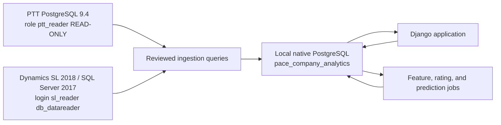

# Pace Company Analytics
## Django Build Specification for 070 Historical Profitability and Active-Project Forecasting

## Implementation status (2026-08-17, same day)

The application described here has been built and runs locally (`./scripts/run_app.sh` → http://127.0.0.1:8000/). What exists:

- **Ingestion**: `apps/ingestion` — guard + registry (§2.4), PTT/SL clients (§2.3), loaders for all 21 queries (§6), `refresh_all` (§7.1) with permissions audit, watermarks, hash-diffed budget change log, checksum (§6.0 — exact on 44,447 rows), backfill (`--full`, ~5 min) and incremental (~45 s) modes, `pg_dump` backup on nightly runs.
- **Truth layer**: `apps/analytics/services.py` — daily financial and operational snapshots, denormalised current state on `Project`, lifecycle (§11), field/crew-lead roles, data-quality flags; `eac.py` — deterministic EAC and risk (§9.6, §9.11); `ratings.py` — ridge expected-outcome residuals with empirical-Bayes shrinkage (§10.1) for PM, customer, sector, solution, mode, commissioned salesperson, division-head era.
- **UI**: Command Center, Projects (filters/sort), Project detail (every number traced to `PJTran`/`PJPTDSUM`/PTT rows), Active Book & Forecast, Project Managers, Field Crew, Customers & Sectors, Ratings, Data Quality & Refresh (manual refresh button, run log, watermarks), Definitions.
- **Tests**: `tests/unit/test_rules.py` (identity, modes, sub-tags, pay-period parsing, guard); browser QA via Playwright on every page.

Deviations from the text below, all deliberate: integer primary keys instead of UUIDs (bulk-load speed); psycopg2 for both source and local connections (PTT is PostgreSQL 9.4); no login wall (the app binds to 127.0.0.1 only; the refresh POST is CSRF-protected); `SourceRecordVersion` is modelled but the loaders use per-table content hashes and change-log rows instead of storing raw payloads; ML models (§9.7–9.10) are not trained — the deterministic EAC is production and is labelled as such; `CohortDefinition`, `ProjectFeatureSnapshot`, `ModelDefinition/ModelVersion` are deferred with the ML; the estimator role exists in the schema but is empty (no source data — Owner confirmed); the "budget touched after setup" signal is displayed as an edit date on the project page and used as a control in ratings, not as a change-order fact (Owner has not seen such a flag in SL; it is derived from `PJPTDSUM.lupd_datetime` on the CONTRACT VALUE row).

**Erratum (2026-08-20) — commitments and purchase variance.** §1/§6/§16 describe `PJPTDSUM.com_amount` as "open POs". Verified on project 254627 and company-wide: 86 % of it ($27.1 M of $31.5 M) is *project-inventory allocations* (`InvProjAlloc`, `PJCOMDET system_cd='IN'`) created when project PO lines are received at the warehouse and **never relieved** when the stock ships to the job through Order Management — i.e. cost that is already in `MATERIALS` via `OM/IN`. The EAC therefore no longer reads `com_amount`; `sql/source/sl/project_commitments.sql` (query 22) copies `PJCOMDET` with shipped quantities from `SOLine`, the loader nets allocations FIFO (`rules.fifo_open_units`) into `finance_projectcommitmentline`, and "open commitments" = open PO lines + unshipped allocations only. `PURCHASEVARIANCE` is now reported as its own direct-cost component (and folded into material in the EAC) instead of being hidden inside "other direct". Full mechanism and measurements: `docs/02_data_sources.md` §3b.

## How to read this version

Version 2 of this document was written by an author who had never seen PTT or Dynamics SL. It correctly locked the destination architecture (a standalone Django app with its own PostgreSQL database, sources treated as immutable, read-only credentials, static reviewed SQL) and it correctly anticipated most of the data-quality risks. But every statement about *where* a number lives, *what* it means, and *whether* it exists was a guess flagged "pending source inspection".

Version 3 replaces those guesses with verified facts. On 2026-08-17 the author of this version:

- connected to **PTT** (PostgreSQL 9.4.26, database `docker`, role `ptt_reader`) and **Dynamics SL 2018** (SQL Server 2017 Standard 14.0.2120.1, database `PACEAPP`, login `sl_reader`) using the verified read-only accounts in `.env`;
- read the PTT source code (`../pacescheduler`, branch `timetracker-master`) — in particular `apps/project/models.py`, `apps/project/sqlserver.py`, `apps/time_tracking/models.py`, `apps/person/models.py`, `apps/project/utils.py`;
- inventoried all 97 PTT tables and all 131 `PJ*` tables in `PACEAPP`, plus `Customer`, `Salesperson`, `Employee`, `Account`, `SOHeader/SOLine`;
- profiled row counts, code lists, populated fields, date ranges, posting lags, index structure and natural keys;
- reconciled one closed 070 project (`231080`) transaction-by-transaction between `PJTran`, `PJPTDSUM`, `PJPTDROL` and PTT, and reconciled 191 closed 2024 projects in aggregate (PTT hours vs SL hours tie to 99.98%);
- ran zero writes. Every query was a `SELECT` executed through the project's `db.py` guard, inside a transaction that was rolled back.

Where v2 said "the source-aware agent must determine…", v3 states the answer. Where the answer changes a design decision, the design has been changed and the reason recorded. Sections that were architecture-only (read-only rules, testing discipline, operational cadence) are retained largely as written because they were correct.

Two conventions:

- **VERIFIED** marks a fact observed directly in the databases or code on 2026-08-17.
- **DECISION** marks a design choice this document makes on the basis of those facts.

The most consequential corrections to v2 are summarised in §0.1. Read that first.

---

# 0. Executive build decision

Build a **new, standalone Django application** named **Pace Company Analytics** that runs locally on Owner's secured company Mac and uses its own native PostgreSQL database.

The application will periodically **read** data from:

1. **PTT** (Pace Time Tracker), the Pace time-tracking application running on PostgreSQL 9.4; and
2. **Microsoft Dynamics SL 2018**, running on Microsoft SQL Server 2017.

It will normalize and store copies of the required source data in Pace Company Analytics' own PostgreSQL database, calculate 070 project profitability, create historical ratings, and predict the final profitability of awarded-not-started and in-progress projects.

**070 is the Premise Security Systems division** (VERIFIED: SL's internal overhead projects are labelled `2026 PREMISE SECURITY SYSTEMS` on sub-account `0700`; the field-log "System" values on 070 hours are dominated by `Security - Cam`, `Security - SMS` (access control), `Security - Intrusion`, `Fire Alarm`, `Electrical`). It is the largest field-labor division at Pace by hours (VERIFIED: 78k PTT hours in 2023, 70k in 2024, 50k in 2025).

### Non-negotiable architecture rule

> **The Pace Company Analytics must never alter the schema or data in PTT or Microsoft Dynamics SL.**

This means the application must never:

- run Django migrations against PTT or SL;
- create, alter, or drop source tables, columns, views, indexes, functions, triggers, or procedures;
- insert, update, merge, or delete source records;
- execute source-system stored procedures;
- write classifications, corrections, predictions, ratings, or annotations back to either source;
- expose a free-form SQL console against either source database.

All application writes occur only in the new local Pace Company Analytics database. PTT and SL are immutable upstream source systems from this application's perspective.

Note for context (VERIFIED, and a reason to keep the rule loud): PTT itself **does** write to SL — `apps/project/sqlserver.py::update_project_percent_complete()` issues `UPDATE dbo.pjprojex SET pm_id26=…` whenever a PM saves percent-complete in PTT. That is PTT's job, with PTT's credentials. Pace Company Analytics must never replicate that behaviour; it reads `PM_ID26` and nothing more.

### Release sequence

**Release 1 — 070 Historical Profitability Truth Layer**

- ingest all 070 project history that both systems hold (PTT hours exist from **May 2015**; SL project transactions exist from **2013**; the modelling window is 2021-01-01 onward = five full years plus year-to-date, ~1,490 projects);
- join PTT and SL by the exact project number (VERIFIED one-to-one, no normalisation required beyond trim/uppercase — see §1.3);
- display observed project revenue, direct-cost components, gross-profit dollars, and gross-margin percentage using Pace's actual SL account categories (§1.5, §4);
- show current budget versus actual outcome, and preserve a local budget/contract change history from go-live (SL keeps only the current budget — §1.7);
- show PTT hours (on-site / off-site / overtime), PM-entered remaining hours **and their revision history since 2019**, and project participants with union classification;
- classify project type and solution from project titles, the PTT per-entry `System` and `Work Type` fields, and work-log text;
- calculate preliminary customer, site, sector, project-type, PM, and salesperson ratings (estimator is not a source field — see §1.8);
- make every number traceable to its source row and ingestion run.

**Release 2 — Awarded and In-Progress Project Forecasting**

- produce deterministic estimate-at-completion calculations immediately, using per-employee actual wage and burden observed in SL;
- train an award-time prediction model for awarded-but-not-started projects;
- train an in-flight prediction model — historical as-of reconstruction **is** possible: SL transactions carry `trans_date`, `crtd_datetime` and fiscal period, PTT entries carry `date_of_work` and `submitted_time`, and PTT preserves every remaining-hours revision with a UTC timestamp since 2019-08-08;
- predict final revenue, labor hours, direct cost, GP dollars, and GP percentage;
- calculate probability of losing money and probability of missing sold margin by more than a defined threshold;
- show prediction intervals, principal drivers, comparable historical projects, and risk status;
- refresh nightly, show the last successful refresh time, and provide a manual refresh button.

### Important scope clarification

PTT does not contain a work schedule. SL has `start_date`/`end_date` on `PJPROJ` (VERIFIED populated on 93 %/92 % of 070 projects) but they are the PM's planned dates entered at project setup, not a maintained schedule (VERIFIED: several sampled closed projects have `end_date` months before their last labor posting). The app can reliably distinguish:

- awarded/open with no field hours;
- active/in progress;
- field-complete but financially open;
- financially closed/stabilized;
- dormant or stalled;
- unknown.

It must present SL `start_date`/`end_date` as "planned at setup", never as a schedule, and must call the first screen's population **"Awarded / Not Started"**, not "Scheduled".

## 0.1 What source inspection changed (summary of corrections to v2)

| # | v2 assumption | Verified reality | Design consequence |
|---|---|---|---|
| 1 | Project numbers may carry leading zeros and a `000000` sub-account suffix that should be stripped. | No leading zeros anywhere. Two numbering styles coexist: 6-char (`265330`, "SO3" projects) and 12-char ending in `000000` (`260120000000`, "SO2" projects). **`241517` and `241517000000` are different projects.** PTT stores the identical string as SL. 8,997 SL projects ↔ 8,997 PTT projects match exactly. | Canonical key = `RTRIM(UPPER(project))`. **Never strip the suffix.** PTT's `cleaned_project_id` is display-only. |
| 2 | Division 070 "may be stored directly or derived". | Division = `PJPROJ.gl_subacct` (`'0700'`; legacy `'0701'` used for service until 2021). PTT mirrors it as `project.expense_subaccount`. | Population filter is `gl_subacct IN ('0700','0701')`. Other divisions (`0200` IT, `0400` AV, `0600` Electrical, `0800` Airport/Roadway/Municipal) are ingested for later releases but not modelled. |
| 3 | SL stores labor dollars, not hours. | SL stores **both**: `PJPTDSUM.act_units` and `PJTran.units` hold hours for `LABOR`/`LABORUNION`, posted weekly per employee with SL employee ID. Aggregate SL hours = PTT hours to 99.98 %. | Per-employee labor dollars, hours, wage rate and payroll-tax burden are available from SL. PTT remains authoritative for *daily* timing and notes; SL for cost. |
| 4 | Cost categories: labor / material / subcontract / freight / equipment / other. | SL account categories (`PJACCT`) are `LABOR`, `LABORUNION`, `BURDEN`, `MATERIALS`, `SUBCONTRACT`, `ODC`, `TRAVEL`, `PURCHASEVARIANCE` for cost; `REVENUE`/`BILLINGS`/`BTD` for revenue; `CONTRACT VALUE` as a memo budget. There is no equipment category; freight is inside `ODC` (GL 50750/50760). | GP definition rewritten in Pace's own categories (§4). Union burden ≈ 70 % of wages and is a first-class component. |
| 5 | Original and current budgets both exist. | SL keeps **one** current budget per project/task/account (`PJPTDSUM.total_budget_amount`); `eac_amount` equals it 98 % of the time; `PJBUDSUM/PJBUDROL` (budget revisions) are empty. `CONTRACT VALUE` is revised in place; 91 % of closed 070 projects have billed revenue exactly equal to current contract value. | "Sold" economics use the current budget with an explicit quality flag; the CV row's `lupd_datetime > crtd_datetime` gives a "budget touched after creation" signal (37 % of 070 projects). Local nightly snapshots build the true history from go-live. |
| 6 | Salesperson, estimator, PM stored somewhere in PTT/SL. | PM = `PJPROJ.manager1` (100 % populated); `manager2` = division head (Example employee, then Example employee), not an estimator; salesperson = `PJPROJ.slsperid` but **67 % of 070 projects since 2020 are `OT` = "NON-COMMISSION SALE"**; **no estimator field exists** in either system. | Estimator becomes a local, manually assigned role (with import UI). Salesperson ratings apply to the commissioned subset only. |
| 7 | Remaining-hours history probably not preserved. | PTT stores every remaining-hours revision in `project.estimated_hours_to_completion['history']` (person, UTC timestamp, hours by union/non-union) since 2019-08-08 — 58,721 revisions on 2,381 of 2,650 070 projects. | PM forecast-accuracy metrics and historical in-flight snapshots are in scope for Release 2, not deferred. |
| 8 | Work type / solution must be inferred from free text. | Every PTT Job Report entry carries a structured **System** (`Security - Cam`, `Security - SMS`, `Security - Intrusion`, `Audio Visual`, `Electrical`, `Fire Alarm`, `Data Cable`, `PC Support`, …) and **Work Type** (`Project`, `Service Ticket`, `Warranty Repair`, `Other`, …). Free-text notes are short (median 24 chars). | Classification uses structured hour-weighted System/Work-Type mix first, title keywords second, AI on notes third. |
| 9 | Customer segment must be inferred. | `Customer.User2` holds a maintained market sector (`Gov-State/Local`, `Higher Education`, `K-12`, `Healthcare`, `General Contractor`, `Private`, `Airlines`, …) on ~2/3 of customers. | Sector comes from SL; blanks are locally assigned. Customer *families* (e.g. `CCC012/CCC014/CCC015` = City Colleges of Chicago) need a local grouping table. |
| 10 | Historical as-of reconstruction uncertain. | `PJTran` (899k rows, immutable after creation, PK `fiscalno+system_cd+batch_id+detail_num`) has `trans_date`, `post_date`, `fiscalno`, `crtd_datetime`, rowversion. PTT has `date_of_work`, `submitted_time`, `last_edited_time`. | Weekly historical snapshots are reconstructable from 2015 (hours) / 2013 (dollars). |
| 11 | Close date from SL status. | SL has no close-date field; `status_pa` flips `A`→`I` and `lupd_datetime` moves. PTT records `project_inactivation_date` when its 20-minute sync notices the flip (present on 1,934 of 2,395 closed 070 projects). | Close date = PTT inactivation date, else SL `lupd_datetime` at flip (flagged approximate), else last transaction date. |
| 12 | Revenue may be recognised on percent complete. | SL project `REVENUE` actuals are AR invoices (`AR/IN`, `AR/CM`, `AR/DM`). GL revenue journals on 070 are rare corrections. Percent-complete revenue recognition is not posted to projects. | Revenue-to-date = billed-to-date. Earned revenue (contract × % complete) is a derived, labelled figure. |

---

# 1. Verified source facts (replaces v2 §1 "Decisions and facts now locked")

## 1.1 Source systems

### PTT (Pace Time Tracker)

- VERIFIED: PostgreSQL **9.4.26** on `192.0.2.24:5432`, database `docker`, schema `public`, 97 tables. Django 1.x application (Python 2 codebase in `../pacescheduler`, branch `timetracker-master`). Multi-tenant: `client_client.id = 7` is Pace (`subdomain = 'pace'`); all Pace Company Analytics queries filter `client_id = 7`.
- Authoritative for actual hours worked by day, by person, by project (and by SL task/phase), with the daily work-log note, a structured "System" and "Work Type" per entry, an on-site/off-site/overtime split, shift code, who submitted the entry and when it was last edited.
- Employees are expected to log hours to projects every day (VERIFIED: 98 % of entries are submitted within 7 days of the work date; edits after 30 days are rare — 125 of ~5,300 edited entries since 2024).
- Contains PM-entered remaining labor hours **with full revision history** (`project.estimated_hours_to_completion`, JSON with a `history` array, since 2019-08-08).
- Contains PM-entered percent complete (`project.estimated_percent_complete`, with `_last_updated_time` and `_last_updated_by`), which PTT **writes back to SL** `PJPROJEX.PM_ID26`.
- Contains project status (`project_status` 1 = active / 0 = inactive, mirroring SL `status_pa`), and `project_inactivation_date` (the date PTT first saw the project inactive).
- Receives SL financial actuals and budgets hourly (`hours_budgets`, `hours_actuals`, `costs_budgets`, `costs_actuals` JSON copied from `PJPTDSUM`) — display copies; SL remains the accounting source.
- Time-entry data starts **2015-05-18**. Older projects exist in PTT (synced from SL) but have no hours.
- Warning: `time_off_persontimeofftype` has 80 million rows and is irrelevant; never scan it.

### Microsoft Dynamics SL 2018

- VERIFIED: SQL Server **2017 Standard Edition (64-bit), 14.0.2120.1 RTM** on `192.0.2.27,1433`. Application database `PACEAPP` (system database `PACESYS` is not needed). Copies `PACEAPP_17FEB25`, `PACEAPP_SL2011FP1`, `PACEAPP_TEST` exist on the same instance and must never be queried by the app (wrong data). 1,954 tables/views in `PACEAPP`.
- Project Controller ("PA") module tables carry everything Release 1 needs: `PJPROJ` (8,997 projects), `PJPROJEX`, `PJPENT` (22,307 tasks), `PJPTDSUM` (193,927 project-to-date rows by project × task × account category), `PJPTDROL` (86,366 project-level rollups), `PJTran` (899,057 posted transactions) + `PJTRANEX`, `PJACCT` (19 account categories), `PJEMPLOY` (905 employees), `PJACTSUM`/`PJACTROL` (per-fiscal-period actuals), `PJCOMSUM/PJCOMDET` (commitments). Plus `Customer` (2,060), `Salesperson` (66), `Employee` (881, payroll master), `Account` (GL chart).
- Authoritative for revenue (billed), costs by account category, budgets (current only), customers, salesperson code, PM, task structure, and per-employee labor dollars/hours.
- Labor is posted to projects **weekly** through Project Charge Entry (`PJTran.system_cd='PA', batch_type='CHRG'`), one row per employee × project × task × week, `trans_date` = payroll check date (Wednesday), `tr_comment` = `CK DT 7/26/2023  7/17/23 -7/23/23` (check date and pay-period). The SL Payroll module was retired in Oct 2015; `PJWAGEUN` wage tables are stale (2015) and must not be used for rates.
- Does not preserve budget revisions or an original budget (§1.7).
- Fiscal periods are calendar months (`fiscalno` = `YYYYMM`).

## 1.2 Source access (VERIFIED 2026-08-17 — see `scripts/check_readonly.py`)

- SQL Server login `sl_reader`: `db_datareader` only; explicit `DENY INSERT, UPDATE, DELETE` at database level; effective permissions `CONNECT`, `SELECT`, `VIEW ANY COLUMN ENCRYPTION KEY DEFINITION`, `VIEW ANY COLUMN MASTER KEY DEFINITION`; server-level only `CONNECT SQL`, `VIEW ANY DATABASE`. It **cannot** read view/procedure definitions (`sys.sql_modules` returns NULL) — irrelevant, since the app queries base tables. It can `SELECT` from views such as `PJPrjBgt`, but the `QQ*` quick-query views wrap parameterised functions and are not usable.
- PostgreSQL role `ptt_reader`: not superuser, no CREATEDB/CREATEROLE, no role memberships, `SELECT` on all 97 tables and `INSERT/UPDATE/DELETE/TRUNCATE` on none, no `CREATE` on the database or `public`; sessions additionally run with `default_transaction_read_only=on`.
- These permissions are the ultimate technical control. Application-level protections are additional defense in depth.
- The working connection recipe is the one in this repository's `db.py`: ODBC Driver 18, `Encrypt=no;TrustServerCertificate=yes` (the server does not present a trusted certificate; `Encrypt=yes` fails — keep the traffic on the internal network); psycopg2 with `options='-c default_transaction_read_only=on'`.

## 1.3 Project identity (VERIFIED)

- SL key: `PJPROJ.project` (`char(16)`, right-padded with spaces, unique). PTT key: `project_project.project_id` (`varchar(50)`), which PTT's sync sets to the trimmed SL value. **8,997 SL projects and 8,997 PTT projects match exactly by trimmed string; PTT has one extra placeholder `'0000'`.**
- Two live numbering styles:
  - **6-character**: `YY` + 4-digit sequence, e.g. `265330` (created 2026), `231080` (2023). SL `user1 = 'SO3'`. Used for most 070/0800 work and for service/T&M in all divisions.
  - **12-character**: `YY` + 4-digit sequence + literal `000000`, e.g. `260120000000`. SL `user1 = 'SO2'` (created from the "Sales Order Type 2" project template `120000000`). Used mainly for AV (0400) and IT (0200) installations; 120 of 2,650 070 projects use it.
  - Legacy shapes exist (5, 7–11 chars, e.g. `1159221628`, `105667685`), all pre-2017 or test rows.
- **Alphanumeric suffixes exist**: `269999SEC`, `259999SECSAL`, `249999SESALE`, `248888SEWNTY`, `239999WRHSE`, `260000` … These are internal overhead / warranty / template projects (§1.4).
- **No leading zeros** in either system. **The `000000` suffix is part of the key**: `241517` (KANELAND SUMMER CAMERAS) and `241517000000` (UNIV OF ILL … INSTALL) are different projects; 12 such pairs exist. PTT's `Project.cleaned_project_id` strips the suffix for display only.
- Sub-accounts: `PJPROJ.gl_subacct` is the **division**, not a per-project sub-account (see §1.4). Tasks (`PJPENT.pjt_entity`) are the intra-project breakdown; 80 % of 070 projects have only the default task `00`.

Canonical normalization rule (DECISION, replaces v2 §1.3):

```text
1. Read the source project number as text.
2. Trim leading/trailing whitespace (SL pads char(16) with spaces).
3. Convert to uppercase (defensive; all observed values are already uppercase digits/letters).
4. Do NOT remove any leading zeros (none exist) and do NOT remove a trailing "000000".
5. Preserve the exact raw PTT and SL values separately in ProjectSourceIdentity.
6. Never convert the canonical project number to an integer.
7. Reject empty strings and the PTT placeholder '0000'.
```

Unit tests must include the pair `241517` / `241517000000` (must remain distinct) and `269999SEC` (alphanumeric, valid).

Owner's example `254286` (VERIFIED) is a real 6-character project — `HOLLYWOOD AURORA CASINO`, sub-account `0400` (AV), so it is a good format example but is not a 070 project.

## 1.4 Division, population and project types (VERIFIED)

`PJPROJ.gl_subacct` values and their meaning (from the internal overhead project descriptions `YY9999xxx`):

| gl_subacct | Division | Notes |
|---|---|---|
| `0700` | **070 Premise Security Systems** | 2,650 projects all-time; ~250–310 created per year 2022–2026. Release 1 target. |
| `0701` | 070 legacy service sub-division | ~220 projects, essentially all ≤ 2017 (one in 2021). Include as 070 with `legacy_subaccount` flag. |
| `0800` | Airport / Roadway / Municipality (formerly "Transportation") | since 2017; ARM |
| `0400` | AV | largest by count |
| `0200` | IT | |
| `0600` | Electrical | tapering after 2024 |
| `0000` | Admin / Warehouse / CAD overhead / templates | |
| `0100`, `0250`, `0300`, `0500`, `0X01` | small / legacy | |

`PJPROJ.status_pa` values: `A` active (598), `I` inactive/closed (8,362), `G` = year templates (16), `M` = converted-to-sales-order or cancelled (15), `T` = test/void (6). DECISION: only `A` and `I` are real projects; `G/M/T` are ingested as raw records but flagged `excluded_template_or_void` and never shown as projects.

Project-mode signals available *before* any AI classification (VERIFIED on 1,492 070 projects created ≥ 2021):

| Signal | Rule | Count |
|---|---|---|
| T&M ticket | `project_desc LIKE 'TM TICKET%'` (also `purchase_order_num = 'TM TICKET'` on 295) | 405 |
| T&M service blanket | `project_desc LIKE 'TM SERVICE%'` | 27 |
| Service agreement | `project_desc LIKE 'SA%-%'` or `'SA %'` (annual support/monitoring contracts, e.g. `SA - SENTINEL SECURITY ITSSMMM …`) | 41 |
| JOC (job-order contract) work | `project_desc LIKE '%JOC%'` (City Colleges JOC) | 69 |
| Warranty | `'%WARRANTY%'` or project `YY8888xxWNTY` | 4 |
| Internal / overhead | `project LIKE '__9999%'` or `'__8888%'` (e.g. `249999SESALE` 2024 Security Sales, `269999SEC`) — PTT's `is_internal()` only knows the 2016–2022 prefixes; ours must be the regex `^\d\d(9999|8888)` | 6 |
| Cancelled / void | `'%CANCEL%'`, `'%VOID%'`, or `status_pa IN ('M','T')` | 12 |
| Installation / project (default) | everything else | 928 |

Additional structure: `PJPROJ.contract_type` is `FPW` (Fixed Price to WIP) on 99 % of projects — the `TMW/TMR/CPW/CPR` codes exist but are unused, so contract type does **not** distinguish T&M work; the description prefix does. `purchase_order_num` holds the customer PO or the literal `TM TICKET`, `CONTRACT`, `SIGNED PROPOSAL`, `PENDING`, `PER PHASE`. `pm_id32` (65 % populated) holds the sales proposal / helpdesk reference (`SP 9812`, `HD# 12706`) — the only link to the quoting process, which lives outside SL. `pm_id36` is a 0/1 flag of unknown meaning (22 projects). Titles frequently end with a 6-digit quote number (`… 610205`).

Population counts (VERIFIED, `gl_subacct='0700'`, by `crtd_datetime` year): 2019: 147, 2020: 124, 2021: 143, 2022: 257, 2023: 265, 2024: 258, 2025: 308, 2026 YTD: 261. Active today: 255 (of which 37 have no PTT hours yet).

## 1.5 Financial account model (VERIFIED)

SL account categories (`PJACCT`) as Pace uses them:

| `acct` | Type | Meaning at Pace | GL accounts observed on 070 (`PJTran.gl_acct`) | Pace Company Analytics category |
|---|---|---|---|---|
| `REVENUE` | RV | Billed revenue (AR invoices, credit/debit memos) | 40000 SALES, 40001 SALES-MBE, 20500 accrued sales tax (net ≈ 0, flag) | revenue |
| `BILLINGS` | RV | rarely used (16 rows) | | revenue (flag) |
| `BTD` | memo | Billed to date — mirrors REVENUE 1:1 | | ignore (use REVENUE) |
| `CONTRACT VALUE` | memo | Contract value **budget only**; never receives actuals | | contract value |
| `(OVER)/UNDER`, `DEFERRED REVENUE`, `PROGRESS BILLING`, `RETENTION`, `RETENTIONAP`, `UBWIP`, `UNBILLED` | balance-sheet memo | unused / zero on 070 | | ignore |
| `LABOR` | EX | Non-union labor wages (hours in `units`) | blank (charge entry), 60000 | labor_wage |
| `LABORUNION` | EX | Union labor wages (hours in `units`) | blank, 50714 | labor_wage |
| `BURDEN` | EX | Payroll taxes (`PA/CHRG`, per employee: FICA/FUTA/SUTA GL 50719/50720/50721) **plus** union fringe vouchers (`AP/VO` to funds: 50710 A-card, 50711 C-card, 50712 NEBF, 50706 Local 701) | | labor_burden |
| `MATERIALS` | EX | Purchased and stock material (`AP/PO` receipts, `AP/VO` vouchers, `OM/IN` sales-order shipments, `IN/II` issues) | 50700 COST OF GOODS | material |
| `SUBCONTRACT` | EX | Subcontractors | 50716 | subcontract |
| `ODC` | EX | Other direct: 50300 other direct, **50750 FREIGHT IN, 50760 FREIGHT OUT**, 50717 contractor fees | | other_direct (freight kept as sub-tag) |
| `TRAVEL` | EX | Travel (25 rows all-time) | | other_direct |
| `PURCHASEVARIANCE` | EX | PPV (small, ± ) | 50500 | other_direct |

There is **no equipment category** and **no separate freight category**; v2's "equipment" bucket is dropped and "freight" becomes a GL-account sub-tag inside other_direct.

Sign and module conventions (VERIFIED on `PJTran`):

- `system_cd`/`batch_type` pairs: `AR/IN` invoice (+), `AR/CM` credit memo (−), `AR/DM` debit memo (+); `AP/VO` voucher (+), `AP/AD` adjustment/debit memo (−), `AP/PO` PO receipt accrual (+); `OM/IN` sales-order invoice COGS (+), `OM/CM`, `OM/AJ` (−); `PA/CHRG` charge entry (labor, burden, occasional material); `PA/TFR` inter-project transfers (± pairs, ~9.5k burden / 2.5k labor rows); `GL/GJ` journals (± , used for corrections and 2015–2016 reversing revenue entries that net to zero); `PR/PR` old payroll (2012–2015); `TM/LABR` old timecards (2013–2015).
- `tr_status` values `''`, `'A'`, `'N'` — **all** are included in SL's own `PJPTDSUM/PJPTDROL` actuals (VERIFIED by comparison), so the app includes all statuses. Reversals are separate rows with opposite sign, never in-place edits.
- `PJTran` rows are **never updated after creation** (VERIFIED `lupd_datetime = crtd_datetime` on all rows since 2023) and are keyed by `(fiscalno, system_cd, batch_id, detail_num)` (unique, 899,057 = 899,057).
- Identity that must hold and is used as the nightly checksum: `SUM(PJTran.amount) GROUP BY project, acct` = `PJPTDROL.act_amount` and `SUM(units)` = `act_units` (VERIFIED exactly on project `231080` and on the aggregate).
- Anomalies exist and must be handled, not hidden: e.g. project `220023000000` (AV) has an OM invoice of **$14,018,197,875.00** with matching reversal (net ~$600). DECISION: any single transaction with `|amount| > $5,000,000` on a project whose contract value is under $5,000,000 raises a `DataQualityIssue(code='implausible_transaction')`; the reconciliation still uses the net.
- Posting lag (`crtd_datetime − trans_date`, VERIFIED 2024+): ≥ 90 % of every category posts within 7 days; but 1,697 `LABORUNION` and 2,303 `BURDEN` rows were created 91–365 days after their `trans_date` (back-dated corrections/transfers). Therefore incremental extraction watermarks on **`crtd_datetime`** (or `tstamp`), never on `trans_date`.

## 1.6 Labor facts (VERIFIED)

- PTT is the daily record: one `TTFormResponse` per person × date × project × form (a person may have several per day), hours in `TTFormEntry` rows: element **5** "Hours Spent Onsite", **10** "OT Hours Spent Onsite", **6** "Hours Spent Offsite" (all stored as text like `'8.0'`). PTT's own `hours` property = onsite + OT + offsite.
- SL is the cost record: `PJTran` (`PA/CHRG`) rows per **employee** (`PJTran.employee` = `PJEMPLOY.employee` = PTT `person.employee_id`, e.g. `EMP-DEMO`) × project × task × pay week, `units` = hours, `amount` = **wages only** (`LABOR`/`LABORUNION`), with a separate per-employee `BURDEN` row for employer payroll tax and separate `AP/VO` `BURDEN` vouchers to the union funds allocated to the project.
- Aggregate tie-out (VERIFIED, 191 closed 070 projects created 2024): PTT onsite 54,670.0 + OT 861.5 + offsite 2,487.0 = 58,018.5 h vs SL 58,030.5 h (99.98 %); 148 projects tie exactly, 14 within 5 %, 29 differ (transfers/corrections). Per-employee tie-out on `231080`: 17 of 18 employees exact.
- Lag: SL labor posts on the Wednesday after the pay week; PTT hours are typically 3–10 days ahead of SL dollars. Burden vouchers post through the month.
- Rates: union electricians (IBEW Local 134 A-card = inside wireman, C-card = communications/low-voltage; also Local 701) at roughly $27/h (junior apprentice) to $78/h (foreman) wage in 2023–2026; employer payroll-tax burden ≈ 5–8 % of wage; union fringe vouchers ≈ 60–80 % of *union* wages (on `231080`: 11,478 fringe on 14,332 union wages); total `BURDEN` ≈ 70 % of all 070 wages in 2023–2024; observed loaded rate on `231080` ≈ $81/h against a budget rate of $98/h (`LABORUNION` budget $32,928 / 336 h). PTT stores a per-person "Hourly Pace Burden" (`person.hourly_rate`, ~$96–126/h for union) that PTT uses for its own remaining-cost estimate; treat it as an estimate, not a cost.
- Labor class (apprentice %, journeyman, foreman, general foreman; A/C card) codes exist in `PJCODE(LABC)`, on `PJEMPPJT` (308 rows, sparse) and PTT `person.labor_class` (sparse); union code on PTT `person.union_code` (`134A`/`134C`) and `Employee.HomeUnion`. Employee home division = `PJEMPLOY.gl_subacct`. Hire/termination = `PJEMPLOY.date_hired/date_terminated`.
- Foreman/crew-lead is not a field, but PTT `submitted_by ≠ person` (11 % of 070 entries since 2024; e.g. one foreman submits for a crew of 14 across 74 projects) is a usable weak signal.

## 1.7 Budgets, contract value and the "original" problem (VERIFIED)

- Budgets live in `PJPTDSUM(project, pjt_entity, acct)`: `total_budget_amount` (current budget), `total_budget_units` (budget hours for labor accounts), `eac_amount`, `fac_amount`, `com_amount` (open commitments). `PJPTDROL` is the same rolled to project level.
- `eac_amount = total_budget_amount` on ~98 % of 070 rows; `fac_amount` unused. Budget revision tables are empty. There is **no original budget** anywhere in SL.
- `CONTRACT VALUE.total_budget_amount` is the contract; the `REVENUE.total_budget_amount` equals it on 97 % of projects (differs on 39). Actual billed `REVENUE` equals current `CONTRACT VALUE` on 91 % of closed 2021–2025 070 projects (970 of 1,062; 29 billed < CV by > 1 %, 9 billed > CV, 43 have CV = 0). Interpretation: contract value is revised in place to the final billed amount, so "current CV" is a *final* figure on closed jobs.
- Because `CONTRACT VALUE` never receives actuals, its `PJPTDSUM.lupd_datetime` moves only when someone edits the budget: 548 of 1,460 (37 %) 070 projects since 2021 show an edit more than a day after creation (`lupd_prog` `PAPRJ` project maintenance or `PABSM` budget maintenance). This is a **"budget touched after setup" flag with a last-edit date**, not an amount history.
- `BURDEN` budget is populated on only 29 of 1,490 projects — the labor budget (`LABOR`/`LABORUNION` at a loaded rate) is meant to cover burden. Comparing actual `LABOR+LABORUNION+BURDEN` to budget `LABOR+LABORUNION` is therefore the correct labor-vs-budget test.
- DECISION: Release 1 shows **current** budgets and labels sold economics "as currently budgeted"; the nightly `ProjectAccountSummary` snapshot starts a true budget/contract history from go-live; `ProjectCommercialChange` is populated from detected day-over-day differences.

## 1.8 People and roles (VERIFIED)

| Role | Source | Coverage on 070 (2020+) | Notes |
|---|---|---|---|
| Project manager | `PJPROJ.manager1` → `PJEMPLOY` (mirrored in PTT `project.project_lead`) | 100 % | Example employee `EMP-DEMO` (558), Example employee `EMP-DEMO` (499), Example employee `EMP-DEMO` (324, service coordinator on TM tickets), Example employee `EMP-DEMO` (81), Example employee `EMP-DEMO` (46), Example employee `EMP-DEMO` (35), Michael ExampleSurname `EMP-DEMO` (32), Jeff ExampleSurname `EMP-DEMO` (17), others < 10 |
| Division head / approver | `PJPROJ.manager2` | 99 % | Example employee `EMP-DEMO` (1,211) then Example employee `EMP-DEMO` from Oct 2024 (382). Not an estimator; a useful "era" covariate. |
| Salesperson | `PJPROJ.slsperid` → `Salesperson` (PTT maps via `person.sl_salesperson_ids`) | 99 % populated but **`OT` NON-COMMISSION SALE = 1,085 of 1,616 (67 %); commissioned 513; blank 18** | Commissioned: Example employee `MB00/MB07` (207), Example employee `TO00` (78), Example employee `GP00` (67), Example employee `HS00` (54 — also a PM), Example employee `FP00` (29), Example employee `SM00` (23), Example employee `BG00` (17), Example employee `PE00` (11), Example employee `SU00` (10). |
| Estimator | **none** | — | Estimating time is charged to the sales overhead project (`YY9999SESALE/SECSAL/SEC`): Example employee ~1,000–1,400 h/yr, Jeff ExampleSurname, Example employee (2024), Example employee/Example employee (2023). DECISION: local `ProjectRoleAssignment(role='estimator', assignment_method='manual')`, seeded empty, with a bulk-assign screen. |
| Field employees | PTT `person` (`employee_id`) = SL `PJEMPLOY.employee` = `PJTran.employee` | 426 of 434 SL labor employees since 2020 exist in PTT | Union code, labor class (sparse), home division, hire/term dates. |
| Foreman / crew lead | inferred (`submitted_by`) | weak | see §1.6 |

PTT `person.employee_role`: 1 = Head PM, 2 = PM, 3 = regular; `employee_type`: 1 = non-union, 2 = union.

## 1.9 Customers, sites and segments (VERIFIED)

- `PJPROJ.customer` → `Customer.CustId` (99 % populated on 070). PTT `project_customer` mirrors `CustId`/`Name`.
- **Sector**: `Customer.User2` ∈ {`Gov-State/Local` 853, `Private` 187, `Higher Education` 134, `General Contractor` 127, `K-12` 81, `Healthcare` 34, `Employee` 32, `Legal` 7, `Commercial` 4, `Airlines` 4, `Vendor` 3}; blank on 594 of 2,060 customers. `Customer.User1` holds a tax ID on some public entities. `CustClass` is a single `DEFLT` class (useless).
- Concentration on 070 since 2021 by contract value: Chicago Public Schools `CHI004` 318 projects / $24.3M; Sentinel Technologies `EMP-DEMO` 16 / $9.2M (service agreements); SDI Presence `SDI002` 67 / $3.0M (O'Hare); City Colleges of Chicago `CCC014` (JOC) 70 / $2.9M, `CCC015` 32 / $2.1M, `CCC012` 8 / $1.2M; DePaul `DEP007` 77 / $2.2M; general contractors (Anchor, Pacific, Connelly, Bulley & Andrews, Excel, Arc 1, Leopardo…) as intermediaries for end users.
- Customer **families** are needed: multiple `CustId`s per organisation (three CCC IDs; UIC/UNI025 University of Chicago vs UNI001; GC-intermediated work where the *end user* is a school district). DECISION: local `CustomerFamily` table, seeded by exact-name-prefix heuristics, manually curated; the *end-user* customer for GC-intermediated projects is inferred from the title (e.g. `PACIFIC CONSTRUCTION CPS BRONZEVILLE …` → end user CPS) and stored as `Project.end_user_customer` with method/confidence.
- **Sites**: no site field. 20 % of 070 projects have multiple SL tasks and the task IDs are frequently site names (`BRONZEVILLE`, `CURIE`, `MDF`, `AIRFORCE`); titles carry the site (`CPS NIGHTINGALE ES …`, `DEPAUL LOOP …`, `SDI T5 …`). `PJPROJ.shiptoid` is unused. Site inference is title/task-based, nullable, with confidence.

## 1.10 PTT operational data model (VERIFIED)

Tables (all `client_id = 7` unless noted):

- `project_project` (8,999): `id`, `project_id`, `project_status` (1/0), `status` (BaseModel soft-delete: 1 live, 2 removed), `project_inactivation_date`, `description`, `project_lead_id` → `person_person`, `customer_id` → `project_customer`, `salesperson_id` → `person_person`, `expense_account` (= SL `user1`, `SO2/SO3`), `expense_subaccount` (= SL `gl_subacct`), `start_date`, `end_date`, `estimated_percent_complete` (0–100), `estimated_percent_complete_last_updated_time/_by`, JSON text fields `hours_budgets`, `hours_actuals`, `estimated_hours_to_completion`, `costs_budgets`, `costs_actuals` (keys `'1'` non-union / `'2'` union for hours; SL `acct` names for costs, values in **cents**), `remaining_labor_costs`, `remaining_expense_costs` (cents). No created/updated timestamps on this table.
- `project_projectphase` (22,324) = SL `PJPENT` tasks (`phase_id` = `pjt_entity`).
- `project_customer` (2,070) = SL `Customer` (`customer_id` = `CustId`).
- `person_person` (1,173): `employee_id` (SL key), names, `employee_type`, `employee_role`, `active_status`, `status`, `hourly_rate` (loaded estimate), `base_hourly_wage`, `labor_class`, `union_code`, `work_location`, `sl_salesperson_ids`, `title_id`, `user_id`.
- `time_tracking_ttform` (6; Pace uses form 1 "Job Report" `form_type=1`, form 5 "Time Off" `form_type=2`, form 6 "SERVICE TICKET" removed), `time_tracking_ttformelement` (49; live elements on form 1: **1** Work Type (choices), **2** System (choices), **3** Describe Activity (text), **4** Completed? (bool), **5** Hours Spent Onsite, **10** OT Hours Spent Onsite, **6** Hours Spent Offsite, **7** Describe Open Issues and Next Steps (text); elements 14–49 are removed conduit/device counters), `time_tracking_ttformresponse` (318,922; 311,592 live + 7,330 removed): `submitted_by_id`, `submitted_time`, `person_id`, `date_of_work`, `form_id`, `project_id`, `project_phase_id`, `project_phase_other`, `last_edited_by_id`, `last_edited_time`, `work_shift_id` → `union_shiftcode` (`1st Shift` ×1.00, `2nd Shift` ×1.17, `3rd Shift` ×1.31, `Double Time` ×2.00), `status`, `removed_time`; `time_tracking_ttformentry` (4,546,297): `form_response_id`, `form_element_id`, `entry` (text).
- Indexes exist on `ttformresponse(submitted_time)`, `(last_edited_time)`, `(date_of_work)`, `(project_id)`, `(person_id)`; on `ttformentry(form_response_id)`, `(form_element_id)`.
- Structured per-entry values (all-time counts): Work Type — `Project` 245,617, `Other` 43,219, `Service Ticket` 18,606, `OFF` 2,947, `CCC SchoolDude Non-Emergency` 1,534, `Warranty Repair` 468, `CCC SchoolDude Emergency` 209; System — `Security - Cam` 82,075, `Electrical` 58,177, `Other` 55,238, `Audio Visual` 45,337, `PC Support` 44,317, `Security - SMS` 9,108, `Security - Intrusion` 6,415, `Data Cable` 6,339, `Server Support` 2,456, `Fire Alarm` 1,179, `Security - TAP` 1,151, `UPS` 438, `Walk Through` 385.
- Notes: element 3 median length 24 characters, mean 70; 37 % under 10 characters ("Ran pipe", "Terminated"). Element 7 is usually blank.
- Remaining-hours history: `estimated_hours_to_completion = {"1": h, "2": h, "history": [{"person_id": 446, "1": 12.0, "2": 212.0, "datetime": [2026, 8, 14, 18, 10, 59]}, …]}` — `datetime` is a UTC tuple; PMs typically revise several projects in a batch (month-end progress e-mail workflow); 82 of 255 active 070 projects currently have remaining hours > 0.
- Percent complete: `estimated_percent_complete` last updated ≤ 30 days ago on 183 of 255 active 070 projects, never updated on 36, > 90 days on 24. PTT's `update_percent_complete()` derives it as a labor-weighted blend of hours-remaining and expense-remaining (see §4.6 for the exact formula), and PTT writes it to SL `PJPROJEX.PM_ID26`.
- Sync cadence PTT←SL (from `docker_settings.py`): projects every 20 min (`PJPROJ` + `PJPrjBgt` view + `PJPROJEX`), project progress (`PJPTDSUM`) hourly, customers/people hourly, phases every 20 min. Pace Company Analytics reads SL directly and uses PTT only for what PTT owns.

## 1.11 Time coverage and volumes (VERIFIED)

| Data | Range | Volume |
|---|---|---|
| SL projects (`PJPROJ`) | 2012-12 → today | 8,997 (070: 2,650 + 0701 legacy ~220) |
| SL transactions (`PJTran`) | 2013-01 → today (a few back-dated to 2001) | 899,057 total; 482,258 created since 2021; **244,899 on 070/0701 projects** |
| SL project-to-date summary (`PJPTDSUM`) | current state | 193,927 rows (all projects); refreshed fully each night (< 1 s to read) |
| PTT time entries (`ttformresponse`) | **2015-05-18** → today | 318,922 (070: 80,579 responses, 1.20 M entry rows) |
| PTT remaining-hours revisions | 2019-08-08 → today | 58,721 on 070 |
| 070 hours by year (PTT) | 2015: 11.0k · 2016: 20.2k · 2017: 18.5k · 2018: 22.8k · 2019: 59.7k · 2020: 42.5k · 2021: 30.1k · 2022: 46.8k · 2023: 78.1k · 2024: 69.7k · 2025: 50.2k · 2026 YTD: 32.3k | |
| 070 closed-project economics by creation year (billed revenue / GP) | 2019: $5.4M / 22.7 % · 2020: $3.5M / 29.3 % · 2021: $10.1M / 27.6 % · 2022: $6.9M / 34.9 % · 2023: $12.7M / 27.9 % · 2024: $18.2M / 33.9 % · 2025 (closed so far): $5.9M / 32.0 % | |

Query timings from the Mac over VPN/LAN: full `PJTran` count/aggregate scans < 1 s; PTT 1.2 M-entry aggregation ~1 s. Source load is not a constraint; chunking is for memory and restartability, not for the servers.

## 1.12 Known data limitations (updated)

- No original budget or contract value; only current values plus a "touched after setup" flag. Local history starts at go-live.
- No estimator field. Salesperson is "non-commission" on ~2/3 of 070 projects.
- No site field; sites are inferred from titles/tasks.
- No schedule; SL `start_date/end_date` are setup-time plans.
- Free-text work notes are short; structured System/Work Type fields are the primary classification signal.
- SL revenue is billed revenue; earned revenue must be derived from contract × percent complete and labelled as such.
- Some 070 projects (43 of 1,062 closed 2021–25) have zero contract value (T&M billed without a CV entry) — sold-margin metrics are undefined for them; they remain visible with GP dollars.
- Employee labor class is sparsely populated; union code (A/C card) is well populated.
- ~29 of 191 sampled projects have PTT/SL hour differences > 5 % (inter-project transfers, corrections) — surfaced per project as a reconciliation metric, not silently reconciled.

These limitations are not reasons to delay the app. They determine which outputs are factual, approximate, provisional, or unavailable.

---

# 2. Non-negotiable read-only architecture

## 2.1 Three physically and logically separate databases



### Local application database

The local database is the **only** database Django manages.

Recommended database name:

```text
pace_company_analytics
```

It contains:

- Django auth, sessions, and administration tables;
- imported raw source record versions;
- canonical projects, tasks, customers, employees, time entries, account summaries and financial transactions;
- daily snapshots;
- local mappings, overrides, annotations, and classifications;
- features, model artifacts, predictions, ratings, and refresh logs.

### Source databases

PTT and SL are not Django application databases. They must **not appear in Django's `DATABASES` setting at all**.

This is intentionally stricter than using unmanaged Django models. `managed=False` prevents Django from managing the table lifecycle, but it does not make model instances inherently read-only. The cleanest control is to avoid source ORM models and avoid source database aliases entirely.

## 2.2 Required settings pattern

```python
# config/settings/base.py
DATABASES = {
    "default": {
        "ENGINE": "django.db.backends.postgresql",
        "NAME": env("PCA_DB_NAME", default="pace_company_analytics"),
        "USER": env("PCA_DB_USER"),
        "PASSWORD": env("PCA_DB_PASSWORD"),
        "HOST": env("PCA_DB_HOST", default="127.0.0.1"),
        "PORT": env("PCA_DB_PORT", default="5432"),
        "CONN_MAX_AGE": 60,
    }
}

# Deliberately NOT part of DATABASES. Same keys the existing .env / db.py already use.
PTT_SOURCE = {
    "host": env("PTT_SERVER_IP"), "port": env("PTT_SERVER_PORT"),
    "dbname": env("PTT_SERVER_DATABASE"), "user": env("PTT_SERVER_USERNAME"),
    "password": env("PTT_SERVER_PASSWORD"),
}
SL_SOURCE = {
    "server": env("SQL_SERVER_IP"), "port": env("SQL_SERVER_PORT"),
    "database": env("SQL_SERVER_DATABASE"), "user": env("SQL_SERVER_USERNAME"),
    "password": env("SQL_SERVER_PASSWORD"),
}
```

Consequences:

- `python manage.py migrate` can affect only the local Pace Company Analytics database.
- Django ORM calls cannot accidentally route to PTT or SL.
- Django admin cannot save a PTT or SL object because no such ORM models exist.
- Cross-database foreign keys are impossible.

## 2.3 Source client modules

Only two modules may open source connections:

```text
apps/ingestion/sources/ptt_client.py
apps/ingestion/sources/sl_client.py
```

Both must be direct descendants of the already-proven `db.py` in this repository (same guard, same connection recipe, same rollback-always discipline). All other code consumes rows returned by these source clients or reads imported local models.

### PTT client controls

- VERIFIED: PTT is PostgreSQL 9.4. `psycopg2` (as in `db.py`) is proven; `psycopg` 3 officially supports server ≥ 10 and must not be assumed to work without an integration test. DECISION: use **psycopg2** for the PTT client. The local database may use psycopg 3 or psycopg2 (Django 5.2 supports both); pick one for the whole project unless the 9.4 test forces a split.
- Connection options: `-c default_transaction_read_only=on -c statement_timeout=300000 -c lock_timeout=10000 -c application_name=pace_company_analytics`; `conn.set_session(readonly=True, autocommit=False)`; each extraction is one transaction, always rolled back.
- Server-side cursors (`cursor(name=…)`, `itersize=5000`) for the two large reads (`ttformresponse` + `ttformentry` backfill), so 4.5 M rows never sit in RAM.
- Only static, reviewed query files may execute (§2.4). Parameters are bound, never interpolated.

### SL client controls

- `pyodbc` with **Microsoft ODBC Driver 18 for SQL Server**; connection string exactly as `db.py`: `DRIVER={ODBC Driver 18 for SQL Server};SERVER=…;DATABASE=PACEAPP;UID=…;PWD=…;Encrypt=no;TrustServerCertificate=yes;APP=PaceCompanyAnalytics;ApplicationIntent=ReadOnly`. (`Encrypt=no` is the verified working setting; the server certificate is not trusted by the Mac. Permissions, not transport, are the security boundary; the traffic stays on the corporate LAN/VPN.)
- `conn.autocommit = False`; `SET TRANSACTION ISOLATION LEVEL READ UNCOMMITTED` (never block SL users; accept dirty reads and re-verify with the nightly checksum); `cursor.arraysize = 5000`; `timeout=30` connect, `cursor` query timeout 300 s; always `rollback()` in `finally`.
- Static, reviewed queries only, parameterised with `?` placeholders.
- Never touch `PACEAPP_TEST`, `PACEAPP_17FEB25`, `PACEAPP_SL2011FP1` or `PACESYS`.

## 2.4 Static query registry

Source queries live in version control (final list, replacing v2's placeholder list — the SQL text is in §6):

```text
sql/source/ptt/projects.sql
sql/source/ptt/project_tasks.sql
sql/source/ptt/customers.sql
sql/source/ptt/employees.sql
sql/source/ptt/time_entries_since.sql
sql/source/ptt/time_entries_removed_since.sql
sql/source/ptt/remaining_hours_history.sql
sql/source/ptt/form_elements.sql
sql/source/sl/projects.sql
sql/source/sl/project_tasks.sql
sql/source/sl/customers.sql
sql/source/sl/employees.sql
sql/source/sl/salespersons.sql
sql/source/sl/account_categories.sql
sql/source/sl/gl_accounts.sql
sql/source/sl/project_account_summary.sql
sql/source/sl/project_account_rollup.sql
sql/source/sl/project_budget_view.sql
sql/source/sl/financial_transactions_since.sql
sql/source/sl/financial_transactions_backfill.sql
sql/source/sl/permissions_audit.sql
```

The web app may request a query by a hard-coded query name. It may never submit arbitrary SQL.

```python
ALLOWED_SOURCE_QUERIES = {
    "ptt.projects": "sql/source/ptt/projects.sql",
    "ptt.time_entries_since": "sql/source/ptt/time_entries_since.sql",
    "sl.projects": "sql/source/sl/projects.sql",
    "sl.financial_transactions_since": "sql/source/sl/financial_transactions_since.sql",
    # ... one entry per file above
}
```

The guard is the existing `assert_read_only()` from `db.py`, extended:

- exactly one statement (`;` only as an optional terminator; comments stripped first);
- must start with `SELECT` or `WITH`;
- reject the tokens `INSERT UPDATE DELETE MERGE TRUNCATE DROP CREATE ALTER GRANT REVOKE DENY EXEC EXECUTE CALL BACKUP RESTORE SHUTDOWN RECONFIGURE CHECKPOINT DBCC INTO OPENROWSET OPENQUERY BULK sp_* xp_*` as whole words (note: because `DENY` and `INSERT` are rejected as *words*, any query that needs them as string values — e.g. the permissions audit — must pass them as bound parameters, as `scripts/check_readonly.py` does);
- reject unregistered query names;
- reject any string interpolation of identifiers or values (queries are loaded from disk, hashed, and the hash is recorded on the `IngestionRun`).

These checks are defense in depth, not a replacement for database permissions.

## 2.5 No source writes from tests or development

- Test settings omit source DSNs by default.
- Unit tests mock the source clients or use local fixtures (`tests/fixtures/` will contain the ten reconciled projects' raw rows).
- Integration tests against live PTT/SL are tagged `@pytest.mark.live_source` and explicitly opt-in.
- No automated test should attempt a harmless write to prove read-only access. `create_readonly_login.sql` in this repo was edited on 2026-08-17 to remove exactly such a `WHERE 1=0` UPDATE from its verification block.
- Source permissions are verified through metadata queries: `scripts/check_readonly.py` (17 checks, all passing on 2026-08-17) becomes `sql/source/sl/permissions_audit.sql` + its PTT equivalent and runs at the start of every nightly refresh; a failing check aborts the run.
- CI searches the source SQL directory for forbidden statement types.

## 2.6 Source-load protections

- Run nightly refreshes outside peak business hours (SL is quiet after 19:00; PTT receives entries until late evening — 02:00 is fine for both).
- Read in ordered chunks (server-side cursors on PTT; `ORDER BY crtd_datetime, batch_id, detail_num` with `OFFSET/FETCH` or keyset paging on SL).
- Apply statement timeouts.
- Use incremental watermarks that are trustworthy (§7.3): SL `PJTran.crtd_datetime` (rows are append-only), SL `PJPROJ.lupd_datetime`/`tstamp`, PTT `submitted_time` and `last_edited_time` (both indexed).
- Re-read a trailing overlap window to catch late edits (PTT 45 days; SL 30 days) and run a full 5-year checksum weekly (cheap: `SUM(amount)/SUM(units) GROUP BY project, acct` vs `PJPTDROL`).
- Never add indexes or views to source databases for this project. If a query is too slow, optimize the query or ask the source-system owner for an approved reporting solution outside this app's scope. (VERIFIED: nothing here needs it — the heaviest read is ~1.2 s.)

## 2.7 Local-only application exposure

Initial bind address:

```text
127.0.0.1:8000
```

The app is initially for Owner's use on his Mac. It should not listen on all network interfaces and should not be made available to other computers until authentication, deployment, backup, and access requirements are deliberately expanded.

---

# 3. Recommended native Mac stack

## 3.1 Pinned application stack

Recommended conservative stack:

```text
Python 3.13
Django 5.2 LTS
Native PostgreSQL 17 (local Pace Company Analytics DB)
psycopg2-binary for the PTT source client (PostgreSQL 9.4 server) — proven by db.py
psycopg2 or psycopg 3 for the local Django database (Django 5.2 supports both; one driver preferred)
pyodbc + Microsoft ODBC Driver 18 for Dynamics SL — proven by db.py
python-dotenv (already used) or django-environ for .env
pandas or Polars for feature assembly
scikit-learn for baseline, quantile, and forecasting models
joblib for model artifacts
Django templates plus lightweight JavaScript for dashboards
pytest + pytest-django for testing
ruff for linting and formatting
mypy for static checks on critical ingestion/model code
```

No Docker is required.

## 3.2 Local directories

```text
~/Programming/pace-performance-lab/pace-performance-lab/   # this Git repository (existing)
~/Programming/pace-performance-lab/pacescheduler/          # PTT source, read-only reference (existing)
~/Library/Application Support/PaceCompanyAnalytics/
├── artifacts/                                  # serialized model artifacts
├── exports/                                    # deliberate user exports
├── logs/                                       # application and refresh logs
└── backups/                                    # local pg_dump files
```

## 3.3 Repository structure

The existing repository already contains `db.py`, `scripts/check_readonly.py`, `README.md`, `create_readonly_login.sql`, `.env`. The Django project grows around them:

```text
pace-performance-lab/
├── manage.py
├── pyproject.toml
├── .env                    # existing; keep owner-only permissions (chmod 600)
├── .env.example
├── README.md               # existing; keep the credential section current
├── db.py                   # existing guard; becomes apps/ingestion/sources/_guard.py (keep a thin shim)
├── scripts/check_readonly.py   # existing; wired into the nightly run
├── config/
│   ├── settings/ base.py local.py test.py
│   ├── urls.py wsgi.py asgi.py
├── apps/
│   ├── ingestion/ (models, services, source_guard, sources/ptt_client.py, sources/sl_client.py,
│   │              management/commands/refresh_all.py refresh_ptt.py refresh_sl.py reconcile_sources.py backfill.py)
│   ├── core/          # Division, Customer, CustomerFamily, CustomerSite, Employee, Project, ProjectTask, ProjectSourceIdentity, ProjectRoleAssignment
│   ├── finance/       # AccountCategory, GLAccountMap, ProjectAccountSummary, ProjectFinancialTransaction, ProjectFinancialSnapshot, ProjectCommercialChange
│   ├── operations/    # TimeEntry, RemainingHoursRevision, PercentCompleteObservation, ProjectOperationalSnapshot
│   ├── classification/
│   ├── analytics/
│   ├── forecasting/
│   ├── ratings/
│   └── dashboard/
├── sql/source/ptt/  sql/source/sl/
├── pipelines/ (canonicalize.py build_snapshots.py build_features.py train_models.py score_projects.py calculate_ratings.py)
├── model_artifacts/
├── notebooks/exploration_only/
├── docs/ (source_mapping.md  metric_dictionary.md  model_cards/  runbooks/  data_quality_rules.md)
└── tests/ (unit/ integration/ fixtures/)
```

Notebooks are permitted for exploration but cannot become the production pipeline. Production calculations must live in tested Python modules or SQL transformations called by Django management commands.

---

# 4. Canonical economic definitions (rewritten in Pace's actual account categories)

## 4.1 Money, hours and percentages

- Store money in `DecimalField`, never floating point. SL stores `float`; convert with `Decimal(str(round(x, 4)))` at ingestion and record `source_precision='float'` on the transaction table. PTT JSON cost fields are integers in **cents** — divide by 100 at ingestion.
- Store percentages as decimal fractions (25 % → `0.250000`). PTT `estimated_percent_complete` and SL `PM_ID26` are 0–100 → divide by 100.
- Round only for display; preserve source precision in local facts.

```python
MONEY = {"max_digits": 20, "decimal_places": 4}
PERCENT = {"max_digits": 12, "decimal_places": 6}
HOURS = {"max_digits": 14, "decimal_places": 4}
```

## 4.2 Category mapping (the `CostCategoryRule` seed)

| Pace Company Analytics category | SL `acct` | Notes |
|---|---|---|
| `revenue` | `REVENUE`, `BILLINGS` | `BTD` is a mirror and is excluded to avoid double count |
| `contract_value` (budget only) | `CONTRACT VALUE` | never has actuals |
| `labor_wage` | `LABOR`, `LABORUNION` | `units` = hours; `employee` populated on `PA/CHRG` rows |
| `labor_burden` | `BURDEN` | payroll tax (per employee) + union fringe vouchers (per project) |
| `material` | `MATERIALS` | includes PO receipts, vouchers, sales-order shipments |
| `subcontract` | `SUBCONTRACT` | |
| `other_direct` | `ODC`, `TRAVEL`, `PURCHASEVARIANCE` | sub-tag `freight` when `gl_acct IN ('50750','50760')`; sub-tag `contractor_fee` when `gl_acct='50717'` |
| `excluded_memo` | `(OVER)/UNDER`, `DEFERRED REVENUE`, `PROGRESS BILLING`, `RETENTION`, `RETENTIONAP`, `UBWIP`, `UNBILLED`, `BTD` | balance-sheet / memo |

`labor` (total) = `labor_wage + labor_burden`. Every rule row is seeded with `rationale` text pointing at this section, and finance (the finance reviewer) signs off on it in Phase 2.

## 4.3 Sold ("as currently budgeted") economics

```text
Contract value                = Σ CONTRACT VALUE.total_budget_amount over tasks
Revenue budget                = Σ REVENUE.total_budget_amount           (≈ contract value; flag if ≠)
Budget labor (loaded)         = Σ (LABOR + LABORUNION).total_budget_amount   [+ BURDEN budget if present]
Budget labor hours            = Σ (LABOR + LABORUNION).total_budget_units
Budget material               = Σ MATERIALS.total_budget_amount
Budget subcontract            = Σ SUBCONTRACT.total_budget_amount
Budget other direct           = Σ (ODC + TRAVEL + PURCHASEVARIANCE).total_budget_amount
Budget direct cost            = Budget labor + Budget material + Budget subcontract + Budget other direct

Sold GP dollars               = Contract value − Budget direct cost
Sold GP %                     = Sold GP dollars / Contract value       (NULL if contract value = 0)
Budget labor rate             = Budget labor / Budget labor hours      (NULL if hours = 0)
```

Every "sold" figure carries `budget_basis = 'current'` and the flags `contract_value_zero`, `revenue_budget_differs_from_cv`, `budget_touched_after_setup` (from the CV row's `lupd_datetime`), and — once local history exists — `contract_changed_since_go_live`. If a source field is missing, store `NULL`; never convert missing to zero.

## 4.4 Actual economics

```text
Billed revenue to date        = Σ REVENUE.act_amount   (= AR invoices − credits; = PJTran REVENUE sum)
Actual labor wage             = Σ (LABOR + LABORUNION).act_amount
Actual labor burden           = Σ BURDEN.act_amount
Actual labor (loaded)         = wage + burden
Actual labor hours (SL)       = Σ (LABOR + LABORUNION).act_units
Actual material               = Σ MATERIALS.act_amount
Actual subcontract            = Σ SUBCONTRACT.act_amount
Actual other direct           = Σ (ODC + TRAVEL + PURCHASEVARIANCE).act_amount
Actual direct cost            = labor (loaded) + material + subcontract + other direct

Actual GP dollars to date     = Billed revenue to date − Actual direct cost
Actual GP % to date           = Actual GP dollars / Billed revenue        (NULL if billed = 0)
Effective loaded labor rate   = Actual labor (loaded) / Actual labor hours (SL)
```

For **closed** projects the same formulas give *final* revenue, cost, GP and margin. VERIFIED on `231080`: revenue 88,683.00 − (labor wage 15,932.90 + burden 12,727.16 + material 33,016.91 + other 16.83) = **GP 26,989.20 = 30.4 %**, hours 353.5, loaded rate $81.07/h.

**Cross-check against SL's own number** (VERIFIED): SL's built-in project summary view `PJPrjBgt` (the view PTT originally read, and the basis of SL's Project Net Profit reporting) returns for `231080`: `ACT_Rev 88,683.00`, `ACT_Labor 15,932.90`, `ACT_Exp 45,760.90`, **`ACT_Margin 26,989.20`, `ACT_MarginPct 30.43`**, `ACT_Hrs 353.50`, `Total_Budget_Rev 88,683.00`, `Total_Budget_Labor 34,138.00`, `Total_Budget_Exp 35,798.15`, **`Total_Budget_Margin 18,746.85`, `Total_Budget_MarginPct 21.14`**, `Total_Budget_Hrs 358.00`. These equal §4.3/§4.4 exactly. Note the labelling difference: SL's view counts `BURDEN` inside `ACT_Exp` (45,760.90 = 12,727.16 + 33,016.91 + 16.83) and wages-only in `ACT_Labor`; Pace Company Analytics keeps burden with labor. The metric dictionary must state this so a PM comparing to the SL screen is not confused. `PJPrjBgt` is selectable by the read-only login and is used as a secondary nightly checksum on `ACT_Margin` and `Total_Budget_Margin` per project (it is not used as a source of truth because it is a black-box view whose definition the login cannot read).

The first release does not allocate divisional or corporate overhead into project gross profit. PM, estimating, engineering, commissions, and other overhead remain outside the primary GP measure until Pace deliberately creates a separate contribution-margin layer. (Note: PM/estimator time *is* observable — it lands on the `YY9999SESALE` overhead projects — so a later contribution-margin layer has data.)

## 4.5 Financial stabilization

A project is considered financially stabilized only after:

- SL `status_pa = 'I'` (PTT `project_status = 0`); and
- no transaction with `|amount| ≥ max($250, 0.5 % of contract value)` has been created (`PJTran.crtd_datetime`) in the last **45 days**; and
- billed revenue is within 1 % of contract value **or** the project is a T&M/SA type (where CV is not the target).

Display close date (§11), last transaction date, and last transaction created date so the 45-day assumption can be tuned. VERIFIED: labor and burden corrections created 91–365 days after their `trans_date` are ~3 % of rows — the checksum re-read handles them, and any post-stabilization posting flips the project back to `closed_stabilizing` and raises `DataQualityIssue(code='post_stabilization_posting')`.

## 4.6 Percent complete and earned revenue

PTT's exact formula (`Project.update_percent_complete()`, VERIFIED in code) is:

```text
labor_pc    = (Σ budget hours − Σ remaining hours) / Σ budget hours          (0 if budget hours = 0)
expense_pc  = (budget expense − remaining expense) / budget expense           (0 if budget expense = 0)
                where budget expense = MATERIALS + ODC + SUBCONTRACT budgets (PTT cost_type_mapping)
labor_w     = budget labor $ / (budget labor $ + budget expense $)             (labor $ = BURDEN+LABOR+LABORUNION budgets)
percent_complete = labor_w × labor_pc + (1 − labor_w) × expense_pc            (stored 0–100)
```

PTT writes this to SL `PJPROJEX.PM_ID26`; SL's own `computed_pc`/`entered_pc` are unused (0). PMs can also set `remaining_expense_costs` directly. Pace Company Analytics stores:

- `pm_percent_complete` = PTT value (with `_last_updated_time/_by`),
- `labor_percent_complete_calc` = SL/PTT actual hours ÷ (actual hours + PM remaining hours) — v2's formula, kept as an independent, hours-only measure,
- `earned_revenue` = contract value × `pm_percent_complete` (labelled derived),
- `over/under billing` = billed − earned.

## 4.7 Margin preservation, contract-change proxy, current economics

Retained from v2 with one change: because SL has no original values, **margin preservation on historical projects is measured against the *current* budget** and is only meaningful when `budget_touched_after_setup = false` or the change was immaterial (< 2 % of CV). From go-live, `ProjectCommercialChange` records true changes and the "original" is the first observed local snapshot.

```text
Margin preservation (pts) = Final GP % − Sold GP %  (current-budget basis, quality-flagged)
Net contract change $     = CV_now − CV_first_local_snapshot   (NULL before go-live history exists)
Actual to date / Accrued estimate / Estimate at completion     — kept separate exactly as v2 §4.6
```

---

# 5. Django application models

The following is the destination model design. Source-table names do not leak into local models; the extraction queries in §6 return the agreed canonical column contracts. Compared with v2: models marked **(revised)** gained or lost fields because of source inspection; models marked **(new)** did not exist in v2; models without a mark are unchanged from v2 and are reproduced so this document stands alone.

## 5.1 Shared enums and base classes (revised)

```python
# apps/core/model_types.py
import uuid
from django.conf import settings
from django.db import models

MONEY = {"max_digits": 20, "decimal_places": 4}
PERCENT = {"max_digits": 12, "decimal_places": 6}
HOURS = {"max_digits": 14, "decimal_places": 4}


class TimeStampedModel(models.Model):
    created_at = models.DateTimeField(auto_now_add=True)
    updated_at = models.DateTimeField(auto_now=True)

    class Meta:
        abstract = True


class SourceSystem(models.TextChoices):
    PTT = "ptt", "PTT"
    SL = "sl", "Microsoft Dynamics SL"
    LOCAL = "local", "Pace Company Analytics"


class ProjectLifecycle(models.TextChoices):
    AWARDED_NOT_STARTED = "awarded_not_started", "Awarded / Not Started"
    IN_PROGRESS = "in_progress", "In Progress"
    FIELD_COMPLETE = "field_complete", "Field Complete / Financially Open"
    CLOSED_STABILIZING = "closed_stabilizing", "Closed / Stabilizing"
    CLOSED_STABILIZED = "closed_stabilized", "Closed / Stabilized"
    DORMANT = "dormant", "Dormant / Stalled"
    CANCELED = "canceled", "Canceled / Void"
    TEMPLATE = "template", "Template / Internal Bucket"      # (new) status_pa G, YY9999*, YY0000*
    UNKNOWN = "unknown", "Unknown"


class RoleType(models.TextChoices):
    SALESPERSON = "salesperson", "Salesperson"
    ESTIMATOR = "estimator", "Estimator"                     # local manual only
    PROJECT_MANAGER = "project_manager", "Project Manager"   # SL manager1
    DIVISION_HEAD = "division_head", "Division Head"         # (new) SL manager2
    FIELD = "field", "Field (electrician / technician)"      # (renamed from ELECTRICIAN) from PTT hours
    CREW_LEAD = "crew_lead", "Crew Lead (inferred)"          # (new) from PTT submitted_by
    OTHER = "other", "Other"


class ProjectMode(models.TextChoices):                       # (new) rule-derived, §1.4
    INSTALLATION = "installation", "Installation / Project"
    TM_TICKET = "tm_ticket", "T&M Ticket"
    TM_SERVICE = "tm_service", "T&M Service Blanket"
    SERVICE_AGREEMENT = "service_agreement", "Service Agreement / Support Contract"
    JOC = "joc", "Job Order Contract Work"
    WARRANTY = "warranty", "Warranty"
    INTERNAL = "internal", "Internal / Overhead"
    CANCELED = "canceled", "Canceled / Void"
    TEMPLATE = "template", "Template"
    UNKNOWN = "unknown", "Unknown"
```

## 5.2 Ingestion and lineage models

### `IngestionRun`

One row per source or full refresh execution.

```python
# apps/ingestion/models.py
class IngestionRun(TimeStampedModel):
    class Trigger(models.TextChoices):
        NIGHTLY = "nightly", "Nightly"
        MANUAL = "manual", "Manual"
        BACKFILL = "backfill", "Backfill"
        RETRY = "retry", "Retry"

    class Status(models.TextChoices):
        QUEUED = "queued", "Queued"
        RUNNING = "running", "Running"
        SUCCEEDED = "succeeded", "Succeeded"
        PARTIAL = "partial", "Partial"
        FAILED = "failed", "Failed"

    id = models.UUIDField(primary_key=True, default=uuid.uuid4, editable=False)
    source_system = models.CharField(max_length=16, choices=SourceSystem.choices)
    trigger = models.CharField(max_length=16, choices=Trigger.choices)
    status = models.CharField(max_length=16, choices=Status.choices)
    requested_by = models.ForeignKey(settings.AUTH_USER_MODEL, null=True, blank=True, on_delete=models.SET_NULL)
    started_at = models.DateTimeField(null=True, blank=True)
    finished_at = models.DateTimeField(null=True, blank=True)
    watermark_start = models.JSONField(default=dict, blank=True)
    watermark_end = models.JSONField(default=dict, blank=True)
    rows_read = models.BigIntegerField(default=0)
    rows_inserted = models.BigIntegerField(default=0)
    rows_updated = models.BigIntegerField(default=0)
    rows_unchanged = models.BigIntegerField(default=0)
    rows_rejected = models.BigIntegerField(default=0)
    query_versions = models.JSONField(default=dict, blank=True)   # {query_name: sha256 of file}
    permissions_audit = models.JSONField(default=dict, blank=True)  # (new) result of the read-only audit that gated this run
    code_commit = models.CharField(max_length=64, blank=True)
    error_summary = models.TextField(blank=True)
    log_path = models.TextField(blank=True)
```

### `SourceWatermark`

```python
class SourceWatermark(TimeStampedModel):
    source_system = models.CharField(max_length=16, choices=SourceSystem.choices)
    query_name = models.CharField(max_length=128)
    watermark = models.JSONField(default=dict)   # e.g. {"crtd_datetime": "2026-08-17T02:00:00", "tstamp_hex": "0x0000000012AB34CD"}
    last_successful_run = models.ForeignKey(IngestionRun, null=True, blank=True, on_delete=models.SET_NULL)

    class Meta:
        constraints = [models.UniqueConstraint(fields=["source_system", "query_name"], name="uniq_source_query_watermark")]
```

### `SourceRecordVersion`

Append-oriented raw lineage; preserves changed source payloads without duplicating identical rows on every refresh. Used for every entity that can change in place (`PJPROJ`, `PJPROJEX`, `PJPENT`, `PJPTDSUM`, `Customer`, `PJEMPLOY`, PTT `project`, `person`, `ttformresponse`). Not used for `PJTran` (immutable — stored once as typed rows).

```python
class SourceRecordVersion(models.Model):
    id = models.UUIDField(primary_key=True, default=uuid.uuid4, editable=False)
    source_system = models.CharField(max_length=16, choices=SourceSystem.choices)
    entity_type = models.CharField(max_length=64)          # "sl.pjproj", "ptt.project", ...
    source_key = models.CharField(max_length=255)
    content_hash = models.CharField(max_length=64)
    payload = models.JSONField()
    source_created_at = models.DateTimeField(null=True, blank=True)
    source_updated_at = models.DateTimeField(null=True, blank=True)
    first_seen_at = models.DateTimeField()
    last_seen_at = models.DateTimeField()
    first_seen_run = models.ForeignKey(IngestionRun, related_name="first_seen_records", on_delete=models.PROTECT)
    last_seen_run = models.ForeignKey(IngestionRun, related_name="last_seen_records", on_delete=models.PROTECT)

    class Meta:
        constraints = [models.UniqueConstraint(fields=["source_system", "entity_type", "source_key", "content_hash"], name="uniq_source_record_version")]
        indexes = [models.Index(fields=["source_system", "entity_type", "source_key"]), models.Index(fields=["last_seen_at"])]
```

### `DataQualityIssue`

```python
class DataQualityIssue(TimeStampedModel):
    class Severity(models.TextChoices):
        INFO = "info", "Info"; WARNING = "warning", "Warning"; ERROR = "error", "Error"; BLOCKING = "blocking", "Blocking"
    class Status(models.TextChoices):
        OPEN = "open", "Open"; ACKNOWLEDGED = "acknowledged", "Acknowledged"; RESOLVED = "resolved", "Resolved"; ACCEPTED = "accepted", "Accepted Limitation"

    code = models.CharField(max_length=64)
    severity = models.CharField(max_length=16, choices=Severity.choices)
    status = models.CharField(max_length=16, choices=Status.choices, default=Status.OPEN)
    project = models.ForeignKey("core.Project", null=True, blank=True, on_delete=models.CASCADE, related_name="data_quality_issues")
    source_system = models.CharField(max_length=16, choices=SourceSystem.choices, blank=True)
    source_key = models.CharField(max_length=255, blank=True)
    field_name = models.CharField(max_length=128, blank=True)
    details = models.JSONField(default=dict)
    detected_run = models.ForeignKey(IngestionRun, on_delete=models.PROTECT)
    resolved_at = models.DateTimeField(null=True, blank=True)
    resolution_note = models.TextField(blank=True)
```

Initial issue codes (seed list, `docs/data_quality_rules.md`): `ptt_sl_identity_missing`, `ptt_placeholder_project`, `template_or_void_project`, `contract_value_zero`, `revenue_budget_differs_from_cv`, `budget_touched_after_setup`, `hours_ptt_sl_mismatch_gt_5pct`, `labor_employee_unknown`, `implausible_transaction`, `post_stabilization_posting`, `pm_percent_complete_stale`, `remaining_hours_missing_active`, `customer_missing`, `customer_sector_missing`, `salesperson_non_commission`, `estimator_unassigned`, `pjtran_checksum_mismatch`, `ptt_entry_hours_unparseable`, `ptt_entry_removed`.

## 5.3 Core identity models

### `Division` (revised)

```python
class Division(TimeStampedModel):
    code = models.CharField(max_length=8, unique=True)          # "070"
    name = models.CharField(max_length=128)                     # "Premise Security Systems"
    sl_subaccounts = models.JSONField(default=list)             # ["0700", "0701"]
    active = models.BooleanField(default=True)
    modelled = models.BooleanField(default=False)               # True only for 070 in Release 1
```

Seed all observed sub-accounts (§1.4) so other divisions are ingested and visible descriptively; only `070` is `modelled=True`.

### `Customer`, `CustomerFamily` (new), `CustomerSite` (revised)

```python
class CustomerFamily(TimeStampedModel):
    id = models.UUIDField(primary_key=True, default=uuid.uuid4, editable=False)
    name = models.CharField(max_length=255, unique=True)        # "City Colleges of Chicago"
    market_sector = models.CharField(max_length=64, blank=True) # local override for the family
    note = models.TextField(blank=True)


class Customer(TimeStampedModel):
    id = models.UUIDField(primary_key=True, default=uuid.uuid4, editable=False)
    sl_customer_id = models.CharField(max_length=15, unique=True)     # Customer.CustId, trimmed
    canonical_name = models.CharField(max_length=255)                 # Customer.Name
    sl_class_id = models.CharField(max_length=10, blank=True)         # always DEFLT today
    market_sector_source = models.CharField(max_length=64, blank=True)  # Customer.User2 as-is
    market_sector = models.CharField(max_length=64, blank=True)       # effective (source or local override)
    city = models.CharField(max_length=64, blank=True)
    state = models.CharField(max_length=8, blank=True)
    sl_status = models.CharField(max_length=4, blank=True)
    sl_salesperson_id = models.CharField(max_length=10, blank=True)   # Customer.SlsperId (default rep)
    family = models.ForeignKey(CustomerFamily, null=True, blank=True, on_delete=models.SET_NULL, related_name="customers")
    is_general_contractor = models.BooleanField(default=False)        # sector = General Contractor or local flag
    active = models.BooleanField(default=True)
    source_payload_hash = models.CharField(max_length=64, blank=True)


class CustomerSite(TimeStampedModel):
    id = models.UUIDField(primary_key=True, default=uuid.uuid4, editable=False)
    customer = models.ForeignKey(Customer, on_delete=models.PROTECT, related_name="sites")   # end-user customer
    canonical_name = models.CharField(max_length=255)         # "URBAN PREP BRONZEVILLE", "T5", "LOOP"
    aliases = models.JSONField(default=list)                  # title tokens / task ids that map here
    city = models.CharField(max_length=128, blank=True)
    state = models.CharField(max_length=32, blank=True)
    inferred = models.BooleanField(default=True)
    classification_confidence = models.DecimalField(**PERCENT, null=True, blank=True)

    class Meta:
        constraints = [models.UniqueConstraint(fields=["customer", "canonical_name"], name="uniq_customer_site_name")]
```

### `Employee` (revised)

```python
class Employee(TimeStampedModel):
    id = models.UUIDField(primary_key=True, default=uuid.uuid4, editable=False)
    employee_key = models.CharField(max_length=10, unique=True)   # PJEMPLOY.employee == PTT person.employee_id == PJTran.employee ("EMP-DEMO")
    canonical_name = models.CharField(max_length=255)             # "Example employee" (PTT first/last; PJEMPLOY has "ExampleSurname~WILLIAM")
    ptt_person_id = models.IntegerField(null=True, blank=True, unique=True)
    ptt_employee_type = models.CharField(max_length=16, blank=True)   # non_union / union
    ptt_employee_role = models.CharField(max_length=16, blank=True)   # head_pm / pm / regular
    ptt_active = models.BooleanField(null=True)
    sl_status = models.CharField(max_length=4, blank=True)            # PJEMPLOY.emp_status A/I
    home_division_subaccount = models.CharField(max_length=8, blank=True)   # PJEMPLOY.gl_subacct
    union_code = models.CharField(max_length=10, blank=True)          # "134A","134C","701" (PTT) / Employee.HomeUnion
    labor_class = models.CharField(max_length=10, blank=True)         # AJOU/CJOU/A60/CFOR/... (sparse)
    hire_date = models.DateField(null=True, blank=True)               # PJEMPLOY.date_hired
    termination_date = models.DateField(null=True, blank=True)        # PJEMPLOY.date_terminated (1900-01-01 → NULL)
    ptt_loaded_rate_estimate = models.DecimalField(**MONEY, null=True, blank=True)  # person.hourly_rate ("Hourly Pace Burden")
    ptt_base_wage = models.DecimalField(**MONEY, null=True, blank=True)
    salesperson_ids = models.JSONField(default=list)                  # PTT person.sl_salesperson_ids split (["MB00","MB07"])
    default_role = models.CharField(max_length=32, choices=RoleType.choices, blank=True)
    active = models.BooleanField(default=True)
```

A separate `Salesperson` reference row (new) keeps SL's 66 codes with names and an `employee` FK where PTT provides the mapping; `OT`/`VOT` are flagged `non_commission=True`.

### `Project` (revised)

```python
class Project(TimeStampedModel):
    id = models.UUIDField(primary_key=True, default=uuid.uuid4, editable=False)
    canonical_project_number = models.CharField(max_length=32, unique=True)  # RTRIM(UPPER(PJPROJ.project)); no suffix stripping
    display_number = models.CharField(max_length=32)                          # PTT-style display: strips trailing 000000 for 12-char ids ONLY for display
    division = models.ForeignKey(Division, on_delete=models.PROTECT, related_name="projects")
    sl_subaccount = models.CharField(max_length=8)                            # PJPROJ.gl_subacct raw
    numbering_style = models.CharField(max_length=8)                          # "SO3" (6-char) / "SO2" (12-char) / "legacy" / "alnum"
    customer = models.ForeignKey(Customer, null=True, blank=True, on_delete=models.PROTECT, related_name="projects")   # billing customer (SL)
    end_user_customer = models.ForeignKey(Customer, null=True, blank=True, on_delete=models.PROTECT, related_name="end_user_projects")  # inferred when customer is a GC
    end_user_method = models.CharField(max_length=16, blank=True)             # same / title_rule / ai / manual
    site = models.ForeignKey(CustomerSite, null=True, blank=True, on_delete=models.PROTECT, related_name="projects")
    title = models.CharField(max_length=80, blank=True)                       # PJPROJ.project_desc (char 60) / PTT description
    quote_reference = models.CharField(max_length=32, blank=True)             # trailing 6-digit number in title, or pm_id32 "SP 9812" / "HD# 12706"
    customer_po = models.CharField(max_length=32, blank=True)                 # PJPROJ.purchase_order_num
    contract_type = models.CharField(max_length=4, blank=True)                # PJPROJ.contract_type (FPW ...)
    project_mode_rule = models.CharField(max_length=32, choices=ProjectMode.choices, default=ProjectMode.UNKNOWN)   # §1.4 rules
    lifecycle_state = models.CharField(max_length=32, choices=ProjectLifecycle.choices, default=ProjectLifecycle.UNKNOWN)
    lifecycle_rule_version = models.CharField(max_length=16, blank=True)
    lifecycle_evidence = models.JSONField(default=dict)
    sl_status = models.CharField(max_length=2, blank=True)                    # A/I/G/M/T
    ptt_status = models.SmallIntegerField(null=True, blank=True)              # 1/0
    sl_created_at = models.DateTimeField(null=True, blank=True)               # PJPROJ.crtd_datetime  ≈ award/setup date
    sl_last_updated_at = models.DateTimeField(null=True, blank=True)          # PJPROJ.lupd_datetime
    sl_planned_start = models.DateField(null=True, blank=True)                # PJPROJ.start_date (setup-time plan)
    sl_planned_end = models.DateField(null=True, blank=True)                  # PJPROJ.end_date
    ptt_inactivation_date = models.DateField(null=True, blank=True)           # PTT project_inactivation_date
    close_date = models.DateField(null=True, blank=True)                      # derived, §11
    close_date_method = models.CharField(max_length=32, blank=True)           # ptt_inactivation / sl_lupd_at_flip / last_transaction
    first_work_date = models.DateField(null=True, blank=True)                 # min PTT date_of_work
    last_work_date = models.DateField(null=True, blank=True)
    last_transaction_date = models.DateField(null=True, blank=True)           # max PJTran.trans_date
    last_transaction_created_at = models.DateTimeField(null=True, blank=True) # max PJTran.crtd_datetime
    financially_stabilized_at = models.DateField(null=True, blank=True)
    project_manager = models.ForeignKey(Employee, null=True, blank=True, on_delete=models.SET_NULL, related_name="managed_projects")   # PJPROJ.manager1
    division_head = models.ForeignKey(Employee, null=True, blank=True, on_delete=models.SET_NULL, related_name="headed_projects")      # PJPROJ.manager2
    salesperson_code = models.CharField(max_length=10, blank=True)            # PJPROJ.slsperid
    salesperson = models.ForeignKey(Employee, null=True, blank=True, on_delete=models.SET_NULL, related_name="sold_projects")
    salesperson_non_commission = models.BooleanField(default=False)           # slsperid in ("OT","VOT")
    estimator = models.ForeignKey(Employee, null=True, blank=True, on_delete=models.SET_NULL, related_name="estimated_projects")   # local manual only
    task_count = models.PositiveIntegerField(default=1)
    is_internal_bucket = models.BooleanField(default=False)                   # ^\d\d(9999|8888) or status_pa G
    latest_source_observed_at = models.DateTimeField(null=True, blank=True)
    descriptive_eligible = models.BooleanField(default=False)
    closed_model_eligible = models.BooleanField(default=False)
    award_model_eligible = models.BooleanField(default=False)
    inflight_model_eligible = models.BooleanField(default=False)
    rating_eligible = models.BooleanField(default=False)

    class Meta:
        indexes = [
            models.Index(fields=["division", "lifecycle_state"]),
            models.Index(fields=["customer"]), models.Index(fields=["end_user_customer"]),
            models.Index(fields=["project_manager"]), models.Index(fields=["close_date"]),
            models.Index(fields=["sl_created_at"]), models.Index(fields=["project_mode_rule"]),
        ]
```

### `ProjectTask` (new)

```python
class ProjectTask(TimeStampedModel):
    project = models.ForeignKey(Project, on_delete=models.CASCADE, related_name="tasks")
    task_id = models.CharField(max_length=32)                 # PJPENT.pjt_entity ("00", "MDF", "BRONZEVILLE")
    description = models.CharField(max_length=60, blank=True) # PJPENT.pjt_entity_desc
    sl_status = models.CharField(max_length=2, blank=True)    # PJPENT.status_pa
    task_manager_key = models.CharField(max_length=10, blank=True)  # PJPENT.manager1 (rare)
    ptt_phase_id = models.IntegerField(null=True, blank=True) # project_projectphase.id
    inferred_site = models.ForeignKey(CustomerSite, null=True, blank=True, on_delete=models.SET_NULL)

    class Meta:
        constraints = [models.UniqueConstraint(fields=["project", "task_id"], name="uniq_project_task")]
```

### `ProjectSourceIdentity`

```python
class ProjectSourceIdentity(models.Model):
    project = models.ForeignKey(Project, on_delete=models.CASCADE, related_name="source_identities")
    source_system = models.CharField(max_length=16, choices=SourceSystem.choices)
    source_primary_key = models.CharField(max_length=255)     # SL: project string; PTT: project_project.id
    project_number_raw = models.CharField(max_length=128)     # exact, untrimmed
    project_number_normalized = models.CharField(max_length=64)
    subaccount_raw = models.CharField(max_length=64, blank=True)   # SL gl_subacct / PTT expense_subaccount
    source_record_hash = models.CharField(max_length=64)
    last_seen_run = models.ForeignKey(IngestionRun, on_delete=models.PROTECT)

    class Meta:
        constraints = [
            models.UniqueConstraint(fields=["source_system", "source_primary_key"], name="uniq_project_source_identity"),
            models.UniqueConstraint(fields=["project", "source_system"], name="uniq_project_per_source_system"),
        ]
```

### `ProjectRoleAssignment` (revised)

```python
class ProjectRoleAssignment(TimeStampedModel):
    project = models.ForeignKey(Project, on_delete=models.CASCADE, related_name="assignments")
    employee = models.ForeignKey(Employee, on_delete=models.PROTECT, related_name="assignments")
    role = models.CharField(max_length=32, choices=RoleType.choices)
    start_date = models.DateField(null=True, blank=True)
    end_date = models.DateField(null=True, blank=True)
    source_system = models.CharField(max_length=16, choices=SourceSystem.choices)
    assignment_method = models.CharField(max_length=32, choices=[
        ("explicit", "Explicit Source Field"),          # PM, division head, salesperson
        ("work_log", "Inferred from PTT hours"),        # field
        ("submitted_by", "Inferred from PTT submitter"),# crew lead
        ("manual", "Local Manual Assignment"),          # estimator, corrections
    ])
    confidence = models.DecimalField(**PERCENT, default=1)
    actual_hours = models.DecimalField(**HOURS, null=True, blank=True)     # PTT hours for field roles
    actual_labor_cost = models.DecimalField(**MONEY, null=True, blank=True) # SL wage+payroll-tax burden for this employee on this project
    share_of_project_hours = models.DecimalField(**PERCENT, null=True, blank=True)

    class Meta:
        indexes = [models.Index(fields=["project", "role"]), models.Index(fields=["employee", "role"])]
```

## 5.4 PTT operational models

### `TimeEntry` (revised — one row per PTT `ttformresponse`, with the Job Report elements pivoted)

```python
class TimeEntry(models.Model):
    id = models.UUIDField(primary_key=True, default=uuid.uuid4, editable=False)
    source_key = models.CharField(max_length=32, unique=True)      # str(ttformresponse.id)
    project = models.ForeignKey(Project, on_delete=models.CASCADE, related_name="time_entries", null=True)  # NULL for time-off/no-project rows (kept for coverage stats)
    task = models.ForeignKey(ProjectTask, null=True, blank=True, on_delete=models.SET_NULL)     # via project_phase_id
    task_other_text = models.CharField(max_length=50, blank=True)                                # project_phase_other
    employee = models.ForeignKey(Employee, on_delete=models.PROTECT, related_name="time_entries")   # person_id
    submitted_by = models.ForeignKey(Employee, on_delete=models.PROTECT, related_name="submitted_time_entries")
    form_type = models.CharField(max_length=16)                    # job_report / time_off / other
    work_date = models.DateField()
    hours_onsite = models.DecimalField(**HOURS, default=0)         # element 5
    hours_ot = models.DecimalField(**HOURS, default=0)             # element 10
    hours_offsite = models.DecimalField(**HOURS, default=0)        # element 6
    hours_total = models.DecimalField(**HOURS, default=0)          # sum; PTT's definition of "hours"
    system_choice = models.CharField(max_length=32, blank=True)    # element 2 ("Security - Cam", ...)
    work_type_choice = models.CharField(max_length=32, blank=True) # element 1 ("Project", "Service Ticket", ...)
    completed_flag = models.BooleanField(null=True)                # element 4
    activity_note = models.TextField(blank=True)                   # element 3
    open_issues_note = models.TextField(blank=True)                # element 7
    shift_code = models.CharField(max_length=16, blank=True)       # union_shiftcode.shift
    shift_multiplier = models.DecimalField(max_digits=5, decimal_places=2, null=True, blank=True)
    submitted_at = models.DateTimeField()
    last_edited_at = models.DateTimeField(null=True, blank=True)
    source_status = models.SmallIntegerField(default=1)            # 1 live, 2 removed (soft delete in PTT)
    removed_at = models.DateTimeField(null=True, blank=True)
    hours_parse_warning = models.BooleanField(default=False)
    content_hash = models.CharField(max_length=64)
    last_seen_run = models.ForeignKey(IngestionRun, on_delete=models.PROTECT)

    class Meta:
        indexes = [
            models.Index(fields=["project", "work_date"]), models.Index(fields=["employee", "work_date"]),
            models.Index(fields=["work_date"]), models.Index(fields=["system_choice"]), models.Index(fields=["source_status"]),
        ]
```

Only `source_status = 1` rows count toward hours; removed rows are retained (flagged) so a re-run cannot resurrect them and so removal history is auditable.

### `RemainingHoursRevision` (new)

Materialised from the PTT JSON `history` array (one row per history item), plus the current value as the latest revision.

```python
class RemainingHoursRevision(models.Model):
    project = models.ForeignKey(Project, on_delete=models.CASCADE, related_name="remaining_hours_revisions")
    revised_at = models.DateTimeField()                          # history datetime tuple, UTC
    revised_by = models.ForeignKey(Employee, null=True, blank=True, on_delete=models.SET_NULL)   # history person_id
    remaining_hours_non_union = models.DecimalField(**HOURS, null=True, blank=True)   # key "1"
    remaining_hours_union = models.DecimalField(**HOURS, null=True, blank=True)       # key "2"
    remaining_hours_total = models.DecimalField(**HOURS, null=True, blank=True)
    budget_hours_at_revision = models.DecimalField(**HOURS, null=True, blank=True)    # best available (current budget; flagged)
    actual_hours_at_revision = models.DecimalField(**HOURS, null=True, blank=True)    # PTT hours with work_date <= revised_at
    sequence = models.PositiveIntegerField()
    is_current = models.BooleanField(default=False)
    content_hash = models.CharField(max_length=64)

    class Meta:
        constraints = [models.UniqueConstraint(fields=["project", "revised_at", "sequence"], name="uniq_remaining_hours_revision")]
        indexes = [models.Index(fields=["project", "revised_at"])]
```

### `PercentCompleteObservation` (new)

Nightly (or on change) capture of PTT `estimated_percent_complete` with `_last_updated_time/_by`, and SL `PJPROJEX.PM_ID26` — starts the percent-complete history that neither source keeps.

```python
class PercentCompleteObservation(models.Model):
    project = models.ForeignKey(Project, on_delete=models.CASCADE, related_name="percent_complete_observations")
    observed_at = models.DateTimeField()
    ptt_percent_complete = models.DecimalField(**PERCENT, null=True, blank=True)
    ptt_last_updated_at = models.DateTimeField(null=True, blank=True)
    ptt_last_updated_by = models.ForeignKey(Employee, null=True, blank=True, on_delete=models.SET_NULL)
    sl_pm_id26_percent = models.DecimalField(**PERCENT, null=True, blank=True)
    ptt_remaining_expense_costs = models.DecimalField(**MONEY, null=True, blank=True)   # PTT cents / 100
    ptt_remaining_labor_costs = models.DecimalField(**MONEY, null=True, blank=True)
    ingestion_run = models.ForeignKey(IngestionRun, on_delete=models.PROTECT)

    class Meta:
        constraints = [models.UniqueConstraint(fields=["project", "observed_at"], name="uniq_pc_observation")]
```

### `ProjectOperationalSnapshot` (revised)

One daily row per project after each successful refresh.

```python
class ProjectOperationalSnapshot(models.Model):
    id = models.UUIDField(primary_key=True, default=uuid.uuid4, editable=False)
    project = models.ForeignKey(Project, on_delete=models.CASCADE, related_name="operational_snapshots")
    as_of_date = models.DateField()
    ingestion_run = models.ForeignKey(IngestionRun, on_delete=models.PROTECT)
    ptt_hours_to_date = models.DecimalField(**HOURS, null=True, blank=True)          # onsite+ot+offsite, live entries
    ptt_hours_onsite_to_date = models.DecimalField(**HOURS, null=True, blank=True)
    ptt_hours_ot_to_date = models.DecimalField(**HOURS, null=True, blank=True)
    ptt_hours_offsite_to_date = models.DecimalField(**HOURS, null=True, blank=True)
    ptt_hours_union_to_date = models.DecimalField(**HOURS, null=True, blank=True)
    ptt_hours_non_union_to_date = models.DecimalField(**HOURS, null=True, blank=True)
    sl_labor_hours_to_date = models.DecimalField(**HOURS, null=True, blank=True)     # PJPTDROL act_units
    hours_ptt_minus_sl = models.DecimalField(**HOURS, null=True, blank=True)         # unposted-labor indicator
    pm_remaining_hours = models.DecimalField(**HOURS, null=True, blank=True)
    pm_remaining_hours_updated_at = models.DateTimeField(null=True, blank=True)
    budget_hours = models.DecimalField(**HOURS, null=True, blank=True)
    pm_percent_complete = models.DecimalField(**PERCENT, null=True, blank=True)
    pm_percent_complete_updated_at = models.DateTimeField(null=True, blank=True)
    labor_percent_complete_calc = models.DecimalField(**PERCENT, null=True, blank=True)   # hours/(hours+remaining)
    hours_last_7_days = models.DecimalField(**HOURS, default=0)
    hours_last_30_days = models.DecimalField(**HOURS, default=0)
    hours_last_90_days = models.DecimalField(**HOURS, default=0)
    active_workers_last_30_days = models.PositiveIntegerField(default=0)
    distinct_workers_to_date = models.PositiveIntegerField(default=0)
    days_since_last_work = models.IntegerField(null=True, blank=True)
    first_work_date = models.DateField(null=True, blank=True)
    last_work_date = models.DateField(null=True, blank=True)
    system_mix = models.JSONField(default=dict)         # {"Security - Cam": 0.62, "Electrical": 0.30, ...} hour-weighted, to date
    work_type_mix = models.JSONField(default=dict)
    data_quality_flags = models.JSONField(default=list)

    class Meta:
        constraints = [models.UniqueConstraint(fields=["project", "as_of_date"], name="uniq_project_operational_snapshot_day")]
        indexes = [models.Index(fields=["as_of_date", "project"])]
```

## 5.5 SL financial models

### `AccountCategory` (new) and `CostCategoryRule` (revised)

```python
class CostCategory(models.TextChoices):
    REVENUE = "revenue", "Revenue"
    CONTRACT_VALUE = "contract_value", "Contract Value (budget memo)"
    LABOR_WAGE = "labor_wage", "Labor Wages"
    LABOR_BURDEN = "labor_burden", "Labor Burden (payroll tax + union fringe)"
    MATERIAL = "material", "Material"
    SUBCONTRACT = "subcontract", "Subcontractor"
    OTHER_DIRECT = "other_direct", "Other Direct (incl. freight, travel, PPV)"
    EXCLUDED_MEMO = "excluded_memo", "Excluded / Memo / Balance Sheet"
    UNKNOWN = "unknown", "Unknown"


class AccountCategory(TimeStampedModel):          # PJACCT copy
    sl_acct = models.CharField(max_length=16, unique=True)   # "LABORUNION"
    description = models.CharField(max_length=64)
    sl_acct_type = models.CharField(max_length=4)             # RV/EX/NA/AS/LB
    sl_group_cd = models.CharField(max_length=4, blank=True)  # LB/OD/RV/MS
    category = models.CharField(max_length=32, choices=CostCategory.choices)


class CostCategoryRule(TimeStampedModel):
    priority = models.PositiveIntegerField(default=100)
    sl_acct_pattern = models.CharField(max_length=32, blank=True)      # e.g. "ODC"
    gl_account_pattern = models.CharField(max_length=16, blank=True)   # e.g. "5075%" for freight sub-tag
    system_cd = models.CharField(max_length=4, blank=True)
    batch_type = models.CharField(max_length=4, blank=True)
    category = models.CharField(max_length=32, choices=CostCategory.choices)
    sub_tag = models.CharField(max_length=32, blank=True)              # "freight", "payroll_tax", "union_fringe", "po_receipt", "sales_order_cogs"
    effective_start = models.DateField(null=True, blank=True)
    effective_end = models.DateField(null=True, blank=True)
    active = models.BooleanField(default=True)
    rationale = models.TextField(blank=True)
```

### `ProjectAccountSummary` (new — daily typed copy of `PJPTDSUM`, the budget/actual state)

```python
class ProjectAccountSummary(models.Model):
    project = models.ForeignKey(Project, on_delete=models.CASCADE, related_name="account_summaries")
    task = models.ForeignKey(ProjectTask, null=True, blank=True, on_delete=models.SET_NULL)
    task_id = models.CharField(max_length=32)                       # PJPTDSUM.pjt_entity
    account = models.ForeignKey(AccountCategory, on_delete=models.PROTECT)
    as_of_date = models.DateField()                                 # snapshot date (nightly)
    actual_amount = models.DecimalField(**MONEY, default=0)
    actual_units = models.DecimalField(**HOURS, default=0)
    committed_amount = models.DecimalField(**MONEY, default=0)      # com_amount (open POs)
    eac_amount = models.DecimalField(**MONEY, default=0)
    fac_amount = models.DecimalField(**MONEY, default=0)
    budget_amount = models.DecimalField(**MONEY, default=0)         # total_budget_amount (current)
    budget_units = models.DecimalField(**HOURS, default=0)
    source_created_at = models.DateTimeField(null=True, blank=True)  # PJPTDSUM.crtd_datetime
    source_updated_at = models.DateTimeField(null=True, blank=True)  # PJPTDSUM.lupd_datetime
    source_updated_by = models.CharField(max_length=10, blank=True)  # lupd_user
    source_updated_prog = models.CharField(max_length=8, blank=True) # lupd_prog (PAPRJ/PABSM)
    content_hash = models.CharField(max_length=64)
    ingestion_run = models.ForeignKey(IngestionRun, on_delete=models.PROTECT)

    class Meta:
        constraints = [models.UniqueConstraint(fields=["project", "task_id", "account", "as_of_date"], name="uniq_account_summary_day")]
        indexes = [models.Index(fields=["project", "as_of_date"])]
```

Storage note: 194k rows/day is too many to keep daily forever. DECISION: keep a full row every day for **30 days**, then only rows whose `content_hash` changed vs the prior kept row (change-log semantics), plus month-end full copies. `ProjectFinancialSnapshot` (below) is the daily per-project rollup and is kept daily forever (one row/project/day ≈ 3k rows/day).

### `ProjectFinancialTransaction` (revised — typed copy of `PJTran`, immutable)

```python
class ProjectFinancialTransaction(models.Model):
    id = models.UUIDField(primary_key=True, default=uuid.uuid4, editable=False)
    source_key = models.CharField(max_length=64, unique=True)   # f"{fiscalno}|{system_cd}|{batch_id}|{detail_num}"
    project = models.ForeignKey(Project, on_delete=models.CASCADE, related_name="financial_transactions")
    task_id = models.CharField(max_length=32, blank=True)       # pjt_entity
    account = models.ForeignKey(AccountCategory, on_delete=models.PROTECT)
    category = models.CharField(max_length=32, choices=CostCategory.choices)
    sub_tag = models.CharField(max_length=32, blank=True)
    category_rule = models.ForeignKey(CostCategoryRule, null=True, blank=True, on_delete=models.SET_NULL)
    system_cd = models.CharField(max_length=2)                  # AP/AR/GL/OM/PA/PR/TM/IN
    batch_type = models.CharField(max_length=4)                 # VO/AD/PO/IN/CM/DM/GJ/CHRG/TFR/...
    batch_id = models.CharField(max_length=10)
    detail_num = models.IntegerField()
    fiscal_period = models.CharField(max_length=6)              # fiscalno YYYYMM
    transaction_date = models.DateField(null=True, blank=True)  # trans_date (labor: payroll check date)
    posting_date = models.DateField(null=True, blank=True)      # post_date (often 1900-01-01 → NULL)
    source_created_at = models.DateTimeField()                  # crtd_datetime — the watermark
    source_created_by = models.CharField(max_length=10, blank=True)
    amount = models.DecimalField(**MONEY)
    units = models.DecimalField(**HOURS, default=0)             # hours on labor rows
    employee = models.ForeignKey(Employee, null=True, blank=True, on_delete=models.SET_NULL, related_name="labor_transactions")
    vendor_num = models.CharField(max_length=15, blank=True)
    gl_account = models.CharField(max_length=10, blank=True)
    gl_subaccount = models.CharField(max_length=24, blank=True)
    tr_status = models.CharField(max_length=1, blank=True)
    comment = models.CharField(max_length=30, blank=True)       # tr_comment: "CK DT 7/26/2023  7/17/23 -7/23/23", vendor names, invoice refs
    pay_period_start = models.DateField(null=True, blank=True)  # parsed from comment on PA/CHRG labor rows
    pay_period_end = models.DateField(null=True, blank=True)
    voucher_num = models.CharField(max_length=10, blank=True)
    tstamp_hex = models.CharField(max_length=20, blank=True)
    content_hash = models.CharField(max_length=64)
    last_seen_run = models.ForeignKey(IngestionRun, on_delete=models.PROTECT)

    class Meta:
        indexes = [
            models.Index(fields=["project", "transaction_date"]), models.Index(fields=["project", "category"]),
            models.Index(fields=["category", "transaction_date"]), models.Index(fields=["employee", "transaction_date"]),
            models.Index(fields=["source_created_at"]), models.Index(fields=["fiscal_period"]),
        ]
```

### `ProjectFinancialSnapshot` (revised — the primary historical/current economics table, one row per project per day)

```python
class ProjectFinancialSnapshot(models.Model):
    id = models.UUIDField(primary_key=True, default=uuid.uuid4, editable=False)
    project = models.ForeignKey(Project, on_delete=models.CASCADE, related_name="financial_snapshots")
    as_of_date = models.DateField()
    ingestion_run = models.ForeignKey(IngestionRun, on_delete=models.PROTECT)

    # current budgets (SL keeps only current); "original" columns are the first local observation
    contract_value = models.DecimalField(**MONEY, null=True, blank=True)
    revenue_budget = models.DecimalField(**MONEY, null=True, blank=True)
    budget_labor = models.DecimalField(**MONEY, null=True, blank=True)          # LABOR+LABORUNION (+BURDEN if budgeted)
    budget_labor_hours = models.DecimalField(**HOURS, null=True, blank=True)
    budget_material = models.DecimalField(**MONEY, null=True, blank=True)
    budget_subcontract = models.DecimalField(**MONEY, null=True, blank=True)
    budget_other_direct = models.DecimalField(**MONEY, null=True, blank=True)
    budget_direct_cost = models.DecimalField(**MONEY, null=True, blank=True)
    first_observed_contract_value = models.DecimalField(**MONEY, null=True, blank=True)   # from first local snapshot
    first_observed_budget_direct_cost = models.DecimalField(**MONEY, null=True, blank=True)
    contract_value_row_last_edited_at = models.DateTimeField(null=True, blank=True)       # PJPTDSUM CV row lupd_datetime
    budget_touched_after_setup = models.BooleanField(default=False)

    # actuals to date
    billed_revenue = models.DecimalField(**MONEY, null=True, blank=True)
    actual_labor_wage = models.DecimalField(**MONEY, null=True, blank=True)
    actual_labor_burden = models.DecimalField(**MONEY, null=True, blank=True)
    actual_labor = models.DecimalField(**MONEY, null=True, blank=True)
    actual_labor_hours_sl = models.DecimalField(**HOURS, null=True, blank=True)
    actual_material = models.DecimalField(**MONEY, null=True, blank=True)
    actual_subcontract = models.DecimalField(**MONEY, null=True, blank=True)
    actual_other_direct = models.DecimalField(**MONEY, null=True, blank=True)
    actual_freight = models.DecimalField(**MONEY, null=True, blank=True)       # sub-tag within other_direct
    actual_direct_cost = models.DecimalField(**MONEY, null=True, blank=True)
    open_commitments_material = models.DecimalField(**MONEY, null=True, blank=True)   # com_amount
    last_transaction_date = models.DateField(null=True, blank=True)
    last_transaction_created_at = models.DateTimeField(null=True, blank=True)

    # derived
    sold_gp_dollars = models.DecimalField(**MONEY, null=True, blank=True)
    sold_gp_percent = models.DecimalField(**PERCENT, null=True, blank=True)
    budget_labor_rate = models.DecimalField(**MONEY, null=True, blank=True)
    actual_gp_dollars = models.DecimalField(**MONEY, null=True, blank=True)
    actual_gp_percent = models.DecimalField(**PERCENT, null=True, blank=True)
    effective_loaded_labor_rate = models.DecimalField(**MONEY, null=True, blank=True)
    labor_cost_vs_budget_ratio = models.DecimalField(**PERCENT, null=True, blank=True)
    earned_revenue = models.DecimalField(**MONEY, null=True, blank=True)        # CV × PM % complete
    over_under_billing = models.DecimalField(**MONEY, null=True, blank=True)
    net_contract_change_dollars = models.DecimalField(**MONEY, null=True, blank=True)   # vs first observed
    net_contract_change_percent = models.DecimalField(**PERCENT, null=True, blank=True)

    calculation_version = models.CharField(max_length=32)
    data_quality_flags = models.JSONField(default=list)

    class Meta:
        constraints = [models.UniqueConstraint(fields=["project", "as_of_date"], name="uniq_project_financial_snapshot_day")]
        indexes = [models.Index(fields=["as_of_date", "project"]), models.Index(fields=["sold_gp_percent"]), models.Index(fields=["actual_gp_percent"])]
```

Calculated fields are materialized for reproducibility and indexed analysis. The calculation service owns them; users do not edit them.

### `ProjectCommercialChange`

Unchanged from v2 (detected from day-over-day differences in `contract_value` / `budget_direct_cost` / `budget_labor_hours`, or manual). Adds `changed_fields = JSONField` listing which budget lines moved and `source_edit_user/prog` copied from the changed `PJPTDSUM` rows.

## 5.6 Classification and local-override models

### Controlled taxonomies (revised to Pace's observed vocabulary)

Initial **solution classes** (aligned to the PTT "System" choices so hour-weighted mixes map directly):

```text
security_video            (Security - Cam)
security_access_control   (Security - SMS)
security_intrusion        (Security - Intrusion)
security_tap              (Security - TAP)
fire_alarm
audio_visual
electrical
structured_cabling        (Data Cable)
it_pc_server_support      (PC Support, Server Support)
ups_power
mixed_security
other
unknown
```

Initial **project modes** = `ProjectMode` enum (§5.1), rule-derived first (§1.4), AI/manual override second.

Additional tags: `manufacturer_tags` (Axis, Genetec, Verkada, Milestone, Valcom, Crestron, Mitel, … from titles/notes), `end_user_segment` (customer sector), `delivery_channel` (`direct` / `via_general_contractor` / `via_integrator` e.g. Sentinel, SDI).

### `TaxonomyVersion`, `ProjectClassification`, `WorkLogClassification`, `ProjectAnnotation`

Unchanged from v2 except:

- `ProjectClassification` gains `system_mix_source = JSONField` (the hour-weighted PTT System/Work-Type shares used as evidence) and `method` choice `structured` (from PTT fields) ahead of `rule`/`ai`/`manual`.
- `WorkLogClassification` is per `TimeEntry` and additionally stores `ptt_system_choice`/`ptt_work_type_choice` verbatim; AI is invoked only when `activity_note` length ≥ 12 characters or `open_issues_note` is non-empty (VERIFIED: 37 % of notes are shorter than 10 characters and carry no classifiable content).
- External AI calls send only the note text, the System/Work-Type choice, and the project's solution class. No names, no dollars.

## 5.7 Eligibility and cohort models

Unchanged from v2 (`ProjectEligibility`, `CohortDefinition`). Initial cohorts, now grounded in verified modes:

- `install_project` — `project_mode ∈ {installation, joc}` and CV > 0 (≈ 1,000 projects since 2021);
- `tm_ticket` — `tm_ticket`, `tm_service` (≈ 430);
- `service_agreement` — `service_agreement` (≈ 41; high-margin support contracts, e.g. Sentinel/CPS);
- `internal_warranty_canceled` — visible, never modelled;
- `unknown_mixed`.

`minimum_closed_projects` default 50 for modelling; `service_agreement` will be descriptive-only in Release 1.

## 5.8 Feature, model, prediction, and rating models

`ProjectFeatureSnapshot`, `ModelDefinition`, `ModelVersion`, `ProjectPrediction`, `PredictionDriver`, `ComparableProject`, `RatingRun`, `EntityType`, `EntityRating`, `RefreshRequest` — unchanged from v2 in structure. Two amendments:

- `EntityType` adds `SECTOR = "sector"`, `CUSTOMER_FAMILY = "customer_family"`, `DIVISION_HEAD_ERA = "division_head_era"` and renames `ELECTRICIAN` → `FIELD_EMPLOYEE`.
- `ProjectPrediction` adds `labor_rate_method = CharField` (which rung of the rate hierarchy in §9.6 was used) and `unposted_labor_hours = DecimalField(**HOURS)` (PTT hours after the last SL payroll posting).

### `EmployeeLaborRateObservation` (new)

Weekly per-employee wage and payroll-tax burden observed in SL — the basis of the deterministic EAC rate hierarchy.

```python
class EmployeeLaborRateObservation(models.Model):
    employee = models.ForeignKey(Employee, on_delete=models.CASCADE, related_name="rate_observations")
    pay_period_end = models.DateField()                       # parsed from tr_comment; falls back to trans_date
    check_date = models.DateField()                           # trans_date
    hours = models.DecimalField(**HOURS)
    wage_amount = models.DecimalField(**MONEY)                # LABOR/LABORUNION amount across all projects that week
    payroll_tax_burden = models.DecimalField(**MONEY)         # PA/CHRG BURDEN with employee
    wage_rate = models.DecimalField(**MONEY, null=True)       # wage/hours
    labor_account = models.CharField(max_length=16)           # LABOR / LABORUNION
    ingestion_run = models.ForeignKey(IngestionRun, on_delete=models.PROTECT)

    class Meta:
        constraints = [models.UniqueConstraint(fields=["employee", "check_date", "labor_account"], name="uniq_employee_rate_week")]
```

Union fringe (`AP/VO BURDEN`) is not per employee; it is allocated per project by SL. The app computes a rolling **division fringe ratio** = Σ fringe burden / Σ union wages over the trailing 13 weeks (VERIFIED order of magnitude ≈ 0.6–0.8 of union wages) and applies it per hour in the EAC.

---

# 6. Source extraction contracts (VERIFIED — every query below was executed against the live sources on 2026-08-17 through the read-only guard)

The Pace Company Analytics depends on these query contracts, not on Dynamics SL's or PTT's native column names elsewhere in the codebase. Each file lives in `sql/source/…`, is registered by name (§2.4), hashed, and its hash recorded on the `IngestionRun`. Parameters are bound (`%(name)s` for psycopg2, `?` for pyodbc). None of them requires a view, function or table to be created in a source.

## 6.0 Reconciliation identity that anchors everything

VERIFIED on the full database: for every one of the **44,447** `(project, acct)` rows in `PJPTDROL` with non-zero actuals, `SUM(PJTran.amount)` equals `act_amount` and `SUM(PJTran.units)` equals `act_units` **exactly** (tolerance $0.05 / 0.05 h; zero mismatches, zero rollup rows without transactions). Consequences:

- `PJTran` is a complete ledger for project actuals; the app can rebuild any historical as-of state from it and must reproduce `PJPTDROL` every night as its primary checksum (`DataQualityIssue(code='pjtran_checksum_mismatch', severity=BLOCKING)` on any variance).
- Budgets and commitments (`total_budget_amount`, `com_amount`) have no transaction ledger — they are snapshotted nightly from `PJPTDSUM`.

## 6.1 PTT queries (`sql/source/ptt/`)

All PTT queries take `client_id = 7`. Row shapes are stable Django tables; the only "schema" risk is the Pace-specific form-element ids, which `ptt.form_elements` re-verifies each run (the loader aborts if element 5 is not `Hours Spent Onsite`, 10 not `OT Hours Spent Onsite`, 6 not `Hours Spent Offsite`, 2 not `System`, 1 not `Work Type`, 3 not `Describe Activity`, 4 not `Completed?`, 7 not `Describe Open Issues and Next Steps`).

### `ptt.projects` — `sql/source/ptt/projects.sql`

Contract: `ptt_project_pk, project_number_raw, ptt_status, ptt_record_status, ptt_removed_at, project_inactivation_date, title, project_lead_employee_key, sl_customer_id, salesperson_employee_key, numbering_style_code, sl_subaccount, planned_start, planned_end, estimated_percent_complete (0–100), estimated_percent_complete_last_updated_time, pc_updated_by_employee_key, hours_budgets_json, hours_actuals_json, remaining_hours_json, costs_budgets_json, costs_actuals_json, remaining_labor_costs_cents, remaining_expense_costs_cents`. Runtime 3.8 s (JSON columns are wide). The JSON fields are display copies of SL and are used only for (a) `remaining_hours_json` (authoritative — PTT owns it), (b) percent complete (authoritative), (c) a PTT-vs-SL consistency check.

```sql
-- ptt.projects — all PTT projects for the Pace client, with the SL keys PTT mirrors.
-- Full read every run (8,999 rows). JSON columns are returned as text and parsed locally.
SELECT
    p.id                                              AS ptt_project_pk,
    p.project_id                                      AS project_number_raw,
    p.project_status                                  AS ptt_status,            -- 1 active, 0 inactive
    p.status                                          AS ptt_record_status,     -- 1 live, 2 removed
    p.removed_time                                    AS ptt_removed_at,
    p.project_inactivation_date,
    p.description                                     AS title,
    p.project_lead_id                                 AS ptt_project_lead_pk,
    pl.employee_id                                    AS project_lead_employee_key,
    p.customer_id                                     AS ptt_customer_pk,
    c.customer_id                                     AS sl_customer_id,
    p.salesperson_id                                  AS ptt_salesperson_pk,
    sp.employee_id                                    AS salesperson_employee_key,
    p.expense_account                                 AS numbering_style_code,  -- SL PJPROJ.user1 (SO2/SO3)
    p.expense_subaccount                              AS sl_subaccount,         -- SL PJPROJ.gl_subacct
    p.start_date                                      AS planned_start,
    p.end_date                                        AS planned_end,
    p.project_created_time,
    p.estimated_percent_complete,                                              -- 0..100
    p.estimated_percent_complete_last_updated_time,
    p.estimated_percent_complete_last_updated_by_id   AS ptt_pc_updated_by_pk,
    upd.employee_id                                   AS pc_updated_by_employee_key,
    p.hours_budgets                                   AS hours_budgets_json,     -- {"1": non-union h, "2": union h}
    p.hours_actuals                                   AS hours_actuals_json,     -- SL act_units copy
    p.estimated_hours_to_completion                   AS remaining_hours_json,   -- {"1":..,"2":..,"history":[...]}
    p.costs_budgets                                   AS costs_budgets_json,     -- {SL acct: cents}
    p.costs_actuals                                   AS costs_actuals_json,
    p.remaining_labor_costs                           AS remaining_labor_costs_cents,
    p.remaining_expense_costs                         AS remaining_expense_costs_cents
FROM project_project p
LEFT JOIN person_person pl  ON pl.id  = p.project_lead_id
LEFT JOIN person_person sp  ON sp.id  = p.salesperson_id
LEFT JOIN person_person upd ON upd.id = p.estimated_percent_complete_last_updated_by_id
LEFT JOIN project_customer c ON c.id  = p.customer_id
WHERE p.client_id = %(client_id)s
ORDER BY p.id
```

### `ptt.project_tasks` — `sql/source/ptt/project_tasks.sql`

Contract: `ptt_phase_pk, ptt_project_pk, project_number_raw, task_id, description, ptt_record_status`. Needed only to resolve `ttformresponse.project_phase_id` → SL `pjt_entity`.

```sql
-- ptt.project_tasks — PTT phases = SL PJPENT tasks; needed to resolve ttformresponse.project_phase_id.
SELECT ph.id AS ptt_phase_pk, ph.project_id AS ptt_project_pk, p.project_id AS project_number_raw,
       ph.phase_id AS task_id, ph.description, ph.status AS ptt_record_status
FROM project_projectphase ph
JOIN project_project p ON p.id = ph.project_id
WHERE p.client_id = %(client_id)s
ORDER BY ph.id
```

### `ptt.customers` — `sql/source/ptt/customers.sql`

Contract: `ptt_customer_pk, sl_customer_id, name, ptt_record_status`. Resolves `project.customer_id`; SL `Customer` is the master.

```sql
-- ptt.customers — PTT's mirror of SL Customer (id/name only). Used to resolve project.customer_id.
SELECT c.id AS ptt_customer_pk, c.customer_id AS sl_customer_id, c.name, c.status AS ptt_record_status
FROM project_customer c
WHERE c.client_id = %(client_id)s
ORDER BY c.id
```

### `ptt.employees` — `sql/source/ptt/employees.sql`

Contract: `ptt_person_pk, employee_key, first_name, last_name, employee_type (1 non-union / 2 union), employee_role (1 head PM / 2 PM / 3 regular), active_status, ptt_record_status, ptt_loaded_rate_estimate, base_hourly_wage, labor_class, union_code, sl_salesperson_ids, …`. `employee_key` is the join to SL (`PJEMPLOY.employee`, `PJTran.employee`); 714 of 724 keyed PTT persons exist in `PJEMPLOY`.

```sql
-- ptt.employees — every Pace person; employee_id is the SL key (PJEMPLOY.employee / PJTran.employee).
SELECT
    p.id                          AS ptt_person_pk,
    p.employee_id                 AS employee_key,
    p.first_name, p.last_name, p.short_name,
    p.employee_type,              -- 1 non-union, 2 union
    p.employee_role,              -- 1 head PM, 2 PM, 3 regular
    p.active_status,              -- 1 active, 2 inactive
    p.status                      AS ptt_record_status,   -- 1 live, 2 removed
    p.is_admin, p.is_visible,
    p.hourly_rate                 AS ptt_loaded_rate_estimate,   -- "Hourly Pace Burden"
    p.overtime_rate               AS ptt_loaded_ot_rate_estimate,
    p.base_hourly_wage,
    p.labor_class, p.union_code, p.work_location, p.work_comp_cd,
    p.sl_account, p.sl_subaccount, p.sl_username,
    p.sl_salesperson_ids,         -- comma list, e.g. "MB00,MB07"
    p.time_submission_expectation,
    p.time_reporter_id            AS ptt_time_reporter_pk,
    p.title_id                    AS ptt_title_pk,
    p.user_id                     AS ptt_auth_user_pk
FROM person_person p
WHERE p.client_id = %(client_id)s
ORDER BY p.id
```

### `ptt.time_entries_since` — `sql/source/ptt/time_entries_since.sql`

Contract: `ptt_response_pk, employee_key, submitted_by_employee_key, work_date, submitted_at, last_edited_at, record_status (1/2), removed_at, ptt_form_type, project_number_raw, task_id, task_other_text, shift_code, shift_multiplier, hours_onsite_raw, hours_ot_raw, hours_offsite_raw, hours_service_ticket_raw, hours_time_off_raw, system_choice, work_type_choice, completed_raw, activity_note, open_issues_note`. Watermark: `since = min(last watermark, now − 45 days)` on **any** of `submitted_time`, `last_edited_time`, `removed_time` (all indexed) — this captures new entries, edits, and soft-deletes. Backfill: run the same query with `since = '2015-01-01'` through a server-side cursor (≈ 319k responses / 4.5M entry rows; ~1–2 minutes). Hours parsing: `Decimal(entry)` after stripping non-numeric characters; unparseable → 0 with `hours_parse_warning`. `hours_total = onsite + ot + offsite (+ service_ticket)`; time-off hours are stored but never counted as project labor. Only `ptt_form_type = 1` rows with a project are labor.

```sql
-- ptt.time_entries_since — one row per TTFormResponse (person x day x project x form), with the
-- Job Report elements pivoted into columns. Incremental on submitted/edited/removed timestamps;
-- pass since = watermark - 45 days. Hours arrive as text ('8.0') and are parsed locally.
-- Element ids are Pace-specific (client 7) and are cross-checked nightly by ptt.form_elements.
SELECT
    r.id                                   AS ptt_response_pk,
    r.person_id                            AS ptt_person_pk,
    pe.employee_id                         AS employee_key,
    r.submitted_by_id                      AS ptt_submitted_by_pk,
    sb.employee_id                         AS submitted_by_employee_key,
    r.date_of_work                         AS work_date,
    r.submitted_time                       AS submitted_at,
    r.last_edited_time                     AS last_edited_at,
    r.last_edited_by_id                    AS ptt_last_edited_by_pk,
    r.status                               AS record_status,       -- 1 live, 2 removed
    r.removed_time                         AS removed_at,
    r.form_id                              AS ptt_form_pk,
    f.form_type                            AS ptt_form_type,       -- 1 time report, 2 time off, 3 other, 4 check-in
    r.project_id                           AS ptt_project_pk,
    p.project_id                           AS project_number_raw,
    r.project_phase_id                     AS ptt_phase_pk,
    ph.phase_id                            AS task_id,             -- SL PJPENT.pjt_entity
    r.project_phase_other                  AS task_other_text,
    sc.shift                               AS shift_code,
    sc.multiplier                          AS shift_multiplier,
    MAX(CASE WHEN e.form_element_id = 5  THEN e.entry END) AS hours_onsite_raw,
    MAX(CASE WHEN e.form_element_id = 10 THEN e.entry END) AS hours_ot_raw,
    MAX(CASE WHEN e.form_element_id = 6  THEN e.entry END) AS hours_offsite_raw,
    MAX(CASE WHEN e.form_element_id = 12 THEN e.entry END) AS hours_service_ticket_raw,   -- retired form 6
    MAX(CASE WHEN e.form_element_id = 13 THEN e.entry END) AS hours_time_off_raw,        -- form 5, never project labor
    MAX(CASE WHEN e.form_element_id = 2  THEN e.entry END) AS system_choice,
    MAX(CASE WHEN e.form_element_id = 1  THEN e.entry END) AS work_type_choice,
    MAX(CASE WHEN e.form_element_id = 4  THEN e.entry END) AS completed_raw,             -- 'True'/'False'
    MAX(CASE WHEN e.form_element_id = 3  THEN e.entry END) AS activity_note,
    MAX(CASE WHEN e.form_element_id = 7  THEN e.entry END) AS open_issues_note
FROM time_tracking_ttformresponse r
JOIN time_tracking_ttform f            ON f.id = r.form_id
JOIN person_person pe                  ON pe.id = r.person_id
LEFT JOIN person_person sb             ON sb.id = r.submitted_by_id
LEFT JOIN project_project p            ON p.id = r.project_id
LEFT JOIN project_projectphase ph      ON ph.id = r.project_phase_id
LEFT JOIN union_shiftcode sc           ON sc.id = r.work_shift_id
LEFT JOIN time_tracking_ttformentry e  ON e.form_response_id = r.id
                                      AND e.form_element_id IN (1, 2, 3, 4, 5, 6, 7, 10, 12, 13)
WHERE f.client_id = %(client_id)s
  AND (   r.submitted_time   >= %(since)s
       OR r.last_edited_time >= %(since)s
       OR r.removed_time     >= %(since)s )
GROUP BY r.id, pe.employee_id, sb.employee_id, f.form_type, p.project_id, ph.phase_id, sc.shift, sc.multiplier
ORDER BY r.id
```

### `ptt.remaining_hours_history` — `sql/source/ptt/remaining_hours_history.sql`

Contract: `ptt_project_pk, project_number_raw, remaining_hours_json, hours_budgets_json`. Local parser: for each `history[i]` create `RemainingHoursRevision(revised_at = UTC(datetime tuple), revised_by = person_id → Employee, remaining_hours_non_union = item['1'], remaining_hours_union = item['2'], sequence = i)`; then upsert the current top-level `'1'`/`'2'` as `is_current`. Idempotent by `(project, revised_at, sequence)`. VERIFIED: 58,721 items on 070; earliest 2019-08-08 12:53:08 UTC.

```sql
-- ptt.remaining_hours_history — raw JSON with the PM remaining-hours revision history.
-- Parsed locally into RemainingHoursRevision (history[] items: person_id, "1", "2", datetime[Y,M,D,h,m,s] UTC).
SELECT p.id AS ptt_project_pk, p.project_id AS project_number_raw,
       p.estimated_hours_to_completion AS remaining_hours_json,
       p.hours_budgets AS hours_budgets_json
FROM project_project p
WHERE p.client_id = %(client_id)s
ORDER BY p.id
```

### `ptt.form_elements` — `sql/source/ptt/form_elements.sql`

Contract: `ptt_form_pk, form_name, form_type, form_status, ptt_element_pk, element_name, element_type, element_status, ordinal_number, form_element_choices`. Used as a schema guard and to keep the `System` / `Work Type` choice lists current.

```sql
-- ptt.form_elements — guards the hard-coded element ids used by time_entries_since.
-- The loader asserts: 5="Hours Spent Onsite"(6), 10="OT Hours Spent Onsite"(8), 6="Hours Spent Offsite"(6),
-- 2="System"(4), 1="Work Type"(4), 3="Describe Activity"(2), 4="Completed?"(3), 7="Describe Open Issues..."(2).
SELECT f.id AS ptt_form_pk, f.name AS form_name, f.form_type, f.status AS form_status,
       e.id AS ptt_element_pk, e.name AS element_name, e.form_type AS element_type, e.status AS element_status,
       e.ordinal_number, e.form_element_choices
FROM time_tracking_ttform f
JOIN time_tracking_ttformelement e ON e.form_id = f.id
WHERE f.client_id = %(client_id)s
ORDER BY f.id, e.ordinal_number
```


Not extracted from PTT (deliberately): `time_off_persontimeofftype` (80 M rows, irrelevant), shift scheduling tables, messages, `django_session`.

## 6.2 SL queries (`sql/source/sl/`)

All SL queries run against `PACEAPP` only, `READ UNCOMMITTED`, `RTRIM()` applied to every `char` column at source so no padded keys reach the app.

### `sl.projects` — `sql/source/sl/projects.sql`

Contract: 33 columns — `project_number_raw, title, sl_status, sl_subaccount, numbering_style_code, sl_customer_id, contract_ref, contract_type, project_manager_key, division_head_key, salesperson_code, customer_po, proposal_reference, pm_flag_36, probability_pct, planned_start, planned_end, sl_created_at, sl_created_by, sl_updated_at, sl_updated_by, sl_updated_prog, budget_type, budget_version, tstamp_int, ptt_percent_complete_writeback (PM_ID26, 0–100), pm_date_28, computed_pc, entered_pc, rev_type, rev_flag, ex_updated_at, ex_updated_by`. Full read nightly (8,997 rows, 0.4 s) with `'1900-01-01'`; the manual refresh may pass the last watermark. `PJPROJ.tstamp` (rowversion, cast to bigint) is a strictly increasing change marker for the whole row.

```sql
-- sl.projects — project master + extension. Full read every run (8,997 rows, < 1 s);
-- the ? parameter is a lupd watermark used only for the intra-day manual refresh (pass '1900-01-01' for full).
SELECT
    RTRIM(p.project)            AS project_number_raw,
    RTRIM(p.project_desc)       AS title,
    p.status_pa                 AS sl_status,               -- A active, I inactive, G template, M converted/cancelled, T test/void
    RTRIM(p.gl_subacct)         AS sl_subaccount,           -- division: 0700 = 070 Premise Security
    RTRIM(p.user1)              AS numbering_style_code,    -- SO2 (12-char ids) / SO3 (6-char) / ADM
    RTRIM(p.customer)           AS sl_customer_id,
    RTRIM(p.contract)           AS contract_ref,            -- master contract id (6 % populated)
    RTRIM(p.contract_type)      AS contract_type,           -- FPW on 99 %
    RTRIM(p.manager1)           AS project_manager_key,     -- PM (PJEMPLOY.employee)
    RTRIM(p.manager2)           AS division_head_key,       -- EMP-DEMO / EMP-DEMO
    RTRIM(p.slsperid)           AS salesperson_code,        -- Salesperson.SlsperId; 'OT' = non-commission
    RTRIM(p.purchase_order_num) AS customer_po,             -- also literals 'TM TICKET', 'CONTRACT', 'PENDING'
    RTRIM(p.pm_id32)            AS proposal_reference,      -- 'SP 9812' / 'HD# 12706'
    p.pm_id36                   AS pm_flag_36,
    p.probability               AS probability_pct,
    p.start_date                AS planned_start,           -- setup-time plan, not a schedule
    p.end_date                  AS planned_end,
    p.crtd_datetime             AS sl_created_at,
    RTRIM(p.crtd_user)          AS sl_created_by,
    p.lupd_datetime             AS sl_updated_at,
    RTRIM(p.lupd_user)          AS sl_updated_by,
    RTRIM(p.lupd_prog)          AS sl_updated_prog,
    p.budget_type, p.budget_version,
    CAST(p.tstamp AS bigint)    AS tstamp_int,
    x.PM_ID26                   AS ptt_percent_complete_writeback,   -- 0..100, written by PTT
    x.PM_ID28                   AS pm_date_28,
    x.computed_pc, x.entered_pc, x.rev_type, x.rev_flag,
    x.lupd_datetime             AS ex_updated_at,
    RTRIM(x.lupd_user)          AS ex_updated_by
FROM PJPROJ p
LEFT JOIN PJPROJEX x ON x.project = p.project
WHERE p.lupd_datetime >= ? OR x.lupd_datetime >= ?
ORDER BY p.project
```

### `sl.project_tasks` — `sql/source/sl/project_tasks.sql`

Contract: `project_number_raw, task_id, description, sl_status, task_manager_key, contract_type, labor_class_cd, planned_start, planned_end, sl_created_at, sl_updated_at`. Full read (22,307 rows). Task ids double as site names on multi-site jobs (`BRONZEVILLE`, `CURIE`, `MDF`).

```sql
-- sl.project_tasks — PJPENT tasks (phases). Full read (22,307 rows).
SELECT RTRIM(t.project) AS project_number_raw, RTRIM(t.pjt_entity) AS task_id, RTRIM(t.pjt_entity_desc) AS description,
       t.status_pa AS sl_status, RTRIM(t.manager1) AS task_manager_key, RTRIM(t.contract_type) AS contract_type,
       RTRIM(t.labor_class_cd) AS labor_class_cd, t.start_date AS planned_start, t.end_date AS planned_end,
       t.crtd_datetime AS sl_created_at, t.lupd_datetime AS sl_updated_at
FROM PJPENT t
ORDER BY t.project, t.pjt_entity
```

### `sl.customers` — `sql/source/sl/customers.sql`

Contract: `sl_customer_id, name, class_id, sl_status, market_sector (User2), user1_tax_id, user5, user6, city, state, zip, country, default_salesperson_code, territory, terms, setup_date, sl_created_at, sl_updated_at`. Full read (2,060 rows).

```sql
-- sl.customers — Customer master with the maintained market sector in User2. Full read (2,060 rows).
SELECT RTRIM(c.CustId) AS sl_customer_id, RTRIM(c.Name) AS name, RTRIM(c.ClassId) AS class_id, RTRIM(c.Status) AS sl_status,
       RTRIM(c.User2) AS market_sector, RTRIM(c.User1) AS user1_tax_id, RTRIM(c.User5) AS user5, RTRIM(c.User6) AS user6,
       RTRIM(c.City) AS city, RTRIM(c.State) AS state, RTRIM(c.Zip) AS zip, RTRIM(c.Country) AS country,
       RTRIM(c.SlsperId) AS default_salesperson_code, RTRIM(c.Territory) AS territory, RTRIM(c.Terms) AS terms,
       c.SetupDate AS setup_date, c.Crtd_DateTime AS sl_created_at, c.LUpd_DateTime AS sl_updated_at
FROM Customer c
ORDER BY c.CustId
```

### `sl.employees` — `sql/source/sl/employees.sql`

Contract: `employee_key, name_last_first ('ExampleSurname~WILLIAM'), sl_status, emp_type_cd, home_subaccount, hire_date, termination_date (1900-01-01 = none), manager_key, sl_user_id, sl_created_at, sl_updated_at, home_union ('134-A','134-C','701-…'), work_comp_code, default_work_location, default_expense_subaccount, payroll_std_unit_rate_stale (do not use for cost), payroll_start_date, payroll_end_date, payroll_status`. Full read (905 rows). Do **not** select `Employee.SSN`, `BirthDate`, pay figures — the app has no need and must not hold them.

```sql
-- sl.employees — Project Controller employee master joined to the payroll master (for union/work-comp codes).
SELECT RTRIM(e.employee) AS employee_key, RTRIM(e.emp_name) AS name_last_first, e.emp_status AS sl_status,
       RTRIM(e.emp_type_cd) AS emp_type_cd, RTRIM(e.gl_subacct) AS home_subaccount,
       e.date_hired AS hire_date, e.date_terminated AS termination_date, RTRIM(e.manager1) AS manager_key,
       RTRIM(e.user_id) AS sl_user_id, e.crtd_datetime AS sl_created_at, e.lupd_datetime AS sl_updated_at,
       RTRIM(m.HomeUnion) AS home_union, RTRIM(m.WCCode) AS work_comp_code, RTRIM(m.DfltWrkloc) AS default_work_location,
       RTRIM(m.DfltExpSub) AS default_expense_subaccount, m.StdUnitRate AS payroll_std_unit_rate_stale,
       m.StrtDate AS payroll_start_date, m.EndDate AS payroll_end_date, RTRIM(m.Status) AS payroll_status
FROM PJEMPLOY e
LEFT JOIN Employee m ON m.EmpId = e.employee
ORDER BY e.employee
```

### `sl.salespersons` — `sql/source/sl/salespersons.sql`

Contract: `salesperson_code, name, territory, commission_pct, sl_created_at, sl_updated_at`. 66 rows; the app tags `OT`, `VOT` as `non_commission`, `*98/*99/RMA` as returns codes.

```sql
-- sl.salespersons — 66 codes; OT/VOT are non-commission placeholders, *98/*99 are RMA codes.
SELECT RTRIM(s.SlsperId) AS salesperson_code, RTRIM(s.Name) AS name, RTRIM(s.Territory) AS territory,
       s.CmmnPct AS commission_pct, s.Crtd_DateTime AS sl_created_at, s.LUpd_DateTime AS sl_updated_at
FROM Salesperson s
ORDER BY s.SlsperId
```

### `sl.account_categories` — `sql/source/sl/account_categories.sql`

Contract: `sl_acct, description, sl_acct_type, sl_group_cd, acct_status, sort_num, sl_updated_at`. 19 rows; seeds `AccountCategory` — the local `category` column is assigned from §4.2, never from SL.

```sql
-- sl.account_categories — PJACCT (19 rows). Seeds AccountCategory; the category mapping is local (§4.2).
SELECT RTRIM(a.acct) AS sl_acct, RTRIM(a.acct_desc) AS description, RTRIM(a.acct_type) AS sl_acct_type,
       RTRIM(a.acct_group_cd) AS sl_group_cd, a.acct_status, a.sort_num, a.lupd_datetime AS sl_updated_at
FROM PJACCT a
ORDER BY a.sort_num, a.acct
```

### `sl.gl_accounts` — `sql/source/sl/gl_accounts.sql`

Contract: `gl_account, description, acct_type, active`. Labels `PJTran.gl_acct` (e.g. 50750 FREIGHT IN, 50710 A CARD - UNION CONTRIBUTIONS, 50719 FICA & MEDICARE 941).

```sql
-- sl.gl_accounts — chart of accounts, for labelling PJTran.gl_acct (freight, union funds, payroll tax).
SELECT RTRIM(a.Acct) AS gl_account, RTRIM(a.Descr) AS description, RTRIM(a.AcctType) AS acct_type, RTRIM(a.Active) AS active
FROM Account a
ORDER BY a.Acct
```

### `sl.project_account_summary` — `sql/source/sl/project_account_summary.sql`

Contract: `project_number_raw, task_id, sl_acct, act_amount, act_units, com_amount, com_units, eac_amount, eac_units, fac_amount, fac_units, budget_amount, budget_units, sl_created_at, sl_created_by, sl_updated_at, sl_updated_by, sl_updated_prog, tstamp_int`. Full read nightly (193,927 rows, ~2 s over the wire). Local diff by content hash → `ProjectAccountSummary` rows and `ProjectCommercialChange` detection. `sl_updated_at` on the `CONTRACT VALUE` row = last budget edit (§1.7).

```sql
-- sl.project_account_summary — PJPTDSUM, the current budget/actual/commitment state per project x task x account.
-- Full read every run (193,927 rows, < 2 s). No reliable per-row watermark for budgets, so it is diffed locally by hash.
SELECT RTRIM(s.project) AS project_number_raw, RTRIM(s.pjt_entity) AS task_id, RTRIM(s.acct) AS sl_acct,
       s.act_amount, s.act_units, s.com_amount, s.com_units, s.eac_amount, s.eac_units, s.fac_amount, s.fac_units,
       s.total_budget_amount AS budget_amount, s.total_budget_units AS budget_units,
       s.crtd_datetime AS sl_created_at, RTRIM(s.crtd_user) AS sl_created_by,
       s.lupd_datetime AS sl_updated_at, RTRIM(s.lupd_user) AS sl_updated_by, RTRIM(s.lupd_prog) AS sl_updated_prog,
       CAST(s.tstamp AS bigint) AS tstamp_int
FROM PJPTDSUM s
ORDER BY s.project, s.pjt_entity, s.acct
```

### `sl.project_account_rollup` — `sql/source/sl/project_account_rollup.sql`

Contract: `project_number_raw, sl_acct, act_amount, act_units, com_amount, eac_amount, fac_amount, budget_amount, budget_units, sl_updated_at`. Full read (86,366 rows). Used only for the checksum against Σ`PJTran` and against Σ of our task-level rows.

```sql
-- sl.project_account_rollup — PJPTDROL, project-level rollup of PJPTDSUM. Used as the nightly checksum
-- against SUM(PJTran) and against our own task-level rollup. Full read (86,366 rows).
SELECT RTRIM(r.project) AS project_number_raw, RTRIM(r.acct) AS sl_acct,
       r.act_amount, r.act_units, r.com_amount, r.eac_amount, r.fac_amount,
       r.total_budget_amount AS budget_amount, r.total_budget_units AS budget_units,
       r.lupd_datetime AS sl_updated_at
FROM PJPTDROL r
ORDER BY r.project, r.acct
```

### `sl.project_budget_view` — `sql/source/sl/project_budget_view.sql`

Contract: `project_number_raw, ACT_Hrs, ACT_Rev, ACT_RevAdj, ACT_Labor, ACT_Exp, ACT_Margin, ACT_MarginPct, COMMIT_*, EAC_*, Total_Budget_Hrs, Total_Budget_Rev, Total_Budget_Labor, Total_Budget_Exp, Total_Budget_Margin, Total_Budget_MarginPct, project_manager_key, division_head_key`. Full read (8,878 rows, 0.7 s). SL's own per-project margin — the figure PMs see in SL — used as a **secondary checksum** on `actual_gp_dollars` and `sold_gp_dollars` (expect exact equality; VERIFIED on `231080`). Labelling: SL's `ACT_Labor` is wages only and `ACT_Exp` includes `BURDEN`; `EAC_*`/`Total_Budget_*` are the current budget. Never a source of truth (view definition unreadable).

```sql
-- sl.project_budget_view — SL's own per-project summary view (PJPrjBgt). Secondary checksum only:
-- ACT_Margin / Total_Budget_Margin must equal the Pace Company Analytics GP figures (labelling differs: SL puts BURDEN in ACT_Exp).
-- Not a source of truth: the view definition is not readable by the read-only login.
SELECT RTRIM(v.Project) AS project_number_raw,
       v.ACT_Hrs, v.ACT_Rev, v.ACT_RevAdj, v.ACT_Labor, v.ACT_Exp, v.ACT_Margin, v.ACT_MarginPct,
       v.COMMIT_Hrs, v.COMMIT_Labor, v.COMMIT_Exp,
       v.EAC_Hrs, v.EAC_Rev, v.EAC_Labor, v.EAC_Exp, v.EAC_Margin, v.EAC_MarginPct,
       v.Total_Budget_Hrs, v.Total_Budget_Rev, v.Total_Budget_Labor, v.Total_Budget_Exp, v.Total_Budget_Margin, v.Total_Budget_MarginPct,
       RTRIM(v.Manager1) AS project_manager_key, RTRIM(v.Manager2) AS division_head_key
FROM PJPrjBgt v
ORDER BY v.Project
```

### `sl.financial_transactions_since` — `sql/source/sl/financial_transactions_since.sql`

Contract: 30 columns — `fiscal_period, system_cd, batch_id, detail_num` (natural key), `project_number_raw, task_id, sl_acct, transaction_date, posting_date, source_created_at, source_created_by, source_created_prog, amount, units, unit_of_measure, batch_type, tr_status, employee_key, vendor_num, gl_account, gl_subaccount, comment, voucher_num, voucher_line, bill_batch_id, tr_id01, tr_id02, subcontract_ref, subtask_name, tstamp_int`. Watermark: `since = last successful watermark − 30 days` on `crtd_datetime` (append-only rows; ~1,900 rows/week). Local dedupe on `source_key`. Runtime 0.2 s for a week; a full-table scan is ~1 s.

```sql
-- sl.financial_transactions_since — PJTran rows created since the watermark (rows are append-only; PK
-- fiscalno+system_cd+batch_id+detail_num). Pass since = last watermark - 30 days; dedupe locally by source_key.
-- crtd_datetime is not indexed but a full scan of 899k rows completes in ~1 s.
SELECT RTRIM(t.fiscalno) AS fiscal_period, RTRIM(t.system_cd) AS system_cd, RTRIM(t.batch_id) AS batch_id, t.detail_num,
       RTRIM(t.project) AS project_number_raw, RTRIM(t.pjt_entity) AS task_id, RTRIM(t.acct) AS sl_acct,
       t.trans_date AS transaction_date, t.post_date AS posting_date, t.crtd_datetime AS source_created_at,
       RTRIM(t.crtd_user) AS source_created_by, RTRIM(t.crtd_prog) AS source_created_prog,
       t.amount, t.units, RTRIM(t.unit_of_measure) AS unit_of_measure,
       RTRIM(t.batch_type) AS batch_type, RTRIM(t.tr_status) AS tr_status,
       RTRIM(t.employee) AS employee_key, RTRIM(t.vendor_num) AS vendor_num,
       RTRIM(t.gl_acct) AS gl_account, RTRIM(t.gl_subacct) AS gl_subaccount,
       RTRIM(t.tr_comment) AS comment, RTRIM(t.voucher_num) AS voucher_num, t.voucher_line,
       RTRIM(t.bill_batch_id) AS bill_batch_id, RTRIM(t.tr_id01) AS tr_id01, RTRIM(t.tr_id02) AS tr_id02,
       RTRIM(t.Subcontract) AS subcontract_ref, RTRIM(t.SubTask_Name) AS subtask_name,
       CAST(t.tstamp AS bigint) AS tstamp_int
FROM PJTran t
WHERE t.crtd_datetime >= ?
ORDER BY t.crtd_datetime, t.fiscalno, t.system_cd, t.batch_id, t.detail_num
```

### `sl.financial_transactions_backfill` — `sql/source/sl/financial_transactions_backfill.sql`

Same contract, one fiscal period per call (`fiscalno` is the leading column of index `pjtran3`). Backfill loop `'201301' … current`; 899k rows in ~2–3 minutes. After backfill, run the §6.0 checksum before anything else is built.

```sql
-- sl.financial_transactions_backfill — one fiscal period at a time (indexed pjtran3: fiscalno, project, acct, trans_date).
-- Loop fiscalno from '201301' to the current period. Same column contract as financial_transactions_since.
SELECT RTRIM(t.fiscalno) AS fiscal_period, RTRIM(t.system_cd) AS system_cd, RTRIM(t.batch_id) AS batch_id, t.detail_num,
       RTRIM(t.project) AS project_number_raw, RTRIM(t.pjt_entity) AS task_id, RTRIM(t.acct) AS sl_acct,
       t.trans_date AS transaction_date, t.post_date AS posting_date, t.crtd_datetime AS source_created_at,
       RTRIM(t.crtd_user) AS source_created_by, RTRIM(t.crtd_prog) AS source_created_prog,
       t.amount, t.units, RTRIM(t.unit_of_measure) AS unit_of_measure,
       RTRIM(t.batch_type) AS batch_type, RTRIM(t.tr_status) AS tr_status,
       RTRIM(t.employee) AS employee_key, RTRIM(t.vendor_num) AS vendor_num,
       RTRIM(t.gl_acct) AS gl_account, RTRIM(t.gl_subacct) AS gl_subaccount,
       RTRIM(t.tr_comment) AS comment, RTRIM(t.voucher_num) AS voucher_num, t.voucher_line,
       RTRIM(t.bill_batch_id) AS bill_batch_id, RTRIM(t.tr_id01) AS tr_id01, RTRIM(t.tr_id02) AS tr_id02,
       RTRIM(t.Subcontract) AS subcontract_ref, RTRIM(t.SubTask_Name) AS subtask_name,
       CAST(t.tstamp AS bigint) AS tstamp_int
FROM PJTran t
WHERE t.fiscalno = ?
ORDER BY t.system_cd, t.batch_id, t.detail_num
```

### `sl.permissions_audit` — `sql/source/sl/permissions_audit.sql`

Returns roles, effective permissions and explicit DENYs for the connected login. Expected exactly: role `db_datareader`; effective `CONNECT, SELECT, VIEW ANY COLUMN ENCRYPTION KEY DEFINITION, VIEW ANY COLUMN MASTER KEY DEFINITION`; explicit `DENY` on `DELETE, INSERT, UPDATE`. Anything else aborts the run. The PTT-side audit reuses the catalog queries in `scripts/check_readonly.py`.

```sql
-- sl.permissions_audit — must show db_datareader only, no write permission, and explicit DENY on INSERT/UPDATE/DELETE;
-- the loader aborts otherwise. 'DENY' is passed as a bound parameter because the source guard rejects the word in SQL text.
-- COLLATE clauses avoid the catalog collation conflict in UNION ALL.
SELECT 'role' AS kind, CAST(r.name AS nvarchar(128)) COLLATE DATABASE_DEFAULT AS item, CAST('' AS nvarchar(60)) COLLATE DATABASE_DEFAULT AS state
FROM sys.database_role_members m
JOIN sys.database_principals r ON r.principal_id = m.role_principal_id
JOIN sys.database_principals p ON p.principal_id = m.member_principal_id
WHERE p.name = USER_NAME()
UNION ALL
SELECT 'effective', CAST(permission_name AS nvarchar(128)) COLLATE DATABASE_DEFAULT, CAST('' AS nvarchar(60)) COLLATE DATABASE_DEFAULT
FROM sys.fn_my_permissions(NULL, 'DATABASE')
UNION ALL
SELECT 'explicit', CAST(dp.permission_name AS nvarchar(128)) COLLATE DATABASE_DEFAULT, CAST(dp.state_desc AS nvarchar(60)) COLLATE DATABASE_DEFAULT
FROM sys.database_permissions dp
JOIN sys.database_principals p ON p.principal_id = dp.grantee_principal_id
WHERE p.name = USER_NAME() AND dp.state_desc = ?
```


Not extracted from SL (deliberately, Release 1): `QQ*` quick-query views (wrap parameterised functions), `SOHeader/SOLine` (sales orders — material cost already reaches `PJTran` via `OM/IN`; PTT's "unbilled inventory" lookup is a display feature), `PJARPAY` (cash application), `PJACTSUM/PJACTROL` (per-period actuals — redundant with `PJTran`), `PJCOMDET` (commitment detail — `PJPTDSUM.com_amount` suffices), AR/AP document tables, `Employee.SSN`/pay history, `PACESYS`.

## 6.3 Local parsing rules that belong with the contracts

- **Labor pay period**: on `PA/CHRG` rows with `sl_acct IN ('LABOR','LABORUNION','BURDEN')`, parse `comment` of the form `CK DT 7/26/2023  7/17/23 -7/23/23` → `check_date = 2023-07-26`, `pay_period_start = 2023-07-17`, `pay_period_end = 2023-07-23`. If unparseable, `pay_period_end = transaction_date − 3 days` (flag).
- **Union fringe vs payroll tax**: `BURDEN` with `employee_key` non-empty and `system_cd='PA'` → sub-tag `payroll_tax`; `BURDEN` with `system_cd='AP'` and `vendor_num` non-empty → sub-tag `union_fringe` (vendor `ELE001/ELE002` = Local 134 funds, `NAT134` = NEBF, GL 50706 = Local 701).
- **Freight**: `ODC` with `gl_account IN ('50750','50760')` → sub-tag `freight`.
- **Material channel**: `MATERIALS` `AP/PO` → `po_receipt`; `AP/VO` → `voucher`; `OM/IN|CM|AJ` → `sales_order_cogs`; `IN/II` → `inventory_issue`; `PA/TFR` → `transfer`.
- **Numbering style**: `len(key)==6 and key.isdigit()` → `SO3`; `len(key)==12 and key.endswith('000000') and key.isdigit()` → `SO2`; regex `^\d\d(9999|8888)` or `sl_status='G'` → `internal/template`; else `legacy`/`alnum`.
- **PTT JSON**: values arrive as text that may be double-encoded (PTT's `json_to_dict` loops `json.loads` until it gets a dict); the loader does the same with a 5-iteration cap and flags anything that fails.
- **Cents**: PTT `costs_*` and `remaining_*_costs` are integer cents → `/100`.
- **Char padding / encoding**: SL `char` columns are RTRIMmed at source; text may contain Latin-1 bytes (PTT decodes `latin1`) — the SL client must set `pyodbc` decoding to `latin-1` for `char` (`conn.setdecoding(pyodbc.SQL_CHAR, encoding='latin-1')`) and `utf-16le` for `nchar`.

## 6.4 Required source sample (named, VERIFIED candidates)

Reconcile these projects first, transaction by transaction, before broad ingestion is trusted (all sub-account `0700`; figures as of 2026-08-17):

| Purpose | Project | Title | Notes |
|---|---|---|---|
| Baseline reference (fully worked in this doc) | `231080` | CPS URBAN PREP BRONZEVILLE CAMERA PROJECT 2023 | rev 88,683.00; cost 61,693.80; GP 30.4 %; 353.5 h; 18 employees; PTT=SL hours except one 8 h difference |
| Highly profitable closed, install | `229805` | CCC WAP HOUSING (2022) | rev 452,889; GP 45.5 % vs sold 17.3 % |
| Highly profitable closed, install | `229433` | T5 TUG ALLEY FIBER - CONDUIT (2022, SDI) | rev 169,838; GP 50.4 % vs sold 17.6 % |
| Unprofitable closed, install | `241449` | ARC 1 DOWNERS GROVE HERRICK SCHOOL (2024) | rev 243,381; cost 291,107; GP −19.6 % vs sold 17.7 % |
| Unprofitable closed, install | `254299` | EXCEL DG58 LESTER ELEMENTARY CABLING (2025) | rev 71,209; cost 103,227; GP −45.0 % |
| Contract value revised in place | `229651` | SDI OHARE T5 UL PHASE 1 ARCHITECTUAL RENOVATION (2022) | CV row edited after setup; GP 53.6 % vs sold 18.2 % |
| Contract value revised, service agreement | `254612` | SA - SENTINEL SECURITY ITSSMMM IN SCOPE JULY 2025–JUL 2026 | active; CV 1,572,057 edited 2026-08-10; 9,874 h to date, 9,200 remaining |
| T&M ticket | `265322` | TM TICKET-KANELAND HS TROUBLESHOOT RUNS A223 AND A120 (2026) | CV 3,135 entered after the fact; PTT % complete 100 |
| Awarded / not started | `265306` | PACIFIC CONSTRUCTION CPS BRONZEVILLE KEYLESS ACCESS | created 2026-08-14; CV 53,769; 224 budget h; 0 actual; two tasks (`00`, `MDF`) with different CV vs revenue budgets |
| Active with hours and remaining hours | `265060` | CPS ACERO SECURITY PROJECT | CV 289,467; 604 h of 1,342 budget; 222 remaining; PM % 88.5 |
| Active, non-security division for cross-check | `254286` | HOLLYWOOD AURORA CASINO (0400 AV) | Owner's format example |

For each, capture the exact PTT rows, `PJPROJ/PJPROJEX/PJPENT` rows, `PJPTDSUM` rows, all `PJTran` rows, and the number leadership currently trusts (PTT project report page and the SL Project Net Profit report), and store them under `tests/fixtures/reconciled_sample_projects.json`.

---

# 7. Ingestion pipeline

## 7.1 Nightly pipeline order (revised)

```text
 0. Run permissions audits (SL + PTT). Abort if anything but the expected read-only shape is returned.
 1. Acquire a local PostgreSQL advisory lock.
 2. Create parent IngestionRun (+ one child run per source).
 3. PTT: form_elements guard → employees → customers → projects → project_tasks → remaining_hours_history → time_entries_since.
 4. SL: account_categories → gl_accounts → salespersons → employees → customers → projects → project_tasks
        → project_account_summary → project_account_rollup → financial_transactions_since.
 5. Canonicalize: normalise keys, build/refresh Project, ProjectTask, Customer, Employee, ProjectSourceIdentity
    (exact 1:1 PTT↔SL match; unmatched → DataQualityIssue).
 6. Upsert typed facts: TimeEntry (incl. removals), ProjectFinancialTransaction (append), RemainingHoursRevision,
    PercentCompleteObservation, EmployeeLaborRateObservation, ProjectAccountSummary (hash-diffed).
 7. Checksum: Σ ProjectFinancialTransaction by (project, acct) == PJPTDROL act_amount/act_units; Σ task rows == rollup.
    Any variance → BLOCKING issue; snapshots for affected projects are still built but flagged unreliable.
 8. Build daily ProjectFinancialSnapshot (all projects, all divisions — cheap) and ProjectOperationalSnapshot.
 9. Detect contract/budget/hours-budget changes vs prior snapshot → ProjectCommercialChange (origin=detected).
10. Reconcile PTT hours vs SL hours per project and per employee (trailing 90 days + closed projects), PTT JSON copies vs SL.
11. Derive lifecycle state, close date, stabilization; evaluate eligibility flags and cohorts.
12. Classify new or changed projects (structured → rule → AI) and new work-log rows (AI only where text is long enough).
13. Build feature snapshots (current; historical as-of on the weekly schedule).
14. Score current projects with production models or deterministic fallback.
15. Recalculate ratings when scheduled (monthly).
16. Owner refresh successful; advance watermarks; release lock.
17. pg_dump the local database.
```

If a source extract fails, do not publish a partially refreshed project prediction as though it were current. Owner the run partial/failed, preserve the prior successful prediction, and display a freshness warning.

## 7.2 Idempotence

Running the same refresh twice against unchanged sources must produce:

- no duplicate canonical projects, tasks, employees or customers;
- no duplicate time entries (`source_key = ttformresponse.id`) or financial transactions (`source_key = fiscalno|system_cd|batch_id|detail_num`);
- no duplicate remaining-hours revisions (`project, revised_at, sequence`) or account-summary rows (`project, task, account, as_of_date`);
- no duplicate daily snapshots or predictions for the same project/date;
- identical calculation hashes;
- an ingestion log showing unchanged rows.

## 7.3 Incremental strategy (VERIFIED watermarks)

| Source table | Strategy | Why |
|---|---|---|
| PTT `ttformresponse` + entries | `since = min(watermark, now−45d)` on `submitted_time OR last_edited_time OR removed_time`; hash rows; upsert on change; mark `record_status=2` rows removed | all three columns indexed; 98 % of entries submitted ≤ 7 days; edits ≤ 30 days except ~2 %; soft deletes exist (7,330 all-time) |
| PTT `project`, `person`, `customer`, `projectphase` | full read nightly, hash-diff → `SourceRecordVersion` | no timestamps on these tables; 9k/1.2k/2k/22k rows — trivial |
| PTT remaining-hours JSON | full read nightly; parse; append new history items | history is append-only inside the JSON |
| SL `PJTran` | `crtd_datetime >= watermark − 30d`; append; dedupe by natural key | rows immutable and append-only; late-dated corrections have late `crtd_datetime` |
| SL `PJPTDSUM` | full read nightly; hash-diff; keep daily rows 30 days then change-log + month-ends | 194k rows, < 2 s; budgets have no ledger |
| SL `PJPROJ/PJPROJEX/PJPENT` | full read nightly (`'1900-01-01'`), hash-diff; `tstamp`/`lupd_datetime` recorded | 9k/9k/22k rows |
| SL `Customer/PJEMPLOY/Salesperson/PJACCT/Account` | full read nightly, hash-diff | small |
| Weekly | full 5-year `PJTran` checksum vs `PJPTDROL`; full PTT hours-by-project checksum vs `hours_actuals_json`; full re-read of `PJTran` for the last 13 fiscal periods | catches deletes (none observed) and any watermark gap |
| One-time backfill | `PJTran` by fiscal period from `201301`; PTT time entries from `2015-01-01` via server-side cursor | ~5 minutes total |

## 7.4 Reconciliation checks

At minimum:

- count of SL projects vs PTT projects vs local `Project` (expect 8,997 / 8,997 / 8,997 + growth); every unmatched key listed;
- `Σ ProjectFinancialTransaction` vs `PJPTDROL` per `(project, acct)` — **must be exact** (§6.0);
- `Σ ProjectAccountSummary` per project vs `PJPTDROL` — must be exact;
- PTT hours per project (live entries, form_type 1) vs SL `LABOR+LABORUNION` `act_units` — report projects > 5 % apart (expected ~15 % of closed projects; each becomes a WARNING with the per-employee breakdown);
- PTT hours per employee-week vs SL `PJTran` per employee-week (trailing 13 weeks) — this is the "unposted labor" measure and the payroll-lag monitor;
- PTT `costs_actuals_json` vs SL actuals (PTT lags SL by ≤ 1 h; differences after 24 h indicate a broken PTT sync — an operational alert Owner will want anyway);
- 070 revenue and direct cost by year vs Pace's trusted SL profitability report;
- unknown/unmapped account categories (must be zero — the mapping is total);
- projects with `contract_value = 0` and billed revenue > 0 (T&M billed without CV);
- projects missing PM, customer, or sector; active projects with stale % complete (> 45 days) or missing remaining hours;
- implausible transactions (`|amount| > $5M`).

Release 1 should not be declared financially trustworthy until:

- the eleven sample projects tie exactly or have documented source/report differences;
- aggregate 070 revenue and direct cost tie to the approved SL report within a defined tolerance;
- all remaining differences appear in an explicit reconciliation queue.

Initial aggregate tolerance target: lesser of **0.10 % or $10,000**, with every material variance explained. Given the exact `PJTran`↔`PJPTDROL` identity, the expected variance to SL's own reports is zero; any variance is a definitional difference (e.g. sales-tax lines in `REVENUE`, sub-account scope, fiscal-period vs creation-year) that must be documented in `docs/metric_dictionary.md`. The final accepted tolerance is set with the finance reviewer/finance.

---

# 8. Historical 070 profitability product

## 8.1 070 Command Center

Top row:

- last successful PTT refresh; last successful SL refresh; last model scoring time;
- projects with stale data (PM % complete > 45 days, remaining hours missing on active jobs, PTT hours with no SL posting > 21 days);
- blocking data-quality issues (checksum, identity).

Historical cards (window selectable; default 2021-01-01 → today):

- 070 billed revenue; direct cost by category (labor wage / burden / material / subcontract / other); gross profit; gross margin;
- sold-vs-final GP variance (current-budget basis, with the "budget touched" share shown);
- project count, closed/stabilized count, and mode split (installation / T&M / SA / JOC).

Active cards:

- current open contract value; billed to date; earned (CV × PM %) vs billed (over/under billing);
- predicted final GP dollars; predicted margin shortfall vs sold plan;
- number and dollar exposure of critical/high-risk jobs;
- projects missing remaining-hour estimates; PTT hours not yet posted in SL (h and estimated $).

Charts:

- GP dollars and GP % by month/quarter/year (by creation date and by close date — both, labelled);
- sold margin vs final margin scatter (size = CV, colour = mode);
- distribution of margin preservation;
- actual labor (loaded) vs labor budget; effective loaded rate by month;
- profitability by customer family, sector, solution class, project mode, PM, salesperson (commissioned only), division-head era;
- PM remaining-hours revision history vs actual burn (per project sparkline);
- contract-change proxy distribution (from go-live).

## 8.2 Project list

Required columns:

```text
Project number (display form + raw)   Title   Customer (billing) / End user   Sector   Site (inferred)
Lifecycle state   Project mode   Solution class   PM   Division head   Salesperson (commission flag)   Estimator (manual)
Contract value   Budget direct cost   Sold GP %   Budget hours
Billed revenue   Actual direct cost   Actual GP % to date   Final GP % if closed
PTT hours (onsite/OT/offsite)   SL hours   PM remaining hours   PM % complete (age)   Labor % complete (calc)
Effective loaded rate   Budget labor rate
Predicted final GP $ / %   P(loss)   P(margin miss)   Risk level
Close date (method)   Last transaction   Data freshness   Eligibility / warning status
```

Filters: date window (created / closed); lifecycle; customer family / customer / end user / sector; project mode; solution; PM / division head / salesperson / estimator; risk; margin band; contract size; data-quality status; modelling eligibility; numbering style; task count.

## 8.3 Project detail

### Header
- identity: canonical number, display number, raw PTT id + PTT pk, raw SL key, numbering style, sub-account, tasks;
- customer/end user/site, sector, PO, proposal reference, contract type; people (PM, division head, salesperson code + name + commission flag, estimator, crew lead inferred, field roster);
- classification (structured mix, rule, AI/manual), lifecycle with evidence, close date with method;
- data freshness and warnings.

### Economics panel
- contract value and revenue budget (with "touched after setup" date); budget by category with budget hours and budget labor rate;
- actual-to-date by category (wage / payroll-tax burden / union fringe / material by channel / subcontract / other incl. freight); open material commitments;
- sold GP and margin (current-budget basis); actual GP to date; final GP if closed; effective loaded rate;
- billed vs earned; local commercial-change history.

### Time and progress panel
- PTT hours (onsite / OT / offsite / by union vs non-union / by System / by Work Type / by task / by employee);
- SL hours and dollars by employee and pay week (wage, payroll tax); PTT-vs-SL hour difference and unposted hours;
- PM remaining hours with full revision history chart (who / when / value) vs actual burn; PM % complete history;
- estimated total hours; labor % complete (calc) vs PM %; velocity 7/30/90 days; worker count; last work date;
- posted labor dollars vs estimated unposted labor accrual.

### Prediction panel — unchanged from v2 (P10/P50/P90 revenue, hours, cost, GP; P(loss); P(margin miss > 5 pts); shortfall; risk; method/version; drivers; comparables) plus the labor-rate method used.

### History panel — daily financial and operational snapshots; account-summary change log; contract/budget changes; prediction history vs later actuals; work logs with System/Work Type and AI tags; local annotations.

## 8.4 Ratings pages — unchanged from v2 (business-unit effect first, interval, reliability, sample size, effective n, exposure, diversity, raw vs adjusted, limitations; the 0–100 index is secondary).

## 8.5 Reconciliation & data-quality console (new)

- Identity console: SL-only / PTT-only / duplicate keys (expected empty), templates/voids excluded, internal buckets;
- Checksum console: `PJTran` vs `PJPTDROL` (expected exact), task rollup, PTT-vs-SL hours per project and per employee-week;
- Issue queue by code/severity with acknowledge/resolve/accept and free-text resolution;
- Sample-project workbook: the eleven named projects with every source row and the reproduced numbers side by side.

---

# 9. Statistical and prediction model design

## 9.1 Why the first model is not ELO — unchanged from v2

Pace projects are not pairwise contests. They involve many participants, continuous outcomes, non-random assignments, different starting margins, and different customers and work types. The system uses deterministic accounting, expected-outcome prediction, residual analysis, empirical-Bayes shrinkage for first ratings, and later cross-classified hierarchical models if the assignment graph supports them. ELO-style presentation can be added later, but it is not the mathematical engine.

## 9.2 Model populations (revised)

- **Descriptive**: all imported 070 projects (`gl_subacct IN ('0700','0701')`, `sl_status IN ('A','I')`), with warnings.
- **Closed outcome**: stabilized (§4.5), reliable identity, billed revenue > 0, mapped direct cost, contract value > 0 (for margin models; GP-dollar models may include CV = 0 T&M work), classification or usable unknown, no BLOCKING issue. Expected size ≈ 900–1,000 installation/JOC projects + ≈ 400 T&M tickets created 2021–2025.
- **Award-time**: closed outcome population plus features known at `sl_created_at` (contract value, budget lines and hours, customer/sector/PM/salesperson, mode, title tokens, planned duration) — with the caveat that budgets are *current* budgets (flag `budget_touched_after_setup`); the model is trained on both flagged/unflagged with the flag as a feature and its effect reported.
- **In-flight**: closed outcome population plus reconstructable weekly as-of snapshots (PTT hours by `date_of_work`, SL transactions by `trans_date`/`crtd_datetime`, remaining hours by revision timestamp; PM % complete history only from local observations forward). Historical snapshots exist for every project with hours since 2015 and remaining-hours revisions since Aug 2019 — this population is real, not hypothetical.

If in-flight reconstruction proves noisy for a cohort, the app still ships deterministic EAC and award-time forecasting for it.

## 9.3 Model target stack (revised targets)

Award-time models (per cohort):

1. final revenue multiplier = final billed revenue / contract value (≈ 1.0 on 91 % of closed jobs — model P(revised) and magnitude);
2. final labor-hours multiplier = final PTT hours / budget hours;
3. final labor-cost multiplier = final loaded labor / labor budget (loaded);
4. final material multiplier; 5. final subcontract multiplier; 6. final other-direct multiplier;
7. direct final GP % benchmark model (consistency check).

In-flight models predict remaining quantities from snapshot `t` (final − known at `t`) exactly as v2 §9.3, with the added known quantities *unposted labor hours* (PTT − SL) and *open commitments*.

## 9.4 Award-time feature set v1 (revised to available fields)

Numerical: log contract value; sold GP % (current basis); labor / material / subcontract / other shares of contract; budget hours; contract $ per budget hour; budget labor rate; planned duration (planned_end − planned_start); creation month/quarter/year; task count; title length; prior customer-family project count and adjusted rating; prior sector rating; prior solution/mode rating; prior PM, division-head-era, salesperson (commissioned) ratings; customer concentration; missing-data indicators; `budget_touched_after_setup`.

Categorical: customer family; end-user customer; sector; delivery channel (direct / via GC / via integrator); solution class; project mode; PM; division-head era; salesperson code (or `non_commission`); numbering style (SO2/SO3); contract-size band; calendar period.

Every historical rating feature is calculated using projects closed before the predicted project's cutoff date. No future outcome may leak into a historical prediction row.

## 9.5 In-flight feature set v1 (revised)

All award-time features plus: days since first/last PTT work; PTT hours to date (onsite/OT/offsite; union/non-union); SL hours to date; unposted hours (PTT − SL); PM remaining hours and age of last revision; count and direction of remaining-hours revisions so far; labor % complete (calc); PM % complete and age; SL % writeback; PTT-vs-PM % complete gap; loaded labor to date and effective rate vs budget rate; material/subcontract/other to date; open commitments; cost-to-budget ratios; hours vs budget hours; hours in last 7/30/90 days; active worker count; crew composition (share of hours by A-card / C-card / non-union; share by top-3 employees; foreman-submitted share); System-mix and Work-Type mix to date; share of `Service Ticket`/`Warranty` entries; note-derived blocker/rework flags (AI); billed vs earned; contract change since first local snapshot; current customer/solution/PM/salesperson ratings; data-freshness indicators.

## 9.6 Deterministic estimate-at-completion model (revised rate hierarchy)

Ships before ML and remains a permanent baseline.

```text
Baseline final labor hours   = PTT hours to date + PM remaining hours (latest revision)
                               (if remaining is null/stale > 60 d on an active job: max(budget hours − PTT hours, 0), flagged)

Posted labor cost            = SL LABOR + LABORUNION + BURDEN actuals to date
Unposted hours               = PTT hours with work_date > last SL pay_period_end for the project (per employee)
Estimated unposted cost      = Σ_employee unposted hours × (employee wage rate + payroll-tax rate) × (1 + fringe ratio if union)
Remaining labor cost         = PM remaining hours × projected loaded rate
Baseline final labor cost    = Posted + Unposted + Remaining
```

Effective loaded rate hierarchy (each rung VERIFIED to exist):

1. **employee-level**: trailing-13-week wage rate and payroll-tax rate from `EmployeeLaborRateObservation` (SL `PA/CHRG` rows) + division fringe ratio for union employees — used for unposted hours per employee;
2. **project-level**: project's own loaded labor $ ÷ SL hours to date (when ≥ 80 h posted) — used for remaining hours;
3. **crew-mix**: weighted average of rung-1 rates over the project's active roster (last 30 days);
4. **division rolling**: 070 loaded $ ÷ hours over the trailing 13 weeks (VERIFIED order ≈ $80–95/h);
5. **budget rate**: project budget labor $ ÷ budget hours (VERIFIED typical $98/h union budget).

The app must display which rung was used (`ProjectPrediction.labor_rate_method`).

Non-labor baseline per category = max(actual to date + open commitments (material only), current category budget). Revenue baseline = current contract value; for T&M/SA modes = max(billed to date, CV). Derived GP as v2 §9.6.

## 9.7 Production model candidates, 9.8 training/validation split, 9.10 intervals and probabilities, 9.11 risk score v1, 9.12 comparable projects — unchanged from v2 (`HistGradientBoostingRegressor` for median/quantiles; rolling-origin validation by close date; project-grouped folds; residual simulation with accounting bounds; risk score weights 0.40/0.30/0.20/0.10 editable and versioned; comparables by weighted mixed-feature distance). Two additions:

- **PM forecast-accuracy metrics** (new, feasible now): for every closed project and every remaining-hours revision, `forecast_error = (PTT hours at revision + remaining at revision) − final PTT hours`; report bias and MAE by PM, by project age (% of duration), and by mode. These feed the in-flight model as a PM-reliability feature and the PM rating as a secondary metric.
- **Historical as-of reconstruction** (v2 §9.9) is now a concrete weekly job: for each closed project, snapshots at every Sunday between first work date and close date, capped at 40 per project (weighted 1/n for long projects).

---

# 10. Rating system design

## 10.1 General rating method v1 — unchanged from v2

Role-specific expected-outcome residuals with empirical-Bayes shrinkage: expected-outcome model excluding the rated entity's identity → project residuals → capped exposure-weighted aggregation → effective n → shrinkage → uncertainty, connectedness, reliability → business-unit effect first, 50-centred index second. Formulas as v2 §10.1 (`weight = min(sqrt(CV / median CV), 3.0)`, `n_eff = (Σw)² / Σw²`, shrinkage = between-var / (between-var + within-var / n_eff), `index = 50 + 10 × effect / cross-entity SD`).

## 10.2 Project outcome and risk rating — unchanged.

## 10.3 Customer, family, site and sector ratings (revised)

Rated separately: billing customer, customer family, end-user customer (for GC-intermediated work), inferred site, sector. Controls: sold margin, size and cost mix, solution/mode, PM, division-head era, salesperson, period, delivery channel. Primary effect: adjusted final GP percentage points; secondary: GP $ per $1M revenue, labor-hour multiplier, margin variability. VERIFIED concentration means CPS alone will dominate K-12/Gov sectors — the sector rating must report the share attributable to its largest family.

## 10.4 Solution / project-mode difficulty and profitability — unchanged in method; solution classes are the PTT-System-aligned list (§5.6), and every project carries a *mix* rather than a single class, so the model uses hour-weighted shares.

## 10.5 PM margin-preservation rating (revised secondary metrics)

Target `Final GP % − Sold GP %` (current-budget basis, `budget_touched_after_setup` as control). Secondary: adjusted GP $ per $1M; labor-hour multiplier; **remaining-hours forecast accuracy (bias/MAE from the revision history)**; % complete update discipline (staleness); closeout speed (last work → close); share of hours on `Other`/`Service Ticket` work types; risk/intervention rate. Provisional if the PM is nearly inseparable from one customer family (VERIFIED risk: Example employee ↔ CPS/Sentinel, Example employee ↔ SDI/O'Hare, Example employee ↔ TM tickets).

## 10.6 Estimator accuracy rating — deferred until the manual estimator assignment table is populated for a training window; the metrics (labor/material/subcontract budget bias, absolute error, sold-margin quality, adjusted preservation) are implemented but publish `insufficient` until ≥ 12 assigned closed projects per estimator.

## 10.7 Salesperson adjusted economic rating (revised)

Applies to commissioned salesperson codes only (513 of 1,616 projects since 2020); `OT` non-commission work is reported as its own bucket ("house/service"). Metrics as v2 §10.7. Example employee appears as both PM (`EMP-DEMO`) and salesperson (`HS00`); the model must not treat these as independent identities on the same project.

## 10.8 Field employee ratings — later release, foundation now (revised)

The foundation is richer than v2 assumed: per-employee hours (PTT), per-employee wage/burden $ (SL), union card and labor class, home division, crew overlap (co-workers on the same project-day), foreman-submitted entries, System/Work-Type per entry, and completed flags. Release 1 builds `ProjectRoleAssignment(role=field)` with hours, cost and share; connectedness graphs; and per-employee descriptive pages (hours by System, projects, coworkers) — **no published ratings** until the conditions in v2 §10.8 hold.

## 10.9 Initial publication thresholds — unchanged (customer/site 5, solution 20, PM/estimator/salesperson 12 with 3 customers & 2 solution contexts, field employee later: 500 h, 5 projects).

---

# 11. Lifecycle and eligibility rules

## 11.1 Lifecycle derivation v1 (rewritten on verified signals)

Inputs per project (nightly): `sl_status`, `ptt_status`, `ptt_inactivation_date`, `sl_last_updated_at`, `first/last_work_date` (PTT live entries), `pm_remaining_hours` (+ age), `pm_percent_complete` (+ age), `hours_last_30_days`, `contract_value`, `billed_revenue`, `last_transaction_created_at`, `project_mode_rule`, `is_internal_bucket`.

```text
Template / Internal      sl_status = 'G' OR is_internal_bucket
Canceled / Void          sl_status IN ('M','T') OR project_mode_rule = canceled OR local annotation
Awarded / Not Started    sl_status = 'A' AND ptt hours = 0 AND sl_labor_hours = 0 AND (contract_value > 0 OR budget_hours > 0)
In Progress              sl_status = 'A' AND ptt hours > 0 AND (hours_last_30_days > 0 OR pm_remaining_hours > 0)
Field Complete / Fin. Open  sl_status = 'A' AND ptt hours > 0 AND hours_last_30_days = 0 AND (pm_remaining_hours = 0 OR pm_percent_complete >= 0.98)
Dormant / Stalled        sl_status = 'A' AND ptt hours > 0 AND hours_last_45_days = 0 AND pm_remaining_hours > 0 AND pm_percent_complete < 0.98
Closed / Stabilizing     sl_status = 'I' AND (close_date within 45 d OR material posting created within 45 d)
Closed / Stabilized      sl_status = 'I' AND close_date older than 45 d AND no material posting created within 45 d
Unknown                  anything else (e.g. sl_status 'A' with no CV, no budget, no hours — 37 such today)
```

Close date: `ptt_inactivation_date` if present; else `sl_last_updated_at` date at the first local observation of `sl_status='I'` (or, for pre-go-live closures, the `PJPROJ.lupd_datetime` observed at backfill, flagged `approx`); else `last_transaction_date`. Every derived state stores the rule version and the evidence dict.

Additional labels: `t_and_m` (mode tm_ticket/tm_service), `service_agreement`, `joc` — orthogonal to lifecycle.

## 11.2 Model eligibility

- **Descriptive-ready**: canonical number + at least one source identity, not template/void.
- **Closed profitability-ready**: closed_stabilized + billed revenue > 0 + mapped direct cost + checksum clean.
- **Award-model-ready**: closed profitability-ready + contract value > 0 + budget direct cost > 0 + `sl_created_at`.
- **In-flight-model-ready**: award-model-ready + ≥ 1 reconstructable pre-close weekly snapshot with PTT hours.
- **Rating-ready**: valid PM/customer, no BLOCKING issue, not internal.

Projects excluded from models remain visible in dashboards with the exact reason.

---

# 12. Refresh scheduling and operations

## 12.1 Nightly refresh

Use macOS `launchd`, not Docker or a persistent distributed queue.

```text
02:00 local time — python manage.py refresh_all --trigger nightly
```

(PTT's own backup runs 02:15 on its host and its SL syncs run every 20–60 minutes; neither conflicts with a read-only client. SL month-end postings by accounting land during business hours.) The command writes its own run log and uses a local PostgreSQL advisory lock so two refreshes cannot overlap.

## 12.2 Manual refresh — unchanged from v2 (POST-only, superuser, creates `RefreshRequest`, launches the same command as a subprocess, UI polls, rejects if a run is active).

## 12.3 Cadence by job

```text
Nightly:  permissions audit, source ingestion, snapshots, checksums, lifecycle, current predictions
Weekly:   full PJTran/PJPTDROL checksum, PTT full hours checksum, historical as-of snapshot build, data-quality rollup
Monthly:  model retraining, entity ratings, PM forecast-accuracy refresh
On demand / on taxonomy change: reclassification backfill
```

## 12.4 Backups — unchanged (pg_dump after each successful nightly run; 30 daily / 12 monthly; encrypted company location; restore tested).

---

# 13. Development method and quality gates

## 13.1 Appropriate use of AI coding — unchanged from v2 (human review mandatory for source connection code, source SQL, key normalization, category mapping, GP formulas, cutoff/leakage logic, calibration, rating methodology, permissions and secrets).

## 13.2 Required automated tests (revised and extended)

Architecture tests — settings contain only the local DB; no source ORM models; registry rejects unknown queries; source SQL contains no forbidden statements; source clients importable only via the refresh service; credentials absent from logs/exceptions; the SL client refuses any database name other than `PACEAPP`.

Identity tests — `241517` vs `241517000000` remain distinct; `269999SEC` accepted; `' 265330 '` → `265330`; `'0000'` rejected; SL char padding stripped; PTT/SL exact 1:1 on the fixture set; duplicate normalized keys become blocking issues.

Finance tests — category mapping is total over the 19 `PJACCT` codes; freight sub-tag; burden split (payroll tax vs fringe); `231080` reproduces revenue 88,683.00 / labor wage 15,932.90 / burden 12,727.16 / material 33,016.91 / other 16.83 / GP 26,989.20 / 353.5 h from the fixture `PJTran` rows and equals its `PJPTDROL` rows; sold GP with CV = 0 → NULL not 0; credit memo and transfer signs; the $14 B anomaly pair nets and is flagged; pay-period parsing of `CK DT 7/26/2023  7/17/23 -7/23/23`.

Pipeline tests — idempotent re-run; failed source does not publish fresh-looking predictions; watermarks advance only on success; PTT soft-deleted entry is marked removed and excluded from hours; a late-created back-dated `PJTran` row is picked up by the `crtd_datetime` watermark; `PJPTDSUM` hash-diff emits a `ProjectCommercialChange` when CV changes; remaining-hours history parse is idempotent; stale data produces warnings; daily snapshots unique.

Model tests — no feature date exceeds cutoff; project-grouped folds; predictions ≥ actual-to-date; P10 ≤ P50 ≤ P90; artifact hash/schema match; fallback rung recorded; historical ratings use only prior outcomes; PM forecast-accuracy uses only revisions before close.

---

# 14. 90-day implementation plan (revised — Phase 0 is substantially complete)

## Phase 0 — Source discovery and scaffolding (Days 1–5) — **largely done 2026-08-17**

Done: read-only credentials verified (`scripts/check_readonly.py`); SQL Server version captured; PTT/SL table and field mapping (this document §1, §6, §16); percent-complete formula documented (§4.6); eleven sample projects identified (§6.4); all 21 source queries written and executed. Remaining: native Django/PostgreSQL environment; Git branch and local DB; project-number normalization tests; empty dashboard showing source health.

Exit gate: source permissions reviewed (done); no source database in Django `DATABASES`; no source write path exists.

## Phase 1 — Canonical ingestion (Days 6–20)

Deliverables: ingestion/lineage models and migrations; `PJTran` backfill (2013→) and PTT time-entry backfill (2015→); employees/customers/projects/tasks/account summaries import; remaining-hours history and % complete observations; source record versioning and watermarks; one-to-one identity dashboard; **checksum console (must be exact)**; data-quality console; nightly `refresh_all`.

Exit gate: 100 % of `A/I` projects match one-to-one (VERIFIED achievable); every non-matching key visible; re-run produces no duplicates; `Σ PJTran = PJPTDROL` exact.

## Phase 2 — Historical profitability truth layer (Days 21–35)

Deliverables: cost-category mapping approved with finance (§4.2 seed); financial and operational snapshots; sold/actual GP; lifecycle derivation; project list and detail; command center; eleven-project reconciliation workbook; aggregate reconciliation to the trusted SL report; per-employee labor rate observations.

Exit gate: eleven sample projects tie exactly or have documented differences; aggregate variance inside tolerance; unknown categories are zero; leadership can inspect every 070 project's observed economics.

## Phase 3 — Classification and cohorting (Days 36–48)

Deliverables: taxonomy aligned to PTT System values; structured classifier (hour-weighted mix) → rules → AI adapter for titles and long notes; end-user/site inference; customer families; manual override screens (classification, estimator, family, sector); cohorts and eligibility; accuracy review on a labelled sample.

## Phase 4 — Historical ratings v1 (Days 49–62) — as v2, with sector/family/end-user entities and PM forecast-accuracy secondary metric; estimator rating implemented but `insufficient` until assignments exist.

## Phase 5 — Award-time and deterministic active forecasting (Days 63–76) — as v2, with the verified rate hierarchy and unposted-labor accrual.

## Phase 6 — In-flight forecasting and operational hardening (Days 77–90) — as v2; historical weekly snapshots are built from real data (hours since 2015, remaining-hours revisions since 2019).

---

# 15. Exact first sprint backlog (revised)

**PCA-001 Create native local app** — as v2.

**PCA-002 Source guard and query registry** — port `db.py` into `apps/ingestion/sources/`; register the 21 queries in §6; hash on load; tests for both clients; `permissions_audit` gate.

**PCA-003 PTT extraction** — implement the seven PTT queries with server-side cursor for time entries; JSON parsers (remaining-hours history, cents); element-id guard. DoD: for `231080`, PTT hours by employee reproduce the verified per-employee table (18 employees; PTT total 361.5 h vs SL 353.5 h, the only difference being 40 h vs 32 h for `EMP-DEMO`).

**PCA-004 SL extraction** — implement the fourteen SL queries; backfill by fiscal period; checksum job. DoD: `Σ PJTran = PJPTDROL` for all 44,447 non-zero rows; `231080` reproduces its ten `PJPTDROL` rows.

**PCA-005 Identity** — canonical key rules and tests (§1.3), including the 12 colliding suffix pairs and alphanumeric internal buckets; 8,997/8,997 match.

**PCA-006 Ingestion/lineage models and first imports** — one year of everything, idempotent re-run, counts and hashes logged.

**PCA-007 Reconcile eleven projects** — page/report showing PTT hours, SL budget, actuals by category, revenue, GP; each difference zero or explained; finance signs off on §4.2.

**PCA-008 First historical project list** — all 070 projects; lifecycle; sold/actual GP; filters; freshness.

The tangible milestone at the end of the first sprint is not a machine-learning model. It is this:

> **Owner can open a local Django page, see every imported 070 project, click one project, and trace PTT hours plus SL revenue/cost/budget into a reconciled gross-profit result—while PTT and SL remain technically incapable of being modified by the app.**

---

# 16. Source mapping — answers to the v2 handoff checklist

## PTT answers

1. **Project model/table**: `project_project` (`apps/project/models.py::Project`), filter `client_id = 7`.
2. **Project number field**: `project_id` (varchar 50), identical string to SL `PJPROJ.project` trimmed; no leading zeros; the `000000` suffix is part of the key.
3. **Division**: `expense_subaccount` (= SL `gl_subacct`); 070 = `'0700'` (+ legacy `'0701'`).
4. **Title/description**: `description` (= SL `project_desc`, 60 chars). No separate long description exists in either system.
5. **Status values**: `project_status` 1 = active / 0 = inactive (from SL `status_pa` `A` vs anything else); `status` 1 live / 2 removed (soft delete); `project_inactivation_date` set when PTT first sees inactive.
6. **PM / estimator / salesperson**: `project_lead_id` → `person` (= SL `manager1`); `salesperson_id` → `person` via `sl_salesperson_ids` (= SL `slsperid`); **no estimator**.
7. **Remaining hours**: `estimated_hours_to_completion` JSON `{'1': non-union h, '2': union h, 'history': [...]}` — hours, not dollars; `remaining_expense_costs` / `remaining_labor_costs` (cents) are the dollar counterparts (labor is recomputed by PTT from an average rate).
8. **Revision history**: yes — `history[]` items with `person_id` and UTC `datetime` tuple since 2019-08-08 (`Project.update_estimated_hours_to_completion_history`).
9. **Percent-complete formula**: `Project.update_percent_complete()` — labor-weighted blend of hours-remaining and expense-remaining (§4.6); stored 0–100 in `estimated_percent_complete`; written to SL `PJPROJEX.PM_ID26` by `update_sl_percent_complete()`.
10. **Work-log model**: `time_tracking_ttformresponse` (person, date_of_work, project, project_phase, submitted_by/time, last_edited_by/time, work_shift, status) + `time_tracking_ttformentry` (element → text entry). Hours = elements 5/10/6 (form 1); note = element 3 (+7); System = element 2; Work Type = element 1; Completed = element 4.
11. **Employee model / key**: `person_person.employee_id` (SL `PJEMPLOY.employee`), unique in practice for keyed persons.
12. **Estimated labor hours at award in PTT**: only as the SL copy `hours_budgets` (= `PJPTDSUM.total_budget_units` current); PTT does not keep an award-time snapshot.
13. **SL actuals synced into PTT**: `costs_actuals`, `costs_budgets`, `hours_actuals`, `hours_budgets`, `estimated_percent_complete` — display copies refreshed hourly/20-min; useful for consistency checks only.
14. **Fields revealing mode/solution**: per-entry `System` and `Work Type`; project `description` prefixes (`TM TICKET`, `SA -`, `TM SERVICE`, `WARRANTY`, `JOC`); PTT `utils.is_tm/is_service_tm/is_staffing/is_internal`.
15. **Row counts / plans**: 80,579 responses and 1.20 M entry rows on 070; full aggregate scans ~1 s; indexes on `submitted_time`, `last_edited_time`, `date_of_work`, `project_id`, `person_id`, `form_response_id`.

## SL answers

1. **Version**: SQL Server 2017 Standard 14.0.2120.1 RTM.
2. **Databases**: `PACEAPP` (application). `PACESYS` (system) not needed. Do not touch the `_TEST`, `_17FEB25`, `_SL2011FP1` copies.
3. **Project master**: `PJPROJ` (+ `PJPROJEX` for `PM_ID26`); tasks `PJPENT` (+ `PJPENTEX`).
4. **Customer**: `Customer` (`CustId`, `Name`, `User2` = sector, `User1` tax id, `City/State`, `SlsperId`).
5. **Original vs current contract**: only current — `PJPTDSUM/PJPTDROL` `acct='CONTRACT VALUE'` `total_budget_amount`. `REVENUE` budget usually equal.
6. **Original vs current budget**: only current — `total_budget_amount/units` per `acct`; `eac_amount` ≈ same; `PJBUDSUM/PJBUDROL` empty.
7. **Are originals preserved**: **no**. Proxy: `PJPTDSUM.lupd_datetime` on the `CONTRACT VALUE` row vs `crtd_datetime`.
8. **Revenue field**: `REVENUE` `act_amount` = billed (AR invoices/credits); `BTD` mirrors it. This is `ACT_Rev` in SL's `PJPrjBgt` view and what SL's Project Net Profit shows; `PJPrjBgt.ACT_Margin` for `231080` (26,989.20 / 30.43 %) equals the §4.4 formula exactly.
9. **Direct-cost fields / transactions**: `PJPTDSUM.act_amount` by `acct`; ledger `PJTran` (`amount`, `units`, `acct`, `system_cd`, `batch_type`, `employee`, `vendor_num`, `gl_acct`, dates).
10. **Mappings**: §4.2 (labor = LABOR+LABORUNION+BURDEN; material = MATERIALS; subcontract = SUBCONTRACT; other = ODC+TRAVEL+PURCHASEVARIANCE with freight GL 50750/50760; no equipment).
11. **Signs / credits / reversals / voids**: separate opposite-sign rows (`AR/CM`, `AP/AD`, `OM/CM|AJ`, `PA/TFR`, `GL/GJ`); all `tr_status` values count; anomalies flagged by magnitude.
12. **Status and close date**: `status_pa` A/I (G/M/T = template/converted/void); no close-date field — derived (§11).
13. **Percent complete**: `PJPROJEX.PM_ID26` (written by PTT); `computed_pc/entered_pc` unused.
14. **Billing vs recognized revenue**: project revenue = billing; no percent-complete revenue posting into projects; WIP is outside the project ledger.
15. **Transaction dates / update timestamps**: `trans_date`, `post_date` (often 1900-01-01), `fiscalno`, `crtd_datetime` (watermark), `lupd_datetime` (= crtd; rows immutable), `tstamp` rowversion.
16. **Payroll detail / employee IDs**: yes — `PA/CHRG` rows per employee per pay week with hours and wages; payroll-tax burden per employee; union fringe per project via AP vouchers; pay period in `tr_comment`.
17. **Open PO commitments**: `PJPTDSUM.com_amount` (material; 58 active 070 projects, $1.27 M today); detail `PJCOMDET` (regenerated snapshot).
18. **WIP / adjustments**: GL journal rows on 070 are rare corrections; include as posted; nothing to separately model in Release 1.
19. **Sub-accounts**: `gl_subacct` = division, never aggregated across; project key carries no sub-account; the `000000` suffix is not a sub-account.
20. **Execution time / watermark**: all reads < 4 s; watermark `PJTran.crtd_datetime` (30-day overlap) and full nightly reads of the small tables; weekly full checksum.

## Required artifacts — status

`docs/source_mapping.md` (= §1, §6, §16 of this document, to be extracted verbatim), the 21 SQL files (written and executed), `tests/fixtures/reconciled_sample_projects.json` (eleven projects named; extraction is Phase 1 work). No artifact requires creating anything in a source.

---

# 17. Open issues that must remain explicit

1. **Original budgets/contract values do not exist in SL** — sold-margin history is current-budget based until local history accumulates; the "touched after setup" flag is the only historical signal.
2. **Estimator is not a source field** — manual assignment; estimator ratings start `insufficient`.
3. **Two-thirds of 070 sales are non-commission (`OT`)** — salesperson ratings cover the commissioned third.
4. **Sites and end users are inferred** from titles/tasks; needs manual curation for the biggest families (CPS, CCC, DePaul, SDI/O'Hare).
5. **Schedule**: only setup-time planned dates.
6. **PTT/SL hour differences on ~15 % of closed projects** (transfers/corrections) — surfaced, not silently reconciled.
7. **Free-text notes are short**; AI classification value is mostly at project-title level and for the minority of longer notes.
8. **PTT PostgreSQL 9.4 is end-of-life**; psycopg2 works today — pin it and add a live smoke test.
9. **SL ODBC connection is unencrypted (`Encrypt=no`)** because the server certificate is untrusted — acceptable on the internal network; revisit if the app ever leaves Owner's Mac.
10. **`REVENUE` contains small sales-tax lines** (GL 20500, net ≈ $11k over 5,800 rows) — immaterial, documented in the metric dictionary.
11. **Stabilization window** 45 days is an initial assumption; ~3 % of labor/burden rows are created 91–365 days after their transaction date — monitor.
12. **Sales-order/hardware (010) economics** are out of scope; `SOHeader/SOLine` are not ingested in Release 1.

The application encodes these as data-quality and model limitations rather than hiding them.

---

# 18. Final Release 1 and Release 2 acceptance criteria — unchanged from v2, plus:

- The nightly `Σ PJTran = PJPTDROL` checksum is exact for every project, or the variance is a listed BLOCKING issue.
- The permissions audit runs before every ingestion and matches the expected read-only shape.
- The eleven named sample projects reconcile.
- Every project shows its raw SL key and PTT id; no `000000` suffix is ever stripped from a key.
- The project list can filter to `gl_subacct IN ('0700','0701')` and excludes templates/voids/internal buckets by default while keeping them findable.

---

# 19. Immediate directive

The first instruction to the developer agent should be:

> Build Pace Company Analytics as a new local Django application with its own native PostgreSQL database. PTT/PostgreSQL 9.4 and Microsoft Dynamics SL 2018/SQL Server 2017 are immutable upstream systems. Access them only through the verified read-only accounts (`ptt_reader`, `sl_reader`) and the twenty-one reviewed SELECT queries in §6, through a guard descended from this repository's `db.py`. Do not put either source in Django's DATABASES, do not create source ORM models, do not run migrations against them, and do not create or modify anything in them. First reproduce five years of 070 (`gl_subacct 0700/0701`) project profitability from `PJTran`/`PJPTDSUM` revenue and direct costs and PTT hours, prove the `PJTran`↔`PJPTDROL` identity nightly, and reconcile the eleven named projects. Then create local daily snapshots (which become the only budget/contract history Pace has), historical ratings, a deterministic estimate-at-completion using per-employee SL labor rates, and validated award-time/in-flight forecasts using PTT's remaining-hours revision history. Every classification, correction, rating, prediction, and annotation belongs only in the Pace Company Analytics database.

That is the governing architectural and product decision for this build.

---

# Appendix A. Reference code lists (VERIFIED 2026-08-17)

## A.1 SL account categories (`PJACCT`)

| acct | description | type | group | PL category |
|---|---|---|---|---|
| REVENUE | Revenue | RV | RV | revenue |
| BILLINGS | Billings | RV | RV | revenue |
| BTD | Billed to Date | NA | MS | excluded_memo (mirror) |
| CONTRACT VALUE | CONTRACT VALUE | NA | | contract_value |
| LABOR | Labor | EX | LB | labor_wage |
| LABORUNION | Union Labor | EX | LB | labor_wage |
| BURDEN | Labor Burden | EX | | labor_burden |
| MATERIALS | Materials | EX | OD | material |
| SUBCONTRACT | Subcontract Costs | EX | OD | subcontract |
| ODC | Other Direct Costs | EX | OD | other_direct |
| TRAVEL | Travel | EX | OD | other_direct |
| PURCHASEVARIANCE | Purchase Variance | EX | OD | other_direct |
| (OVER)/UNDER | Revenue - Unbilled | RV | | excluded_memo |
| DEFERRED REVENUE | | RV | | excluded_memo |
| PROGRESS BILLING | | NA | MS | excluded_memo |
| RETENTION | AR Retention | AS | MS | excluded_memo |
| RETENTIONAP | AP Retention | LB | MS | excluded_memo |
| UBWIP | Unbilled WIP | AS | | excluded_memo |
| UNBILLED | Unbilled Receivables | AS | MS | excluded_memo |

## A.2 GL accounts seen on 070 project transactions (2021+)

40000 SALES · 40001 SALES-MBE · 20500 ACCRUED SALES TAX (in REVENUE, net ≈ 0) · 50700 COST OF GOODS (MATERIALS) · 50716 COST OF GOODS CONTRACTORS (SUBCONTRACT) · 50300 OTHER DIRECT COSTS · 50750 FREIGHT IN · 50760 FREIGHT OUT · 50717 CONTRACTOR FEES · 50500 PURCHASE PRICE VARIANCE · 50710 A CARD - UNION CONTRIBUTIONS · 50711 C CARD - UNION CONTRIBUTIONS · 50712 134 - ELECTRICAL BENEFIT FUND · 50706 701 - UNION CONTRIBUTIONS · 50719 FICA & MEDICARE 941 · 50720 FUTA · 50721 SUTA · 60000 SALARIES & WAGES · 50714 COGS-LABOR.

## A.3 `PJTran` module / batch types

AP: VO voucher, AD adjustment, PO receipt accrual · AR: IN invoice, CM credit memo, DM debit memo, CS · GL: GJ journal · OM: IN invoice COGS, CM, AJ · PA: CHRG charge entry (labor/burden), TFR transfer · IN: II issue · PR: PR (payroll, ≤ 2015) · TM: LABR (timecards, ≤ 2015).

## A.4 Project status, contract type, sub-accounts

`status_pa`: A active · I inactive · G template · M converted/cancelled · T test/void. `contract_type`: FPW (99 %), CPW, FPR, CPR, INT, TMW/TMR unused. `gl_subacct`: 0700 Premise Security · 0701 legacy · 0800 Airport/Roadway/Municipal · 0400 AV · 0200 IT · 0600 Electrical · 0000 admin/warehouse/CAD.

## A.5 070 project managers (`manager1`, 2020+) and division heads (`manager2`)

EMP-DEMO ExampleSurname, Herb · EMP-DEMO ExampleSurname, Mike · EMP-DEMO ExampleSurname, Megan · EMP-DEMO ExampleSurname, Christopher · EMP-DEMO ExampleSurname, Gene · EMP-DEMO ExampleSurname, Benjamin · EMP-DEMO ExampleSurname, Michael · EMP-DEMO ExampleSurname, Jeffrey · EMP-DEMO ExampleSurname, Stephanie · EMP-DEMO ExampleSurname II, ExampleSurname · EMP-DEMO ExampleSurname, Jeff · EMP-DEMO ExampleSurname, Tom. Division heads: EMP-DEMO (→ Oct 2024), EMP-DEMO (Oct 2024 →), occasionally EMP-DEMO/EMP-DEMO.

## A.6 Salesperson codes on 070 (2020+)

OT NON-COMMISSION SALE (1,085) · MB00/MB07 ExampleSurname, Mike (207) · TO00 ExampleSurname, Todd (78) · GP00 ExampleSurname, Gene (67) · HS00 ExampleSurname, Herb (54) · FP00/FP05 ExampleSurname, ExampleSurname (31) · SM00 ExampleSurname, Steve (23) · BG00 ExampleSurname, Beatrice (17) · PE00 ExampleSurname, Rachel (11) · SU00 ExampleSurname, Michael (10) · GB00/GB99 ExampleSurname, Gene (7) · DS01 ExampleSurname, Dan (4) · SS00 ExampleSurname, ExampleSurname · KS00 ExampleSurname, Kevin · JV00 Van ExampleSurname, Jim · BE00 ExampleSurname, ExampleSurname · JP00 ExampleSurname, Jim (1 each). RMA/`*98/*99`/`GEM*`/split codes exist for hardware sales.

## A.7 Labor classes and unions (`PJCODE`)

Unions: 134-A (IBEW 134 A card, inside), 134-C (C card, communications), 134-F (foreman), 150-C, 701-FA, 701-TE. Classes: A40…A90 apprentice %, AJOU journeyman, AFOR foreman, AGFO general foreman (A card); C40…C90, CJOU, CFOR, CGFO/CGF1 (C card); ADMN, TECH.

## A.8 PTT Job Report elements (form 1) and choice lists

1 Work Type {Project, Service Ticket, Warranty Repair, CCC SchoolDude Non-Emergency, CCC SchoolDude Emergency, Other, OFF} · 2 System {Security - Cam, Security - SMS, Security - TAP, Security - Intrusion, Audio Visual, PC Support, Server Support, Electrical, UPS, Fire Alarm, Data Cable, Walk Through, Other} · 3 Describe Activity (text) · 4 Completed? (bool) · 5 Hours Spent Onsite · 10 OT Hours Spent Onsite · 6 Hours Spent Offsite · 7 Describe Open Issues and Next Steps (text). Form 5 Time Off: 13 Number of Hours (never project labor). Shift codes: 1st ×1.00, 2nd ×1.17, 3rd ×1.31, Double Time ×2.00.

## A.9 Internal / overhead bucket projects

`YY9999ADMIN`, `YY9999CAD`, `YY9999WRHSE`, `YY9999SESALE` / `YY9999SECSAL` / `YY9999SEC` (Security sales/estimating), `YY9999ITSALE`, `YY9999AVSALE`, `YY9999ECSALE`, `YY9999TRANS` / `YY9999ARM`, `YY8888SEWNTY` / `ITWNTY` / `AVWNTY` (warranty), `YY0000000000` / `YY0000` (year templates, `status_pa='G'`).

# Appendix B. Verified metrics snapshot (2026-08-17)

- SL `PACEAPP`: 8,997 projects; 22,307 tasks; 193,927 `PJPTDSUM` rows; 86,366 `PJPTDROL` rows; 899,057 `PJTran` rows (244,899 on 070/0701); 905 `PJEMPLOY`; 2,060 customers; 66 salesperson codes; 19 account categories.
- PTT: 8,999 projects; 1,173 persons (724 with SL key); 318,922 responses (7,330 removed); 4,546,297 entry rows; 070: 80,579 responses, 1.20 M entries, 58,721 remaining-hours revisions.
- 070 active projects: 255 (37 with no PTT hours; 82 with remaining hours > 0; 183 with % complete updated ≤ 30 days).
- Checksum: 44,447 / 44,447 `PJPTDROL` actual rows equal Σ`PJTran` exactly.
- 070 closed economics by creation year — see §1.11.

# Appendix C. Discovery method (for reproducibility)

All discovery ran through `db.py` (`sl_query` / `ptt_query`) from this repository: `SELECT`-only, rolled back, `READ UNCOMMITTED` on SL. Key catalog queries: `INFORMATION_SCHEMA.COLUMNS`, `sys.tables`+`sys.partitions` (row counts), `sys.indexes`+`sys.index_columns` (keys), `pg_indexes`, `information_schema.tables` with `query_to_xml` counts. Key data queries: distributions over `PJPROJ.gl_subacct/user1/status_pa/crtd year`, `PJACCT`, `PJTran GROUP BY system_cd, batch_type, tr_status, acct`, per-project drill on `231080`, the `PJTran`↔`PJPTDROL` checksum, PTT form elements and entry distributions, PTT↔SL hours by employee, remaining-hours JSON parse, posting-lag histograms, CV-row edit detection. The scratch queries can be re-run from `scripts/` once promoted; the twenty-one production queries are the ones in §6.
